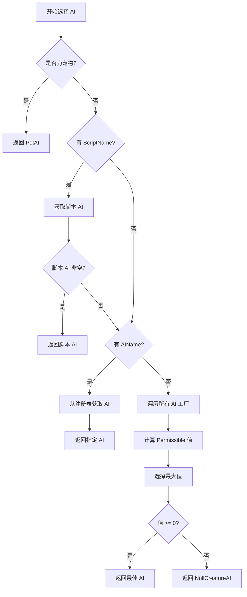

# AzerothCore AI 系统详细分析文档

## 目录

1. [AI 系统概览](#1-ai-系统概览)
2. [目录结构](#2-目录结构)
3. [核心基类分析](#3-核心基类分析)
4. [CoreAI 模块分析](#4-coreai-模块分析)
5. [ScriptedAI 模块分析](#5-scriptedai-模块分析)
6. [SmartScripts 模块分析](#6-smartscripts-模块分析)
7. [AI 选择机制](#7-ai-选择机制)
8. [设计模式](#8-设计模式)
9. [关键子系统](#9-关键子系统)
10. [总结](#10-总结)
11. [AI 系统深入讲解（补充文档）](#11-ai-系统深入讲解补充文档)

---

## 补充文档说明

**AI 系统深入讲解与配置实践** 文档已创建，包含以下内容：

- 各类 AI 类型深入对比与选择决策树
- PassiveAI、CombatAI、PetAI、GuardAI、BossAI、SmartAI 详细讲解
- SmartScripts 高级配置指南
- AI 配置实践案例（巡逻守卫、多阶段首领、任务 NPC）
- AI 系统调试与问题排查
- AI 系统性能优化

**文档位置**: `analysis/AI_System_Deep_Dive.md`

---

## 1. AI 系统概览

AzerothCore 的 AI 系统是一个分层、模块化的游戏 AI 框架，用于驱动游戏中所有非玩家控制单位（生物、宠物、游戏对象等）的行为。该系统采用面向对象设计，支持从简单被动行为到复杂首领战斗的各种场景。

### 1.1 系统特点

- **分层设计**：从基础 UnitAI 到具体实现的多层继承体系
- **灵活选择**：通过 Permissible 机制动态选择最合适的 AI
- **数据驱动**：SmartAI 系统支持完全通过数据库配置 AI 行为
- **事件驱动**：基于事件-条件-动作模型的智能脚本系统
- **可扩展**：支持 C++ 脚本扩展和数据库配置两种方式

---

## 2. 目录结构

```
src/server/game/AI/
├── CoreAI/                          # 核心 AI 实现
│   ├── CombatAI.cpp/h              # 战斗 AI
│   ├── GameObjectAI.cpp/h          # 游戏对象 AI 基类
│   ├── GuardAI.cpp/h              # 守卫 AI
│   ├── PassiveAI.cpp/h            # 被动 AI
│   ├── PetAI.cpp/h                # 宠物 AI
│   ├── ReactorAI.cpp/h            # 反应型 AI
│   ├── TotemAI.cpp/h             # 图腾 AI
│   └── UnitAI.cpp/h              # 单位 AI 基类
├── ScriptedAI/                    # 脚本化 AI
│   ├── ScriptedCreature.cpp/h    # 脚本生物基类
│   ├── ScriptedEscortAI.cpp/h    # 护送 AI
│   ├── ScriptedFollowerAI.cpp/h  # 跟随 AI
│   └── ScriptedGossip.cpp/h     # 对话系统
├── SmartScripts/                  # 智能脚本系统
│   ├── SmartAI.cpp/h             # 智能 AI 实现
│   ├── SmartScript.cpp/h         # 智能脚本引擎
│   └── SmartScriptMgr.cpp/h     # 智能脚本管理器
├── CreatureAI.cpp/h              # 生物 AI 基类
├── CreatureAIFactory.h           # AI 工厂模板
├── CreatureAIImpl.h              # AI 实现辅助
├── CreatureAIRegistry.cpp/h      # AI 注册系统
├── CreatureAISelector.cpp/h      # AI 选择器
├── GameObjectAIFactory.h         # 游戏对象 AI 工厂
└── enuminfo_CreatureAI.cpp     # 枚举信息
```

---

## 3. 核心基类分析

### 3.1 UnitAI - 所有单位 AI 的基类

**文件位置**: `src/server/game/AI/CoreAI/UnitAI.h`

UnitAI 是所有 AI 的最底层基类，定义了单位 AI 的核心接口。

#### 3.1.1 核心方法

```cpp
class UnitAI
{
public:
    // 初始化 AI
    virtual void InitializeAI() { if (!me->isDead()) Reset(); }
    
    // 重置 AI 状态
    virtual void Reset() {};
    
    // 开始攻击目标
    virtual void AttackStart(Unit* target);
    
    // 更新 AI 逻辑（纯虚函数，子类必须实现）
    virtual void UpdateAI(uint32 diff) = 0;
    
    // 被魅惑时的处理
    virtual void OnCharmed(bool apply) = 0;
    
    // 进入/离开战斗
    virtual void JustEnteredCombat(Unit* who) {}
    virtual void JustExitedCombat() {}
};
```

#### 3.1.2 目标选择系统

UnitAI 提供了强大的目标选择功能：

```cpp
// 选择目标的方法
enum class SelectTargetMethod
{
    Random,      // 随机选择
    MaxThreat,   // 优先高威胁目标
    MinThreat,   // 优先低威胁目标
    MaxDistance, // 优先远距离目标
    MinDistance  // 优先近距离目标
};

// 从威胁列表选择最佳目标
Unit* SelectTarget(SelectTargetMethod targetType, uint32 position = 0, 
                   float dist = 0.0f, bool playerOnly = false, 
                   bool withTank = true, int32 aura = 0);
```

#### 3.1.3 预定义选择器

```cpp
// 默认目标选择器：基于距离、玩家、光环条件
struct DefaultTargetSelector {
    bool operator()(Unit const* target) const;
    // 检查：存活、距离、玩家、光环等条件
};

// 法术目标选择器：检查法术施放条件
struct SpellTargetSelector {
    bool operator()(Unit const* target) const;
};

// 非法坦目标选择器：跳过当前坦克
struct NonTankTargetSelector {
    bool operator()(Unit const* target) const;
};

// 能量用户选择器：选择特定能量类型的单位
struct PowerUsersSelector {
    bool operator()(Unit const* target) const;
};

// 范围选择器：基于距离和视线
struct RangeSelector {
    bool operator()(Unit const* target) const;
};
```

#### 3.1.4 法术辅助方法

```cpp
// 施放法术的辅助函数
SpellCastResult DoCast(uint32 spellId);
SpellCastResult DoCast(Unit* victim, uint32 spellId, bool triggered = false);
SpellCastResult DoCastSelf(uint32 spellId, bool triggered = false);
SpellCastResult DoCastVictim(uint32 spellId, bool triggered = false);
SpellCastResult DoCastAOE(uint32 spellId, bool triggered = false);
SpellCastResult DoCastRandomTarget(uint32 spellId, ...);
SpellCastResult DoCastMaxThreat(uint32 spellId, ...);
```

#### 3.1.5 伤害与治疗回调

```cpp
// 伤害相关回调
virtual void DamageDealt(Unit* victim, uint32& damage, ...);
virtual void DamageTaken(Unit* attacker, uint32& damage, ...);
virtual void HealReceived(Unit* done_by, uint32& addhealth) {}
virtual void HealDone(Unit* done_to, uint32& addhealth) {}

// 伤害计算回调
virtual void OnCalculateMeleeDamageReceived(uint32& damage, Unit* attacker) {}
virtual void OnCalculateSpellDamageReceived(int32& damage, Unit* attacker) {}
virtual void OnCalculatePeriodicTickReceived(uint32& damage, Unit* attacker) {}
```

### 3.2 CreatureAI - 生物 AI 基类

**文件位置**: `src/server/game/AI/CreatureAI.h`

CreatureAI 继承自 UnitAI，为生物（NPC）添加特定功能。

#### 3.2.1 核心枚举

```cpp
// 脱战原因
enum EvadeReason
{
    EVADE_REASON_NO_HOSTILES,       // 威胁列表为空
    EVADE_REASON_BOUNDARY,          // 超出边界
    EVADE_REASON_SEQUENCE_BREAK,    // 首领战前置条件未满足
    EVADE_REASON_NO_PATH,           // 无法到达目标超过5秒
    EVADE_REASON_OTHER
};

// AI 优先级
enum Permitions : int32
{
    PERMIT_BASE_NO                 = -1,   // 不允许
    PERMIT_BASE_IDLE              = 1,    // 空闲 AI
    PERMIT_BASE_REACTIVE         = 100,   // 反应型 AI
    PERMIT_BASE_PROACTIVE        = 200,   // 主动型 AI
    PERMIT_BASE_FACTION_SPECIFIC = 400,   // 阵营特定 AI
    PERMIT_BASE_SPECIAL          = 800    // 特殊 AI（宠物、智能AI）
};
```

#### 3.2.2 核心方法

```cpp
class CreatureAI : public UnitAI
{
public:
    // 说话（从 creature_text 表读取文本）
    void Talk(uint8 id, WorldObject const* whisperTarget = nullptr, Milliseconds delay = 0ms);
    
    // 脱战处理
    virtual void EnterEvadeMode(EvadeReason why = EVADE_REASON_OTHER);
    
    // 战斗相关回调
    virtual void JustEngagedWith(Unit* who) {}      // 开始战斗
    virtual void JustDied(Unit* killer) {}          // 被杀死
    virtual void KilledUnit(Unit* victim) {}        // 杀死单位
    
    // 召唤相关回调
    virtual void JustSummoned(Creature* summon) {}
    virtual void SummonedCreatureDespawn(Creature* summon) {}
    virtual void SummonedCreatureDies(Creature* summon, Unit* killer) {}
    
    // 法术相关回调
    virtual void SpellHit(Unit* caster, SpellInfo const* spell) {}
    virtual void SpellHitTarget(Unit* target, SpellInfo const* spell) {}
    virtual void OnSpellStart(SpellInfo const* spell) {}
    virtual void OnSpellCast(SpellInfo const* spell) {}
    virtual void OnSpellFailed(SpellInfo const* spell) {}
    
    // 移动相关回调
    virtual void MovementInform(uint32 type, uint32 id) {}
    virtual void WaypointReached(uint32 nodeId, uint32 pathId) {}
    
    // 边界系统
    bool CheckInRoom();
    void SetBoundary(CreatureBoundary const* boundary, bool negativeBoundaries = false);
    bool IsInBoundary(Position const* who = nullptr) const;
    
    // 召唤辅助函数
    Creature* DoSummon(uint32 entry, Position const& pos, ...);
    Creature* DoSummon(uint32 entry, WorldObject* obj, float radius = 5.0f, ...);
    
    // 将区域内所有玩家带入战斗
    void DoZoneInCombat(Creature* creature = nullptr, float maxRangeToNearestTarget = 250.0f);
};
```

#### 3.2.3 事件系统

CreatureAI 提供了丰富的虚函数回调，供子类重写以实现特定行为：

| 回调方法 | 触发时机 |
|---------|-----------|
| `JustRespawned()` | 生物重生时 |
| `JustReachedHome()` | 回到老家时 |
| `JustEngagedWith(Unit*)` | 开始战斗时 |
| `JustDied(Unit*)` | 死亡时 |
| `KilledUnit(Unit*)` | 杀死单位时 |
| `SpellHit(Unit*, SpellInfo*)` | 被法术命中时 |
| `MovementInform(uint32, uint32)` | 移动完成时 |
| `ReceiveEmote(Player*, uint32)` | 收到表情时 |
| `CorpseRemoved(uint32&)` | 尸体被移除时 |

#### 3.2.4 脱战机制

```cpp
void CreatureAI::EnterEvadeMode(EvadeReason why)
{
    // 1. 调用 _EnterEvadeMode 执行基础脱战逻辑
    if (!_EnterEvadeMode(why))
        return;
    
    // 2. 根据情况处理移动
    if (Unit* owner = me->GetCharmerOrOwner())
    {
        // 拥有者控制的生物：跟随拥有者
        me->GetMotionMaster()->MoveFollow(owner, PET_FOLLOW_DIST, me->GetFollowAngle());
    }
    else
    {
        // 独立生物：返回老家
        me->GetMotionMaster()->MoveTargetedHome();
    }
    
    // 3. 重置 AI 状态
    Reset();
    
    // 4. 触发脚本回调
    sScriptMgr->OnUnitEnterEvadeMode(me, why);
}
```

---

## 4. CoreAI 模块分析

CoreAI 目录包含了最基本、最常用的 AI 实现。

### 4.1 PassiveAI - 被动 AI

**文件位置**: `src/server/game/AI/CoreAI/PassiveAI.h/cpp`

被动 AI 用于完全被动的生物，不会主动攻击。

```cpp
class PassiveAI : public CreatureAI
{
public:
    explicit PassiveAI(Creature* c) : CreatureAI(c) {}
    
    // 不执行任何攻击行为
    void UpdateAI(uint32) override {}
    
    // 可以被魅惑
    void OnCharmed(bool apply) override;
};

// 派生类
class CritterAI : public PassiveAI  // 小动物：受惊时逃跑
class PossessedAI : public CreatureAI  // 被支配时的 AI
class NullCreatureAI : public CreatureAI  // 空 AI：什么都不做
class TriggerAI : public CreatureAI  // 触发器 AI
```

### 4.2 CombatAI - 战斗 AI

**文件位置**: `src/server/game/AI/CoreAI/CombatAI.h/cpp`

战斗 AI 从数据库读取法术列表，自动施放法术。

```cpp
class CombatAI : public CreatureAI
{
public:
    void InitializeAI() override;
    void Reset() override;
    void JustEngagedWith(Unit* who) override;
    void UpdateAI(uint32 diff) override;
    
protected:
    EventMap events;       // 事件调度器
    SpellVct spells;      // 法术列表（从数据库读取）
};

// 派生类
class CasterAI : public CombatAI  // 施法者：保持距离施法
class ArcherAI : public CreatureAI  // 弓箭手：远程攻击
class TurretAI : public CreatureAI  // 炮塔：固定位置攻击
class AggressorAI : public CreatureAI  // 侵略者：主动攻击
class VehicleAI : public CreatureAI  // 载具 AI
```

#### CombatAI 工作流程

```cpp
void CombatAI::UpdateAI(uint32 diff)
{
    // 1. 更新事件计时器
    events.Update(diff);
    
    // 2. 如果不在战斗中，返回
    if (!UpdateVictim())
        return;
    
    // 3. 执行到期的事件
    if (uint32 eventId = events.ExecuteEvent())
    {
        // 根据 eventId 施放对应法术
        DoSpellAttackIfReady(spells[eventId]);
    }
    
    // 4. 执行近战攻击
    DoMeleeAttackIfReady();
}
```

### 4.3 PetAI - 宠物 AI

**文件位置**: `src/server/game/AI/CoreAI/PetAI.h/cpp`

宠物 AI 控制玩家或 NPC 的宠物行为。

```cpp
class PetAI : public CreatureAI
{
public:
    explicit PetAI(Creature* c);
    
    void UpdateAI(uint32) override;
    void AttackStart(Unit* target) override;
    
    // 主人相关回调
    void OwnerAttackedBy(Unit* attacker) override;
    void OwnerAttacked(Unit* target) override;
    
    // 宠物特殊行为
    void KilledUnit(Unit* victim) override;
    void SpellHit(Unit* caster, SpellInfo const* spellInfo) override;
    
private:
    // 内部状态
    bool _needToStop(void);
    void _stopAttack(void);
    void _doMeleeAttack();
    bool _canMeleeAttack();
    
    // 目标选择
    Unit* SelectNextTarget(bool allowAutoSelect) const;
    
    // 返回主人
    void HandleReturnMovement();
    
    TimeTracker i_tracker;      // 行动计时器
    GuidSet m_AllySet;          // 盟友列表
    uint32 m_updateAlliesTimer;  // 更新盟友计时器
    float combatRange;           // 战斗范围
};
```

#### PetAI 行为逻辑

1. **跟随主人**：当没有目标时，跟随主人
2. **自动攻击**：主人受到攻击时，自动攻击攻击者的敌人
3. **返回主人**：距离主人过远时，返回主人身边
4. **法术施放**：根据宠物类型施放特定法术（如小鬼的火焰箭）
5. **被动模式**：如果设置为被动，不主动攻击

### 4.4 GuardAI - 守卫 AI

**文件位置**: `src/server/game/AI/CoreAI/GuardAI.h/cpp`

**重要**: GuardAI 继承自 **ScriptedAI**，不是 CreatureAI。

```cpp
class GuardAI : public ScriptedAI  // 注意：继承自 ScriptedAI
{
public:
    explicit GuardAI(Creature* creature);
    
    static int32 Permissible(Creature const* creature);
    
    void Reset() override;
    void EnterEvadeMode(EvadeReason why) override;
    void JustDied(Unit* killer) override;
};
```

#### GuardAI 特点

1. **保护城镇**：攻击犯罪玩家（PvP 触发）
2. **响应求助**：玩家发出求助表情时，前往援助
3. **群体协作**：附近的守卫会一起加入战斗
4. **返回岗位**：战斗结束后返回原始位置
5. **高级功能**：继承自 ScriptedAI，拥有 EventMap、SummonList 等高级功能

### 4.5 TotemAI - 图腾 AI

**文件位置**: `src/server/game/AI/CoreAI/TotemAI.h/cpp`

图腾 AI 控制萨满图腾的行为。

```cpp
class TotemAI : public CreatureAI
{
public:
    explicit TotemAI(Creature* c);
    
    void UpdateAI(uint32 diff) override;
    
    // 图腾不移动
    void AttackStart(Unit* who) override {}
    
private:
    uint64 i_totemSpell;  // 图腾法术 ID
};
```

### 4.6 ReactorAI - 反应型 AI

**文件位置**: `src/server/game/AI/CoreAI/ReactorAI.h/cpp`

反应型 AI 只在被攻击时反击，不会主动攻击。

```cpp
class ReactorAI : public CreatureAI
{
public:
    explicit ReactorAI(Creature* c) : CreatureAI(c) {}
    
    // 只在被攻击时反击
    void UpdateAI(uint32 diff) override;
    
    // 被攻击时进入战斗
    void AttackedBy(Unit* attacker) override;
};
```

---

## 5. ScriptedAI 模块分析

ScriptedAI 目录包含了用于脚本化生物的 AI 基类，特别适合首领战斗。

### 5.1 ScriptedAI - 脚本生物基类

**文件位置**: `src/server/game/AI/ScriptedAI/ScriptedCreature.h/cpp`

ScriptedAI 提供了丰富的辅助函数，简化脚本生物的编写。

```cpp
struct ScriptedAI : public CreatureAI
{
public:
    explicit ScriptedAI(Creature* creature);
    
    // 核心虚函数
    void Reset() override {}
    void JustEngagedWith(Unit* who) override {}
    void UpdateAI(uint32 diff) override;
    
    // 攻击辅助
    void DoStartMovement(Unit* target, float distance = 0.0f, float angle = 0.0f);
    void DoStartNoMovement(Unit* target);
    void DoStopAttack();
    
    // 法术辅助
    void DoCastSpell(Unit* target, SpellInfo const* spellInfo, bool triggered = false);
    SpellInfo const* SelectSpell(Unit* target, ...);
    
    // 威胁管理
    void DoAddThreat(Unit* unit, float amount);
    void DoModifyThreatByPercent(Unit* unit, int32 pct);
    void DoResetThreat(Unit* unit);
    void DoResetThreatList();
    float DoGetThreat(Unit* unit);
    
    // 传送
    void DoTeleportPlayer(Unit* unit, float x, float y, float z, float o);
    void DoTeleportAll(float x, float y, float z, float o);
    
    // 搜索
    Unit* DoSelectLowestHpFriendly(float range, uint32 minHPDiff = 1);
    std::list<Creature*> DoFindFriendlyCC(float range);
    std::list<Creature*> DoFindFriendlyMissingBuff(float range, uint32 spellId);
    
    // 难度检查
    bool IsHeroic() const;
    Difficulty GetDifficulty() const;
    bool Is25ManRaid() const;
    
    // 模板函数：根据难度返回不同值
    template<class T> inline const T& DUNGEON_MODE(const T& normal5, const T& heroic10) const;
    template<class T> inline const T& RAID_MODE(const T& normal10, const T& normal25) const;
    template<class T> inline const T& RAID_MODE(const T& normal10, const T& normal25, 
                                                const T& heroic10, const T& heroic25) const;
};
```

### 5.2 BossAI - 首领 AI

**文件位置**: `src/server/game/AI/ScriptedAI/ScriptedCreature.h/cpp`

BossAI 是专门为副本首领设计的 AI 基类，支持阶段、技能时间轴、召唤列表等。

```cpp
class BossAI : public ScriptedAI
{
public:
    BossAI(Creature* creature, uint32 bossId);
    
    // 核心方法
    void Reset() override { _Reset(); }
    void JustEngagedWith(Unit* who) override { _JustEngagedWith(); }
    void EnterEvadeMode(EvadeReason why) override { _EnterEvadeMode(why); }
    void JustDied(Unit* killer) override { _JustDied(); }
    void JustReachedHome() override { _JustReachedHome(); }
    void UpdateAI(uint32 diff) override;
    
    // 事件调度钩子（子类重写此函数处理事件）
    virtual void ExecuteEvent(uint32 eventId) {}
    
    // 生命值检查事件
    void ScheduleHealthCheckEvent(uint32 healthPct, std::function<void()> exec, ...);
    void ProcessHealthCheck();
    
    // 狂暴计时器
    void ScheduleEnrageTimer(uint32 spellId, Milliseconds timer, uint8 textId = 0);
    
protected:
    EventMap events;           // 事件调度器
    SummonList summons;        // 召唤物列表
    InstanceScript* instance;  // 副本脚本指针
    
private:
    void _Reset();
    void _JustEngagedWith();
    void _JustDied();
    void _EnterEvadeMode(EvadeReason why);
    void TeleportCheaters();  // 将卡怪的玩家传送回来
    
    uint32 const _bossId;
    std::list<HealthCheckEventData> _healthCheckEvents;
};
```

#### BossAI 使用示例

```cpp
class BossAI_Example : public BossAI
{
public:
    BossAI_Example(Creature* creature) : BossAI(creature, BOSS_ID) {}
    
    void JustEngagedWith(Unit* who) override
    {
        // 调度事件
        events.ScheduleEvent(EVENT_CAST_FIREBALL, 5s);
        events.ScheduleEvent(EVENT_SUMMON_ADDS, 20s);
        events.ScheduleEvent(EVENT_PHASE_2, 50s);
        
        // 调度生命值检查
        ScheduleHealthCheckEvent(50, [this]() {
            Talk(EMOTE_PHASE_2);
            events.ScheduleEvent(EVENT_PHASE_2_START, 1s);
        });
    }
    
    void ExecuteEvent(uint32 eventId) override
    {
        switch (eventId)
        {
            case EVENT_CAST_FIREBALL:
                DoCastVictim(SPELL_FIREBALL);
                events.ScheduleEvent(EVENT_CAST_FIREBALL, 8s);
                break;
            case EVENT_SUMMON_ADDS:
                DoSummon(ADD_ENTRY, me, 5.0f);
                events.ScheduleEvent(EVENT_SUMMON_ADDS, 30s);
                break;
            case EVENT_PHASE_2_START:
                // 进入第二阶段
                break;
        }
    }
    
    void UpdateAI(uint32 diff) override
    {
        // 更新事件调度器
        events.Update(diff);
        
        // 如果不在战斗中，返回
        if (!UpdateVictim())
            return;
            
        // 执行到期的事件
        ExecuteEvent(events.ExecuteEvent());
        
        // 处理生命值检查
        ProcessHealthCheck();
        
        // 更新召唤物
        UpdateSummons(diff);
    }
};
```

### 5.3 SummonList - 召唤物列表管理器

```cpp
class SummonList
{
public:
    // 添加/移除召唤物
    void Summon(Creature const* summon);
    void Despawn(Creature const* summon);
    void DespawnAll(Milliseconds delay = 0ms);
    
    // 查询
    bool empty() const;
    size_type size() const;
    bool IsAnyCreatureAlive() const;
    bool IsAnyCreatureInCombat() const;
    
    // 操作所有召唤物
    void DoAction(int32 info, uint16 max = 0);
    void DoForAllSummons(std::function<void(WorldObject*)> exec);
    
    // 将召唤物带入战斗
    void DoZoneInCombat(uint32 entry = 0);
};
```

### 5.4 ScriptedEscortAI - 护送 AI

**文件位置**: `src/server/game/AI/ScriptedAI/ScriptedEscortAI.h/cpp`

用于护送任务 NPC 的 AI。

```cpp
class npc_escortAI : public CreatureAI
{
public:
    // 开始护送
    void Start(bool isActive, bool isRunning = false, uint32 startWaypoint = 0, uint32 endWaypoint = 0, 
               uint32 questEntry = 0, bool repeat = false, bool isRunningEquipped = false);
    
    // 暂停/恢复护送
    void Pause(bool onPause = true);
    void Resume();
    
    // 设置护送速度
    void SetMaxPlayerDistance(float dist);
    
    // 重写的重要方法
    void UpdateAI(uint32 diff) override;
    void MovementInform(uint32 type, uint32 id) override;
    
protected:
    bool IsEscortActive() const { return mIsRunning; }
    void SetEscortPaused(bool onPause);
};
```

### 5.5 ScriptedFollowerAI - 跟随 AI

**文件位置**: `src/server/game/AI/ScriptedAI/ScriptedFollowerAI.h/cpp`

用于跟随玩家的 NPC。

```cpp
class FollowerAI : public CreatureAI
{
public:
    void UpdateAI(uint32 diff) override;
    
    // 开始/停止跟随
    void StartFollow(Player* player, float followDist = 0.0f, float followAngle = 0.0f, 
                     uint32 quest = 0, uint32 misc = 0);
    void StopFollow(uint32 quest = 0, uint32 misc = 0);
    
    // 重写的方法
    void MovementInform(uint32 type, uint32 id) override;
    void OnCharmed(bool apply) override;
};
```

---

## 6. SmartScripts 模块分析

SmartScripts 是 AzerothCore 最强大的 AI 系统，使用**事件-条件-动作**模型，完全通过数据库配置。

### 6.1 核心概念

SmartScripts 系统基于三个核心概念：

1. **事件 (Event)**：触发 AI 行为的条件（如：获得仇恨、杀死目标、血量百分比等）
2. **条件 (Condition)**：事件触发后，判断是否执行动作的条件
3. **动作 (Action)**：满足条件后执行的行为（如：说话、施法、召唤生物等）

### 6.2 SmartAI - 智能生物 AI

**文件位置**: `src/server/game/AI/SmartScripts/SmartAI.h/cpp`

```cpp
class SmartAI : public CreatureAI
{
public:
    explicit SmartAI(Creature* c);
    
    // 重写 CreatureAI 方法
    void Reset() override;
    void JustRespawned() override;
    void JustReachedHome() override;
    void JustEngagedWith(Unit* enemy) override;
    void JustExitedCombat() override;
    void EnterEvadeMode(EvadeReason why) override;
    void JustDied(Unit* killer) override;
    void KilledUnit(Unit* victim) override;
    void UpdateAI(uint32 diff) override;
    
    // 移动相关
    void StartPath(...);
    void PausePath(uint32 delay, bool forced = false);
    void StopPath(uint32 DespawnTime = 0, uint32 quest = 0, bool fail = false);
    void ResumePath();
    
    // 跟随
    void SetFollow(Unit* target, float dist = 0.0f, float angle = 0.0f, ...);
    void StopFollow(bool complete);
    
    // 距离保持
    void DistanceYourself(float range);
    void SetCombatMovement(bool on, bool stopOrStartMovement);
    
    // 脚本接口
    SmartScript* GetScript() { return &mScript; }
    
private:
    SmartScript mScript;           // 智能脚本引擎
    WaypointPath const* mWayPoints; // 路径点
    uint32 mEscortState;            // 护送状态
    uint32 mCurrentWPID;           // 当前路径点 ID
    bool mCanAutoAttack;           // 是否可以自动攻击
    bool mEvadeDisabled;           // 是否禁用脱战
};
```

### 6.3 SmartScript - 智能脚本引擎

**文件位置**: `src/server/game/AI/SmartScripts/SmartScript.h/cpp`

SmartScript 是 SmartScripts 系统的核心引擎，负责解析和执行数据库配置的脚本。

```cpp
class SmartScript
{
public:
    // 初始化
    void OnInitialize(WorldObject* obj, AreaTrigger const* at = nullptr);
    void GetScript();  // 从数据库读取脚本
    void FillScript(SmartAIEventList e, WorldObject* obj, AreaTrigger const* at);
    
    // 事件处理
    void ProcessEventsFor(SMART_EVENT e, Unit* unit = nullptr, ...);
    void ProcessEvent(SmartScriptHolder& e, Unit* unit = nullptr, ...);
    void ProcessAction(SmartScriptHolder& e, Unit* unit = nullptr, ...);
    
    // 更新
    void OnUpdate(const uint32 diff);
    
    // 目标选择
    void GetTargets(ObjectVector& targets, SmartScriptHolder const& e, 
                   WorldObject* invoker = nullptr) const;
    
    // 计时器
    void UpdateTimer(SmartScriptHolder& e, uint32 const diff);
    bool CheckTimer(SmartScriptHolder const& e) const;
    
    // 存储系统
    void StoreTargetList(ObjectVector const& targets, uint32 id);
    ObjectVector const* GetStoredTargetVector(uint32 id, WorldObject const& ref) const;
    
    // 计数器
    void StoreCounter(uint32 id, uint32 value, uint32 reset, uint32 subtract);
    uint32 GetCounterValue(uint32 id);
    
private:
    // 事件列表
    SmartAIEventList mEvents;
    SmartAIEventList mInstallEvents;
    SmartAIEventList mTimedActionList;
    
    // 阶段系统
    uint32 mEventPhase;
    void IncPhase(uint32 p);
    void DecPhase(uint32 p);
    void SetPhase(uint32 p);
    bool IsInPhase(uint32 p) const;
    
    // 执行栈
    std::deque<SmartScriptFrame> executionStack;
    
    // 存储的目标和计数器
    ObjectVectorMap _storedTargets;
    CounterMap mCounterList;
    
    // 当前对象
    Creature* me;
    GameObject* go;
    AreaTrigger const* trigger;
};
```

### 6.4 事件类型 (SMART_EVENT)

SmartScripts 支持 70+ 种事件类型：

```cpp
enum SMART_EVENT
{
    SMART_EVENT_UPDATE               = 0,   // 定时更新
    SMART_EVENT_AGGRO               = 1,   // 获得仇恨
    SMART_EVENT_KILL                = 2,   // 杀死单位
    SMART_EVENT_DEATH               = 3,   // 死亡
    SMART_EVENT_EVADE               = 4,   // 脱战
    SMART_EVENT_SPELLHIT            = 5,   // 被法术命中
    SMART_EVENT_RANGE               = 6,   // 范围检测
    SMART_EVENT_HEALTH_PCT          = 7,   // 血量百分比
    SMART_EVENT_MANA_PCT            = 8,   // 法力百分比
    SMART_EVENT_AGGRO_SPELL         = 9,   // 施法获得仇恨
    SMART_EVENT_SPELLHIT_TARGET     = 10,  // 法术命中目标
    SMART_EVENT_OOC_LOS             = 11,  // 视线内（脱离战斗）
    SMART_EVENT_RESPAWN             = 12,  // 重生
    SMART_EVENT_TARGET_HEALTH_PCT    = 13,  // 目标血量百分比
    SMART_EVENT_VICTIM_HEALTH_PCT   = 14,  // 受害者血量百分比
    SMART_EVENT_TARGET_MANA_PCT     = 15,  // 目标法力百分比
    SMART_EVENT_ACCEPTED_QUEST      = 16,  // 接受任务
    SMART_EVENT_REWARD_QUEST        = 17,  // 完成任务
    SMART_EVENT_REACHED_WAYPOINT    = 18,  // 到达路径点
    SMART_EVENT_RECEIVE_EMOTE       = 19,  // 收到表情
    SMART_EVENT_HAS_AURA            = 20,  // 拥有光环
    SMART_EVENT_TARGET_BUFFED       = 21,  // 目标被Buff
    SMART_EVENT_RESET               = 22,  // 重置
    // ... 更多事件类型
};
```

### 6.5 动作类型 (SMART_ACTION)

SmartScripts 支持 100+ 种动作类型：

```cpp
enum SMART_ACTION
{
    SMART_ACTION_NONE                       = 0,   // 无动作
    SMART_ACTION_TALK                       = 1,   // 说话
    SMART_ACTION_SET_FACTION                = 2,   // 设置阵营
    SMART_ACTION_MORPH_TO_ENTRY_OR_MODEL   = 3,   // 变形
    SMART_ACTION_SOUND                      = 4,   // 播放声音
    SMART_ACTION_PLAY_EMOTE                 = 5,   // 播放表情
    SMART_ACTION_FAIL_QUEST                 = 6,   // 任务失败
    SMART_ACTION_OFFER_QUEST                = 7,   // 给予任务
    SMART_ACTION_THREAT_SINGLE              = 8,   // 单一威胁
    SMART_ACTION_THREAT_ALL                 = 9,   // 所有威胁
    SMART_ACTION_CALL_AREAEXPLORED          = 10,  // 调用区域探索
    SMART_ACTION_SEND_CASTCREATUREORGO      = 11,  // 传送生物或对象
    SMART_ACTION_SET_EMOTE_STATE            = 12,  // 设置表情状态
    SMART_ACTION_SUMMON_CREATURE_GROUP      = 13,  // 召唤生物组
    SMART_ACTION_MOVE_TO_POS                = 14,  // 移动到位置
    SMART_ACTION_RESPAWN_TARGET             = 15,  // 重生命目标
    SMART_ACTION_EQUIP                      = 16,  // 装备
    SMART_ACTION_CLOSE_GOSSIP               = 17,  // 关闭对话
    SMART_ACTION_TRIGGER_TIMED_EVENT        = 18,  // 触发定时事件
    SMART_ACTION_REMOVE_TIMED_EVENT         = 19,  // 移除定时事件
    SMART_ACTION_ADD_AURA                   = 20,  // 添加光环
    SMART_ACTION_OVERRIDE_SCRIPT_BASE_OBJECT_AI 
                                               = 21,  // 覆盖脚本基类对象AI
    SMART_ACTION_RESET_SCRIPT_BASE_OBJECT  
                                               = 22,  // 重置脚本基类对象
    SMART_ACTION_CALL_SCRIPT_BASE_OBJECT_HOOKS   
                                               = 23,  // 调用脚本基类对象钩子
    SMART_ACTION_SET_RANGE_DISTANCE         = 24,  // 设置范围距离
    SMART_ACTION_FOLLOW                     = 25,  // 跟随
    SMART_ACTION_SET_ORIENTATION            = 26,  // 设置朝向
    SMART_ACTION_STORE_VARIABLE            = 27,  // 存储变量
    SMART_ACTION_STORE_TARGETS             = 28,  // 存储目标
    SMART_ACTION_RESTORE_TARGETS           = 29,  // 恢复目标
    // ... 更多动作类型
};
```

### 6.6 目标类型 (SMART_TARGET)

```cpp
enum SMARTAI_TARGETS
{
    SMART_TARGET_SELF                  = 0,   // 自己
    SMART_TARGET_VICTIM               = 1,   // 当前目标
    SMART_TARGET_HOSTILE_SECOND_AGGRO  = 2,   // 第二仇恨敌对目标
    SMART_TARGET_HOSTILE_LAST_AGGRO    = 3,   // 最后仇恨敌对目标
    SMART_TARGET_HOSTILE_RANDOM        = 4,   // 随机敌对目标
    SMART_TARGET_HOSTILE_RANDOM_NOT_TOP = 5,   // 随机敌对目标（非最高威胁）
    SMART_TARGET_ACTION_INVOKER        = 6,   // 动作调用者
    SMART_TARGET_POSITION              = 7,   // 位置
    SMART_TARGET_CREATURE_RANGE        = 8,   // 范围内生物
    SMART_TARGET_CREATURE_GUID        = 9,   // 指定GUID生物
    SMART_TARGET_CREATURE_DISTANCE     = 10,  // 距离内生物
    SMART_TARGET_STORED               = 11,  // 存储的目标
    SMART_TARGET_GAMEOBJECT_RANGE      = 12,  // 范围内游戏对象
    SMART_TARGET_GAMEOBJECT_GUID      = 13,  // 指定GUID游戏对象
    SMART_TARGET_GAMEOBJECT_DISTANCE  = 14,  // 距离内游戏对象
    SMART_TARGET_INVOKER_PARTY        = 15,  // 调用者队伍
    SMART_TARGET_PLAYER_RANGE         = 16,  // 范围内玩家
    SMART_TARGET_PLAYER_DISTANCE      = 17,  // 距离内玩家
    SMART_TARGET_CLOSEST_CREATURE     = 18,  // 最近生物
    SMART_TARGET_CLOSEST_GAMEOBJECT   = 19,  // 最近游戏对象
    SMART_TARGET_CLOSEST_PLAYER        = 20,  // 最近玩家
    // ... 更多目标类型
};
```

### 6.7 SmartScriptMgr - 脚本管理器

**文件位置**: `src/server/game/AI/SmartScripts/SmartScriptMgr.h/cpp`

负责管理智能脚本的加载和存储。

```cpp
class SmartScriptMgr
{
public:
    // 加载所有智能脚本
    void LoadSmartScripts();
    void LoadSmartAIMovmentorPaths();
    
    // 获取脚本
    SmartAIEventList GetScript(SmartScriptType type, uint32 entry, uint32 difficulty = 0);
    
    // 重新加载
    void Reload();
    
private:
    // 脚本存储
    typedef std::map<std::pair<uint32, uint32>, SmartAIEventList> SmartAIStore;
    SmartAIStore mEventStore;
};
```

### 6.8 SmartScripts 数据库结构

SmartScripts 的配置存储在数据库表 `smart_scripts` 中：

```sql
CREATE TABLE smart_scripts (
    entryorguid INT UNSIGNED NOT NULL,    -- 生物/对象 Entry 或 GUID
    source_type INT UNSIGNED NOT NULL,    -- 源类型（生物、对象、区域触发等）
    id INT UNSIGNED NOT NULL,            -- 脚本 ID
    link INT UNSIGNED NOT NULL,           -- 链接的脚本 ID
    
    -- 事件
    event_type INT UNSIGNED NOT NULL,     -- 事件类型
    event_phase_mask INT UNSIGNED NOT NULL, -- 阶段掩码
    event_chance INT UNSIGNED NOT NULL,  -- 触发几率
    event_flags INT UNSIGNED NOT NULL,    -- 事件标志
    event_param1 INT UNSIGNED NOT NULL,  -- 事件参数1
    event_param2 INT UNSIGNED NOT NULL,  -- 事件参数2
    event_param3 INT UNSIGNED NOT NULL,  -- 事件参数3
    event_param4 INT UNSIGNED NOT NULL,  -- 事件参数4
    event_param5 INT UNSIGNED NOT NULL,  -- 事件参数5
    event_param6 INT UNSIGNED NOT NULL,  -- 事件参数6
    
    -- 动作
    action_type INT UNSIGNED NOT NULL,    -- 动作类型
    action_param1 INT UNSIGNED NOT NULL,  -- 动作参数1
    action_param2 INT UNSIGNED NOT NULL,  -- 动作参数2
    action_param3 INT UNSIGNED NOT NULL,  -- 动作参数3
    action_param4 INT UNSIGNED NOT NULL,  -- 动作参数4
    action_param5 INT UNSIGNED NOT NULL,  -- 动作参数5
    action_param6 INT UNSIGNED NOT NULL,  -- 动作参数6
    
    -- 目标
    target_type INT UNSIGNED NOT NULL,    -- 目标类型
    target_param1 INT UNSIGNED NOT NULL,  -- 目标参数1
    target_param2 INT UNSIGNED NOT NULL,  -- 目标参数2
    target_param3 INT UNSIGNED NOT NULL,  -- 目标参数3
    target_param4 INT UNSIGNED NOT NULL,  -- 目标参数4
    
    comment TEXT                         -- 注释
);
```

### 6.9 SmartScripts 工作流程

```
1. 生物生成时
   └─> SmartAI::InitializeAI()
       └─> SmartScript::OnInitialize()
           └─> SmartScript::GetScript()  // 从数据库读取脚本
               └─> 存储到 mEvents 列表

2. 事件触发时（如：获得仇恨）
   └─> SmartAI::JustEngagedWith()
       └─> SmartScript::ProcessEventsFor(SMART_EVENT_AGGRO)
           └─> 遍历 mEvents
               └─> 找到匹配的事件
                   └─> SmartScript::ProcessEvent()
                       └─> 检查条件
                           └─> 执行动作（可能多个）
                               └─> 可能触发链接事件

3. 更新时
   └─> SmartAI::UpdateAI()
       └─> SmartScript::OnUpdate(diff)
           └─> 更新计时器
               └─> 触发定时事件
```

---

## 7. AI 选择机制

AI 选择遵循严格的优先级顺序，通过 Permissible 系统实现自动选择最合适的 AI。

### 7.1 选择优先级（从高到低）

```
1. 宠物特殊处理
   └─ 如果 creature->IsPet() == true
      └─ 直接返回 PetAI（忽略所有其他设置）

2. ScriptName（脚本名称）
   └─ 检查 creature_template.ScriptName
   └─ 调用 sScriptMgr->GetCreatureAI(creature)
   └─ 如果返回非空，直接使用

3. AIName（AI 名称）
   └─ 检查 creature_template.AIName
   └─ 如果非空，从 AI 注册表查找对应 AI

4. Permissible 机制（自动选择）
   └─ 遍历所有注册的 AI 工厂
   └─ 调用每个工厂的 Permissible(creature) 方法
   └─ 选择返回值最高的 AI（必须 >= 0）

5. 兜底机制
   └─ 返回 NullCreatureAI（永远不会执行到这里）
```

### 7.2 选择流程图



### 7.3 实际代码示例

```cpp
// 示例 1：宠物强制使用 PetAI
// 即使设置了 AIName='SmartAI'，也会被忽略
UPDATE creature_template 
SET AIName = 'SmartAI' 
WHERE entry = 416;  -- 小鬼（宠物）

// 实际选择：PetAI（因为 IsPet() == true）

// 示例 2：ScriptName 优先级最高
UPDATE creature_template 
SET ScriptName = 'boss_lich_king',
    AIName = 'CombatAI'
WHERE entry = 36597;

// 实际选择：boss_lich_king 脚本 AI（ScriptName 优先）

// 示例 3：AIName 次优先级
UPDATE creature_template 
SET AIName = 'SmartAI',
    ScriptName = ''
WHERE entry = 12345;

// 实际选择：SmartAI（从注册表获取）

// 示例 4：自动选择
UPDATE creature_template 
SET AIName = '',
    ScriptName = ''
WHERE entry = 67890;

// 实际选择：根据 Permissible 值自动选择
```

### 7.4 Permissible 机制详解

每个 AI 类都有一个静态的 `Permissible` 方法，用于判断该 AI 是否适用于特定生物：

```cpp
class SomeAI : public CreatureAI
{
public:
    // 静态方法：判断此 AI 是否适用于该生物
    static int32 Permissible(Creature const* creature);
    
    // 返回值：
    // -1 (PERMIT_BASE_NO)：不适用
    // >= 0：适用，返回值越大优先级越高
};
```

#### 权限优先级常量

```cpp
enum Permitions : int32
{
    PERMIT_BASE_NO                 = -1,   // 不允许
    PERMIT_BASE_IDLE              = 1,    // 空闲 AI（NullCreatureAI）
    PERMIT_BASE_REACTIVE         = 100,   // 反应型 AI（ReactorAI）
    PERMIT_BASE_PROACTIVE        = 200,   // 主动型 AI（AggressorAI）
    PERMIT_BASE_FACTION_SPECIFIC = 400,   // 阵营特定 AI（GuardAI）
    PERMIT_BASE_SPECIAL          = 800    // 特殊 AI（TotemAI, VehicleAI）
};
```

#### 实际示例

```cpp
// ReactorAI 的 Permissible 实现
int32 ReactorAI::Permissible(Creature const* creature)
{
    // 只对平民且非攻击性的生物返回高优先级
    if (creature->IsCivilian() && !creature->IsAggressive())
        return PERMIT_BASE_REACTIVE;  // 100
    
    return PERMIT_BASE_NO;  // -1
}

// AggressorAI 的 Permissible 实现
int32 AggressorAI::Permissible(Creature const* creature)
{
    // 对所有攻击性生物返回高优先级
    if (creature->IsAggressive())
        return PERMIT_BASE_PROACTIVE;  // 200
    
    return PERMIT_BASE_NO;  // -1
}

// GuardAI 的 Permissible 实现
int32 GuardAI::Permissible(Creature const* creature)
{
    // 只对守卫类型的生物返回高优先级
    if (creature->IsGuard())
        return PERMIT_BASE_FACTION_SPECIFIC;  // 400
    
    return PERMIT_BASE_NO;  // -1
}

// TotemAI 的 Permissible 实现
int32 TotemAI::Permissible(Creature const* creature)
{
    // 只对图腾返回高优先级
    if (creature->IsTotem())
        return PERMIT_BASE_SPECIAL;  // 800
    
    return PERMIT_BASE_NO;  // -1
}
```

#### 自定义 Permissible 逻辑

```cpp
// 自定义 AI 类
class MyCustomAI : public CreatureAI
{
public:
    explicit MyCustomAI(Creature* c) : CreatureAI(c) {}
    
    // 自定义 Permissible 逻辑
    static int32 Permissible(Creature const* creature)
    {
        // 示例 1：只对特定 entry 使用此 AI
        if (creature->GetEntry() == 12345)
            return PERMIT_BASE_FACTION_SPECIFIC + 50;  // 450，高于 GuardAI
        
        // 示例 2：只对特定阵营使用此 AI
        if (creature->GetFaction() == 35)  // 联盟阵营
            return PERMIT_BASE_FACTION_SPECIFIC + 10;  // 410
        
        return PERMIT_BASE_NO;  // -1
    }
    
    void UpdateAI(uint32 diff) override
    {
        // 自定义 AI 逻辑
    }
};
```

**重要**：
- 自定义 Permissible 值可以在基础值上加减
- 值越大，优先级越高
- 如果多个 AI 返回相同的值，后注册的 AI 优先

### 7.5 工厂模式 (Factory Pattern)

**文件位置**: `src/server/game/AI/CreatureAIFactory.h`

```cpp
// 工厂基类
struct SelectableAI : public CreatureAICreator, public Permissible<Creature>
{
    SelectableAI(std::string const& name) : CreatureAICreator(name), Permissible<Creature>() { }
};

// 工厂模板
template<class REAL_AI>
struct CreatureAIFactory : public SelectableAI
{
    CreatureAIFactory(std::string const& name) : SelectableAI(name) { }
    
    // 创建 AI 实例
    inline CreatureAI* Create(Creature* c) const override
    {
        return new REAL_AI(c);
    }
    
    // 返回该 AI 的优先级
    int32 Permit(Creature const* c) const override
    {
        return REAL_AI::Permissible(c);
    }
};
```

### 7.6 注册系统 (Registry)

**文件位置**: `src/server/game/AI/CreatureAIRegistry.cpp`

```cpp
void AIRegistry::Initialize()
{
    // 注册所有标准 AI 类型
    (new CreatureAIFactory<NullCreatureAI>("NullCreatureAI"))->RegisterSelf();
    (new CreatureAIFactory<TriggerAI>("TriggerAI"))->RegisterSelf();
    (new CreatureAIFactory<AggressorAI>("AggressorAI"))->RegisterSelf();
    (new CreatureAIFactory<ReactorAI>("ReactorAI"))->RegisterSelf();
    (new CreatureAIFactory<PassiveAI>("PassiveAI"))->RegisterSelf();
    (new CreatureAIFactory<CritterAI>("CritterAI"))->RegisterSelf();
    (new CreatureAIFactory<GuardAI>("GuardAI"))->RegisterSelf();
    (new CreatureAIFactory<PetAI>("PetAI"))->RegisterSelf();
    (new CreatureAIFactory<TotemAI>("TotemAI"))->RegisterSelf();
    (new CreatureAIFactory<CombatAI>("CombatAI"))->RegisterSelf();
    (new CreatureAIFactory<ArcherAI>("ArcherAI"))->RegisterSelf();
    (new CreatureAIFactory<TurretAI>("TurretAI"))->RegisterSelf();
    (new CreatureAIFactory<VehicleAI>("VehicleAI"))->RegisterSelf();
    (new CreatureAIFactory<SmartAI>("SmartAI"))->RegisterSelf();
};
```

### 7.7 AI 选择器 (Selector)

**文件位置**: `src/server/game/AI/CreatureAISelector.cpp`

```cpp
CreatureAI* FactorySelector::SelectAI(Creature* creature)
{
    // 1. 宠物强制使用 PetAI（最高优先级）
    if (creature->IsPet())
        return GetAIFromRegistry("PetAI")->Create(creature);
    
    // 2. 检查 C++ 脚本注册的 AI（ScriptName）
    if (CreatureAI* scriptedAI = sScriptMgr->GetCreatureAI(creature))
        return scriptedAI;
    
    // 3. 检查数据库中指定的 AIName
    if (!creature->GetAIName().empty())
    {
        if (CreatureAICreator* aiFactory = sCreatureAIRegistry.GetRegistryItem(creature->GetAIName()))
            return aiFactory->Create(creature);
    }
    
    // 4. 根据 Permissible() 返回值自动选择
    return SelectByPermit(creature);
}

CreatureAI* FactorySelector::SelectByPermit(Creature* creature)
{
    int32 bestPermit = PERMIT_BASE_NO;
    CreatureAICreator* bestFactory = nullptr;
    
    // 遍历所有注册的 AI 工厂
    for (auto& itr : sCreatureAIRegistry.GetRegistry())
    {
        CreatureAICreator* factory = itr.second;
        int32 permit = factory->Permit(creature);
        
        // 选择优先级最高的 AI
        if (permit > bestPermit)
        {
            bestPermit = permit;
            bestFactory = factory;
        }
    }
    
    if (bestFactory)
        return bestFactory->Create(creature);
    
    return nullptr;
}
```

---

## 8. 设计模式

AzerothCore AI 系统使用了多种设计模式：

### 8.1 工厂模式 (Factory Pattern)

**用途**：创建 AI 实例

```cpp
// 工厂模板
template<class REAL_AI>
struct CreatureAIFactory : public SelectableAI
{
    CreatureAI* Create(Creature* c) const override
    {
        return new REAL_AI(c);
    }
};

// 使用
CreatureAI* ai = sCreatureAIRegistry.GetRegistryItem("SmartAI")->Create(creature);
```

### 8.2 注册表模式 (Registry Pattern)

**用途**：管理所有可用的 AI 类型

```cpp
// 注册
void AIRegistry::Initialize()
{
    (new CreatureAIFactory<SmartAI>("SmartAI"))->RegisterSelf();
    // ...
}

// 获取
CreatureAICreator* factory = sCreatureAIRegistry.GetRegistryItem("SmartAI");
```

### 8.3 模板方法模式 (Template Method Pattern)

**用途**：定义算法骨架，子类实现具体步骤

```cpp
class CreatureAI : public UnitAI
{
public:
    // 模板方法
    void UpdateAI(uint32 diff) override
    {
        // 1. 更新事件（子类重写 ExecuteEvent）
        ExecuteEvent(events.ExecuteEvent());
        
        // 2. 更新召唤物（子类重写 UpdateSummons）
        UpdateSummons(diff);
        
        // 3. 近战攻击
        DoMeleeAttackIfReady();
    }
    
    // 钩子函数（子类重写）
    virtual void ExecuteEvent(uint32 eventId) {}
    virtual void UpdateSummons(uint32 diff) {}
};
```

### 8.4 观察者模式 (Observer Pattern)

**用途**：事件触发和响应

```cpp
// 事件触发
void SmartScript::ProcessEventsFor(SMART_EVENT e, ...)
{
    for (auto& event : mEvents)
    {
        if (event.event_type == e)
        {
            ProcessEvent(event, ...);
        }
    }
}

// 事件响应
void ProcessEvent(SmartScriptHolder& e, ...)
{
    // 检查条件
    if (!CheckConditions(e))
        return;
        
    // 执行动作
    ProcessAction(e, ...);
}
```

### 8.5 状态模式 (State Pattern)

**用途**：根据 AI 状态执行不同行为

```cpp
void CreatureAI::UpdateAI(uint32 diff)
{
    // 根据战斗状态执行不同逻辑
    if (IsEngaged())
    {
        // 战斗中的逻辑
        UpdateVictim();
        DoMeleeAttackIfReady();
    }
    else
    {
        // 非战斗中的逻辑
        MoveInLineOfSight();
    }
}
```

### 8.6 策略模式 (Strategy Pattern)

**用途**：动态选择 AI 策略

```cpp
// 根据生物类型选择不同 AI 策略
CreatureAI* FactorySelector::SelectAI(Creature* creature)
{
    if (creature->IsPet())
        return new PetAI(creature);      // 宠物策略
    else if (creature->IsGuard())
        return new GuardAI(creature);    // 守卫策略
    else
        return new PassiveAI(creature);  // 被动策略
}
```

---

## 9. 关键子系统

### 9.1 EventMap 系统

EventMap 是一个灵活的事件调度器，广泛用于 BossAI 和其他 AI。

```cpp
class EventMap
{
public:
    // 调度事件
    void ScheduleEvent(uint32 eventId, Milliseconds timer);
    void ScheduleEvent(uint32 eventId, Milliseconds minTimer, Milliseconds maxTimer);
    
    // 更新计时器
    void Update(uint32 diff);
    
    // 执行到期事件
    uint32 ExecuteEvent();
    
    // 取消事件
    void CancelEvent(uint32 eventId);
    void CancelEventGroup(uint32 group);
    
    // 检查事件
    bool HasEvent(uint32 eventId) const;
    bool HasEventInGroup(uint32 group) const;
};
```

#### 使用示例

```cpp
void BossAI_Example::JustEngagedWith(Unit* who)
{
    // 调度事件：5秒后执行 EVENT_CAST_FIREBALL
    events.ScheduleEvent(EVENT_CAST_FIREBALL, 5s);
    
    // 调度事件：20-30秒后执行（随机时间）
    events.ScheduleEvent(EVENT_SUMMON_ADDS, 20s, 30s);
    
    // 调度事件组
    events.ScheduleEvent(EVENT_GROUP_1_A, 10s, 0);  // 组 0
    events.ScheduleEvent(EVENT_GROUP_1_B, 15s, 0);  // 组 0
}

void BossAI_Example::ExecuteEvent(uint32 eventId)
{
    switch (eventId)
    {
        case EVENT_CAST_FIREBALL:
            DoCastVictim(SPELL_FIREBALL);
            events.ScheduleEvent(EVENT_CAST_FIREBALL, 8s);  // 再次调度
            break;
        case EVENT_SUMMON_ADDS:
            DoSummon(ADD_ENTRY, me, 5.0f);
            break;
    }
}

void BossAI_Example::UpdateAI(uint32 diff)
{
    events.Update(diff);  // 更新计时器
    
    if (uint32 eventId = events.ExecuteEvent())
    {
        ExecuteEvent(eventId);  // 执行到期事件
    }
}
```

### 9.2 TaskScheduler 系统

TaskScheduler 是一个更灵活的任务调度器，支持 lambda 表达式。

```cpp
class TaskScheduler
{
public:
    // 调度任务
    TaskContext Schedule(Milliseconds timer, std::function<void(TaskContext)> task);
    TaskContext Schedule(Milliseconds minTimer, Milliseconds maxTimer, 
                        std::function<void(TaskContext)> task);
    
    // 更新
    void Update(uint32 diff);
};

class TaskContext
{
public:
    // 重复执行
    void Repeat();
    void Repeat(Milliseconds timer);
    void Repeat(Milliseconds minTimer, Milliseconds maxTimer);
    
    // 取消
    void Cancel();
};
```

#### 使用示例

```cpp
void ScriptedAI_Example::JustEngagedWith(Unit* who)
{
    // 调度任务：5秒后施放火球术，然后每8秒重复
    scheduler.Schedule(5s, [this](TaskContext context)
    {
        DoCastVictim(SPELL_FIREBALL);
        context.Repeat(8s);
    });
    
    // 调度任务：20秒后召唤小怪
    scheduler.Schedule(20s, 30s, [this](TaskContext context)
    {
        DoSummon(ADD_ENTRY, me, 5.0f);
        context.Repeat(20s, 30s);
    });
}

void ScriptedAI_Example::UpdateAI(uint32 diff)
{
    // 更新调度器
    scheduler.Update(diff);
}
```

### 9.3 脱战系统 (Evade System)

脱战系统处理生物离开战斗的逻辑。

```cpp
// 脱战原因
enum EvadeReason
{
    EVADE_REASON_NO_HOSTILES,       // 威胁列表为空
    EVADE_REASON_BOUNDARY,          // 超出边界
    EVADE_REASON_SEQUENCE_BREAK,    // 首领战前置条件未满足
    EVADE_REASON_NO_PATH,           // 无法到达目标
    EVADE_REASON_OTHER
};

// 脱战处理
void CreatureAI::EnterEvadeMode(EvadeReason why)
{
    // 1. 设置脱战状态
    me->AddUnitState(UNIT_STATE_EVADE);
    
    // 2. 清除战斗状态
    me->CombatStop(true);
    
    // 3. 移除光环
    me->RemoveEvadeAuras();
    
    // 4. 返回老家或跟随主人
    if (Unit* owner = me->GetCharmerOrOwner())
        me->GetMotionMaster()->MoveFollow(owner, PET_FOLLOW_DIST, me->GetFollowAngle());
    else
        me->GetMotionMaster()->MoveTargetedHome();
    
    // 5. 重置 AI
    Reset();
}
```

### 9.4 边界系统 (Boundary System)

边界系统限制生物的活动范围。

```cpp
// 设置边界
void CreatureAI::SetBoundary(CreatureBoundary const* boundary, bool negativeBoundaries = false)
{
    _boundary = boundary;
    _negateBoundary = negativeBoundaries;
    me->DoImmediateBoundaryCheck();
}

// 检查是否在边界内
bool CreatureAI::IsInBoundary(Position const* who) const
{
    if (!_boundary)
        return true;
    
    if (!who)
        who = me;
    
    return (CreatureAI::IsInBounds(*_boundary, who) != _negateBoundary);
}

// 边界检查失败 -> 脱战
bool CreatureAI::CheckInRoom()
{
    if (IsInBoundary())
        return true;
    else
    {
        EnterEvadeMode(EVADE_REASON_BOUNDARY);
        return false;
    }
}
```

#### 边界定义示例

```cpp
// 使用 AreaBoundary 定义边界
class CircleBoundary : public AreaBoundary
{
public:
    CircleBoundary(Position const& center, float radius);
    
    bool IsWithinBoundary(Position const* pos) const override
    {
        return center.GetExactDist2d(pos) <= radius;
    }
};

class RectangleBoundary : public AreaBoundary
{
public:
    RectangleBoundary(float x1, float y1, float x2, float y2);
    
    bool IsWithinBoundary(Position const* pos) const override
    {
        return pos->GetPositionX() >= minX && pos->GetPositionX() <= maxX &&
               pos->GetPositionY() >= minY && pos->GetPositionY() <= maxY;
    }
};

// 在 AI 中使用
void BossAI_Example::JustEngagedWith(Unit* who)
{
    // 定义首领房间的边界
    CreatureBoundary boundary;
    boundary.push_back(new CircleBoundary(me->GetPosition(), 50.0f));
    
    // 设置边界
    SetBoundary(&boundary);
}
```

### 9.5 威胁系统 (Threat System)

威胁系统管理生物的仇恨列表。

```cpp
// 威胁管理器
class ThreatManager
{
public:
    // 添加威胁
    void AddThreat(Unit* victim, float threat);
    
    // 修改威胁
    void ModifyThreatByPercent(Unit* victim, int32 pct);
    
    // 重置威胁
    void ResetThreat(Unit* victim);
    void ClearThreatList();
    
    // 获取威胁列表
    ThreatList const& GetSortedThreatList();
    ThreatList const& GetUnsortedThreatList();
    
    // 获取最高威胁目标
    Unit* GetCurrentVictim();
};
```

#### 在 AI 中使用

```cpp
void CreatureAI::UpdateVictim()
{
    if (!me->IsEngaged())
        return false;
    
    // 选择最佳目标
    if (Unit* victim = me->SelectVictim())
    {
        if (victim != me->GetVictim())
            AttackStart(victim);
        return true;
    }
    
    return false;
}

// 修改威胁
void ScriptedAI::DoModifyThreatByPercent(Unit* unit, int32 pct)
{
    if (unit)
        me->GetThreatMgr().ModifyThreatByPercent(unit, pct);
}
```

---

## 11. AI 系统相关数据库表分析

AI 系统的行为不仅由 C++ 代码定义，还通过多个数据库表进行配置。本节详细分析这些数据库表的结构及其与 AI 系统的关系。

### 11.1 creature_template 表

**表说明**: 生物模板表，定义所有生物的基础属性和 AI 配置。

**表结构**:

```sql
CREATE TABLE `creature_template` (
  `entry` int unsigned NOT NULL DEFAULT '0' COMMENT '生物 Entry ID',
  `AIName` char(64) NOT NULL DEFAULT '' COMMENT 'AI 名称',
  `ScriptName` char(64) NOT NULL DEFAULT '' COMMENT 'C++ 脚本名',
  `name` char(100) NOT NULL DEFAULT '0' COMMENT '生物名称',
  `gossip_menu_id` int unsigned NOT NULL DEFAULT '0' COMMENT '对话菜单 ID',
  `minlevel` tinyint unsigned NOT NULL DEFAULT '1',
  `maxlevel` tinyint unsigned NOT NULL DEFAULT '1',
  `faction` smallint unsigned NOT NULL DEFAULT '0',
  `npcflag` int unsigned NOT NULL DEFAULT '0',
  `speed_walk` float NOT NULL DEFAULT '1',
  `speed_run` float NOT NULL DEFAULT '1.14286',
  `detection_range` float NOT NULL DEFAULT '20',
  `unit_flags` int unsigned NOT NULL DEFAULT '0',
  `type` tinyint unsigned NOT NULL DEFAULT '0',
  `type_flags` int unsigned NOT NULL DEFAULT '0',
  `MovementType` tinyint unsigned NOT NULL DEFAULT '0',
  `flags_extra` int unsigned NOT NULL DEFAULT '0',
  PRIMARY KEY (`entry`),
  KEY `idx_name` (`name`)
) ENGINE=InnoDB DEFAULT CHARSET=utf8mb4 COLLATE=utf8mb4_unicode_ci COMMENT='Creature System';
```

**与 AI 系统相关的关键字段**:

| 字段名 | 类型 | 说明 | 与 AI 的关系 |
|--------|------|------|----------------|
| `entry` | int unsigned | 生物 Entry ID | AI 选择时的主要标识 |
| `AIName` | char(64) | AI 名称 | 指定使用哪个 AI（如 'SmartAI', 'PetAI', 'GuardAI' 等）|
| `ScriptName` | char(64) | C++ 脚本名 | 指定使用哪个 C++ 脚本（通过 ScriptMgr 注册）|
| `name` | char(100) | 生物名称 | 调试和日志输出 |
| `gossip_menu_id` | int unsigned | 对话菜单 ID | 与 `Talk` 功能配合使用的对话系统 |
| `MovementType` | tinyint unsigned | 移动类型 | 0=空闲，1=随机移动，2=路径移动 |
| `flags_extra` | int unsigned | 额外标志 | 如 CREATURE_FLAG_EXTRA_HARD_RESET（脱战时消失）|

**AI 选择逻辑**:
1. 如果生物是宠物（`IsPet()`） → 使用 `PetAI`
2. 如果 `AIName` 字段不为空 → 使用指定的 AI
3. 如果 `ScriptName` 字段不为空 → 使用 C++ 脚本注册的 AI
4. 否则，通过 `Permissible()` 机制自动选择

**示例数据**:

```sql
-- 使用 SmartAI 的生物
INSERT INTO `creature_template` VALUES
(6,0,0,0,0,0,'Kobold Vermin','',NULL,0,1,2,0,25,0,0.77778,1.14286,1,1,18,1,0,0,2048,0,0,7,0,'SmartAI',...),

-- 使用默认 PetAI 的宠物（AIName 为空，IsPet() 返回 true）
(17252,0,0,0,0,0,'Imp','',NULL,0,1,1,0,35,0,0.91,1.14286,1,1,20,1,0,0,2048,0,0,9,6,'',...);
```

### 11.2 smart_scripts 表

**表说明**: 智能脚本表，存储 SmartScripts 系统的事件-条件-动作配置，是 AzerothCore 最强大的 AI 配置工具。

**表结构**:

```sql
CREATE TABLE `smart_scripts` (
  `entryorguid` int NOT NULL COMMENT '生物 Entry 或 GUID',
  `source_type` tinyint unsigned NOT NULL DEFAULT '0' COMMENT '源类型',
  `id` smallint unsigned NOT NULL DEFAULT '0' COMMENT '脚本 ID',
  `link` smallint unsigned NOT NULL DEFAULT '0' COMMENT '链接的脚本 ID',
  `event_type` tinyint unsigned NOT NULL DEFAULT '0' COMMENT '事件类型',
  `event_phase_mask` smallint unsigned NOT NULL DEFAULT '0' COMMENT '阶段掩码',
  `event_chance` tinyint unsigned NOT NULL DEFAULT '100' COMMENT '触发几率',
  `event_flags` smallint unsigned NOT NULL DEFAULT '0' COMMENT '事件标志',
  `event_param1` int unsigned NOT NULL DEFAULT '0' COMMENT '事件参数1',
  `event_param2` int unsigned NOT NULL DEFAULT '0' COMMENT '事件参数2',
  `event_param3` int unsigned NOT NULL DEFAULT '0' COMMENT '事件参数3',
  `event_param4` int unsigned NOT NULL DEFAULT '0' COMMENT '事件参数4',
  `event_param5` int unsigned NOT NULL DEFAULT '0' COMMENT '事件参数5',
  `event_param6` int unsigned NOT NULL DEFAULT '0' COMMENT '事件参数6',
  `action_type` tinyint unsigned NOT NULL DEFAULT '0' COMMENT '动作类型',
  `action_param1` int unsigned NOT NULL DEFAULT '0' COMMENT '动作参数1',
  `action_param2` int unsigned NOT NULL DEFAULT '0' COMMENT '动作参数2',
  `action_param3` int unsigned NOT NULL DEFAULT '0' COMMENT '动作参数3',
  `action_param4` int unsigned NOT NULL DEFAULT '0' COMMENT '动作参数4',
  `action_param5` int unsigned NOT NULL DEFAULT '0' COMMENT '动作参数5',
  `action_param6` int unsigned NOT NULL DEFAULT '0' COMMENT '动作参数6',
  `target_type` tinyint unsigned NOT NULL DEFAULT '0' COMMENT '目标类型',
  `target_param1` int unsigned NOT NULL DEFAULT '0' COMMENT '目标参数1',
  `target_param2` int unsigned NOT NULL DEFAULT '0' COMMENT '目标参数2',
  `target_param3` int unsigned NOT NULL DEFAULT '0' COMMENT '目标参数3',
  `target_param4` int unsigned NOT NULL DEFAULT '0' COMMENT '目标参数4',
  `target_x` float NOT NULL DEFAULT '0' COMMENT '目标 X 坐标',
  `target_y` float NOT NULL DEFAULT '0' COMMENT '目标 Y 坐标',
  `target_z` float NOT NULL DEFAULT '0' COMMENT '目标 Z 坐标',
  `target_o` float NOT NULL DEFAULT '0' COMMENT '目标朝向',
  `comment` text NOT NULL COMMENT 'Event Comment',
  PRIMARY KEY (`entryorguid`,`source_type`,`id`,`link`)
) ENGINE=InnoDB DEFAULT CHARSET=utf8mb4 COLLATE=utf8mb4_unicode_ci;
```

**字段详细说明**:

#### 事件字段（event_*）

| 字段 | 说明 |
|------|------|
| `event_type` | 事件类型（0=UPDATE，1=AGGRO，2=KILL，3=DEATH，等等）|
| `event_phase_mask` | 阶段掩码，只有当前阶段匹配时才触发 |
| `event_chance` | 触发几率（0-100），100 表示 100% 触发 |
| `event_flags` | 事件标志（如 SMART_EVENT_FLAG_NOT_REPEATABLE）|
| `event_param1-6` | 事件参数，根据 `event_type` 有不同的含义 |

#### 动作字段（action_*）

| 字段 | 说明 |
|------|------|
| `action_type` | 动作类型（1=TALK，2=SET_FACTION，3=MORPH_TO_ENTRY_OR_MODEL，等等）|
| `action_param1-6` | 动作参数，根据 `action_type` 有不同的含义 |

#### 目标字段（target_*）

| 字段 | 说明 |
|------|------|
| `target_type` | 目标类型（0=SELF，1=VICTIM，2=HOSTILE_SECOND_AGGRO，等等）|
| `target_param1-4` | 目标参数，根据 `target_type` 有不同的含义 |
| `target_x, target_y, target_z, target_o` | 目标位置（用于 TARGET_POSITION 类型）|

**事件-条件-动作模型**:

1. **事件（Event）**: 当 `event_type` 指定的事件发生时，触发此脚本
2. **条件（Condition）**: 存储在 `conditions` 表中，通过 `entryorguid` 和 `source_type` 关联
3. **动作（Action）**: 当事件触发且条件满足时，执行 `action_type` 指定的动作

**source_type 取值**:

| 值 | 含义 |
|-----|------|
| 0 | 生物（Creature）|
| 1 | 游戏对象（GameObject）|
| 2 | 区域触发（AreaTrigger）|
| 3 | 地图脚本（Map Script）|

**示例数据**:

```sql
-- 示例 1: 生物获得仇恨时说话
INSERT INTO `smart_scripts` VALUES
(-239030,0,0,0,1,0,100,0,0,0,0,0,0,0,1,0,0,0,0,0,0,0,0,0,0,0,0,0,0,0,0,'Ghostly Denizen - On Aggro - Say Line 0');

-- 示例 2: 数据设置时运行脚本
INSERT INTO `smart_scripts` VALUES
(-239030,0,1,0,38,0,100,512,1,1,0,0,0,0,80,1697600,2,0,0,0,0,1,0,0,0,0,0,0,0,0,'Ghostly Denizen - On Data Set - Run Script');

-- 示例 3: 重置时设置阶段
INSERT INTO `smart_scripts` VALUES
(-239030,0,2,0,25,0,100,512,0,0,0,0,0,0,22,1,0,0,0,0,0,1,0,0,0,0,0,0,0,0,'Ghostly Denizen - On Reset - Set Event Phase');
```

### 11.3 creature_text 表

**表说明**: 生物文本表，存储生物的对话、喊话、表情等文本内容。`CreatureAI::Talk()` 函数使用此表。

**表结构**:

```sql
CREATE TABLE `creature_template` (
  `CreatureID` int unsigned NOT NULL DEFAULT '0' COMMENT '生物 Entry ID',
  `GroupID` tinyint unsigned NOT NULL DEFAULT '0' COMMENT '文本组 ID',
  `ID` tinyint unsigned NOT NULL DEFAULT '0' COMMENT '文本 ID（组内编号）',
  `Text` longtext COMMENT '文本内容',
  `Type` tinyint unsigned NOT NULL DEFAULT '0' COMMENT '文本类型',
  `Language` tinyint NOT NULL DEFAULT '0' COMMENT '语言 ID',
  `Probability` float NOT NULL DEFAULT '0' COMMENT '触发概率',
  `Emote` int unsigned NOT NULL DEFAULT '0' COMMENT '表情 ID',
  `Duration` int unsigned NOT NULL DEFAULT '0' COMMENT '持续时间（毫秒）',
  `Sound` int unsigned NOT NULL DEFAULT '0' COMMENT '声音 ID',
  `BroadcastTextId` int NOT NULL DEFAULT '0' COMMENT '广播文本 ID',
  `TextRange` tinyint unsigned NOT NULL DEFAULT '0' COMMENT '文本范围',
  `comment` varchar(255) DEFAULT '' COMMENT '注释',
  PRIMARY KEY (`CreatureID`,`GroupID`,`ID`)
) ENGINE=InnoDB DEFAULT CHARSET=utf8mb4 COLLATE=utf8mb4_unicode_ci;
```

**字段详细说明**:

| 字段名 | 类型 | 说明 | 示例 |
|--------|------|------|------|
| `CreatureID` | int unsigned | 生物 Entry ID | 6（Kobold Vermin）|
| `GroupID` | tinyint unsigned | 文本组 ID | 0（对应 `Talk(0)`）|
| `ID` | tinyint unsigned | 文本 ID（组内编号）| 0, 1, 2（随机选择）|
| `Text` | longtext | 文本内容 | 'You no take candle!' |
| `Type` | tinyint unsigned | 文本类型 | 12=MONSTER_SAY，41=MONSTER_YELL |
| `Language` | tinyint | 语言 ID | 0=通用，7=兽人语 |
| `Probability` | float | 触发概率（0-100）| 100（100% 概率）|
| `Emote` | int unsigned | 表情 ID | 0（无表情）|
| `Duration` | int unsigned | 持续时间（毫秒）| 0（使用默认时长）|
| `Sound` | int unsigned | 声音 ID | 16658（播放声音）|
| `BroadcastTextId` | int | 广播文本 ID | 0（不使用广播文本）|
| `TextRange` | tinyint unsigned | 文本范围 | 0=默认，1=附近，2=区域 |

**与 AI 系统的关系**:

- `CreatureAI::Talk(uint8 id, WorldObject const* target, Milliseconds delay)` 函数使用此表
- `id` 参数对应 `GroupID` 字段
- 如果组内有多条文本（不同 `ID`），则根据 `Probability` 随机选择一条
- 支持变量替换：`$n`（目标名称），`$N`（生物名称）等
- 支持延迟说话（通过 `delay` 参数）

**示例数据**:

```sql
-- Kobold Vermin 的喊话文本
INSERT INTO `creature_text` VALUES
(6,0,0,'You no take candle!',12,0,100,0,0,0,16658,0,'Kobold Vermin - Random Say on Aggro'),
(6,0,1,'Yiieeeee! Me run!',12,7,100,0,0,0,1864,0,'Kobold Vermin - Random Say on Aggro'),
(6,0,2,'No kill me! No kill me!',12,0,100,0,0,0,1863,0,'Kobold Vermin');

-- 使用方式（在 C++ 代码中）：
-- me->Talk(0);  // 随机选择 GroupID=0 的一条文本
```

### 11.4 waypoints 表

**表说明**: 路径点表，存储生物的路径点数据，用于巡逻、护送等移动行为。

**表结构**:

```sql
CREATE TABLE `waypoints` (
  `entry` int unsigned NOT NULL DEFAULT '0' COMMENT '路径 ID',
  `pointid` int unsigned NOT NULL DEFAULT '0' COMMENT '路径点编号',
  `position_x` float NOT NULL DEFAULT '0' COMMENT 'X 坐标',
  `position_y` float NOT NULL DEFAULT '0' COMMENT 'Y 坐标',
  `position_z` float NOT NULL DEFAULT '0' COMMENT 'Z 坐标',
  `orientation` float DEFAULT NULL COMMENT '朝向（弧度）',
  `delay` int unsigned NOT NULL DEFAULT '0' COMMENT '停留时间（毫秒）',
  `point_comment` text COMMENT '注释',
  PRIMARY KEY (`entry`,`pointid`)
) ENGINE=InnoDB DEFAULT CHARSET=utf8mb4 COLLATE=utf8mb4_unicode_ci COMMENT='Creature waypoints';
```

**字段详细说明**:

| 字段名 | 类型 | 说明 | 示例 |
|--------|------|------|------|
| `entry` | int unsigned | 路径 ID | 225（对应 `creature_addon`.`path_id`）|
| `pointid` | int unsigned | 路径点编号 | 1, 2, 3...（按顺序排列）|
| `position_x, position_y, position_z` | float | 路径点坐标 | -10616.7, -1150.73, 28.0361 |
| `orientation` | float | 朝向（弧度）| NULL（使用默认朝向）|
| `delay` | int unsigned | 停留时间（毫秒）| 0（不停留），5000（停留 5 秒）|
| `point_comment` | text | 注释 | 'Gavin Gnarltree' |

**与 AI 系统的关系**:

1. **SmartAI**: 可以通过动作类型 53（START_WAYPOINT_MOVEMENT）使用路径点
2. **npc_escortAI**: 使用此表实现护送功能
3. **ScriptedAI**: 可以通过 `DoStartMovement()` 使用路径点
4. **CreatureAI::MovementInform(uint32 type, uint32 id)**: 处理路径点到达事件

**路径点使用流程**:

```
1. 生物生成时，如果 MovementType=2，则加载 path_id 对应的路径点
2. 生物按顺序移动到每个路径点
3. 到达路径点后，触发 MovementInform 回调
4. 停留 delay 毫秒后，继续移动到下一个路径点
5. 到达最后一个路径点后，触发 PathEndReached 回调
```

**示例数据**:

```sql
-- 路径 ID=225 的路径点
INSERT INTO `waypoints` VALUES
(225,1,-10616.7,-1150.73,28.0361,NULL,0,'Gavin Gnarltree'),
(225,2,-10609.4,-1154.94,28.2175,NULL,0,'Gavin Gnarltree'),
(225,3,-10605.3,-1157.31,30.007,NULL,0,'Gavin Gnarltree'),
(225,4,-10600.3,-1159.58,30.0602,NULL,0,'Gavin Gnarltree');

-- 在 creature_addon 表中设置路径 ID
INSERT INTO `creature_addon` VALUES
(123456,225,0,0,1,0,0,NULL);

-- 在 C++ 代码中使用：
-- me->GetMotionMaster()->MovePath(225, false);  // 开始路径移动
```

### 11.5 creature_addon 表

**表说明**: 生物附加数据表，存储生物的附加属性，如路径 ID、光环、显示字节等。

**表结构**:

```sql
CREATE TABLE `creature_addon` (
  `guid` int unsigned NOT NULL DEFAULT '0' COMMENT '生物 GUID',
  `path_id` int unsigned NOT NULL DEFAULT '0' COMMENT '路径 ID',
  `mount` int unsigned NOT NULL DEFAULT '0' COMMENT '坐骑 ID',
  `bytes1` int unsigned NOT NULL DEFAULT '0' COMMENT '显示字节 1',
  `bytes2` int unsigned NOT NULL DEFAULT '0' COMMENT '显示字节 2',
  `emote` int unsigned NOT NULL DEFAULT '0' COMMENT '默认表情',
  `visibilityDistanceType` tinyint unsigned NOT NULL DEFAULT '0' COMMENT '可见距离类型',
  `auras` text COMMENT '自动施放的光环（空格分隔的法术 ID 列表）',
  PRIMARY KEY (`guid`)
) ENGINE=InnoDB DEFAULT CHARSET=utf8mb4 COLLATE=utf8mb4_unicode_ci;
```

**字段详细说明**:

| 字段名 | 类型 | 说明 | 示例 |
|--------|------|------|------|
| `guid` | int unsigned | 生物 GUID（唯一标识符）| 123456（对应 `creature`.`guid`）|
| `path_id` | int unsigned | 路径 ID | 225（对应 `waypoints`.`entry`）|
| `mount` | int unsigned | 坐骑 ID | 0（无坐骑）|
| `bytes1` | int unsigned | 显示字节 1 | 0（默认外观）|
| `bytes2` | int unsigned | 显示字节 2 | 1（自定义外观）|
| `emote` | int unsigned | 默认表情 | 0（无表情）|
| `visibilityDistanceType` | tinyint unsigned | 可见距离类型 | 0=默认，1=无限 |
| `auras` | text | 自动施放的光环 | '1244'（空格分隔的法术 ID 列表）|

**与 AI 系统的关系**:

1. **path_id**: 指定生物的默认路径（需要 `MovementType`=2）
2. **auras**: 指定生物生成时自动施放的光环
3. **Creature::LoadCreaturesAddon(bool reload)**: 加载此表数据
4. **AI 可以通过 `me->LoadCreaturesAddon(true)` 重新加载附加数据**

**示例数据**:

```sql
INSERT INTO `creature_addon` VALUES
(1,0,0,0,1,0,0,NULL),
(17,170,0,0,1,0,0,''),
(46,0,0,0,1,0,0,'1244'),  -- 生物生成时自动施放法术 1244
(51,510,0,0,0,0,0,'');

-- 在 C++ 代码中使用：
-- me->LoadCreaturesAddon(false);  // 加载附加数据
-- if (!auras.empty()) { /* 施放光环 */ }
```

### 11.6 数据库表关系图

```
┌─────────────────────────────────────────────────────────────┐
│                    AI 系统数据库表关系                        │
├─────────────────────────────────────────────────────────────┤
│                                                               │
│  ┌─────────────────────┐                                   │
│  │ creature_template    │                                   │
│  │ (生物模板表)        │                                   │
│  └────────┬────────────┘                                   │
│           │                                                   │
│           │ 1. AIName 字段指定 AI 类型                       │
│           │ 2. ScriptName 字段指定 C++ 脚本                  │
│           │                                                   │
│  ┌────────▼────────────────────────────────────┐             │
│  │                 AI 选择逻辑                        │             │
│  │  1. 如果 IsPet() -> PetAI                             │             │
│  │  2. 如果 AIName 不为空 -> 对应 AI                    │             │
│  │  3. 如果 ScriptName 不为空 -> C++ 脚本 AI            │             │
│  │  4. 否则根据 Permissible() 自动选择                  │             │
│  └───────────────────────────────────────────────┘             │
│                                                               │
│  ┌─────────────────────┐     ┌──────────────────┐              │
│  │  smart_scripts    │────>│  creature_text  │              │
│  │  (智能脚本表)      │     │  (生物文本表)    │              │
│  └─────────────────────┘     └──────────────────┘              │
│        │                          ▲                           │
│        │ 1. 动作类型 1 (TALK)     │                           │
│        │ 2. 使用 GroupID 读取文本    │                           │
│        │                          │                           │
│  ┌─────▼────────────────────┐   │                           │
│  │  waypoints (路径点表)       │   │                           │
│  └───────────────────────────┘   │                           │
│        │                          │                           │
│        │ 1. SmartAI 动作类型 53   │                           │
│        │   (START_WAYPOINT_MOVEMENT)                       │
│        │ 2. npc_escortAI 使用        │                           │
│        │                          │                           │
│  ┌─────▼────────────────────┐                             │
│  │ creature_addon (生物附加表) │                             │
│  └───────────────────────────┘                             │
│        │                                                      │
│        │ path_id 字段指定默认路径                               │
│                                                               │
└─────────────────────────────────────────────────────────────┘
```

### 11.7 数据库配置示例

#### 示例 1: 配置一个使用 SmartAI 的简单生物

```sql
-- 1. 在 creature_template 表中设置 AIName
UPDATE `creature_template` SET AIName = 'SmartAI' WHERE entry = 12345;

-- 2. 在 creature_text 表中添加文本
INSERT INTO `creature_text` (`CreatureID`, `GroupID`, `ID`, `Text`, `Type`, `Language`, `Probability`, `Emote`, `Duration`, `Sound`, `BroadcastTextId`, `TextRange`, `comment`) VALUES
(12345,0,0,'Hello, brave adventurer!',12,0,100,0,0,0,0,0,'My Creature - On Aggro - Say Line 0'),
(12345,0,1,'Welcome to our village!',12,0,100,0,0,0,0,0,'My Creature - On Aggro - Say Line 1');

-- 3. 在 smart_scripts 表中添加脚本
INSERT INTO `smart_scripts` (`entryorguid`, `source_type`, `id`, `link`, `event_type`, `event_phase_mask`, `event_chance`, `event_flags`, `event_param1`, `event_param2`, `event_param3`, `event_param4`, `event_param5`, `event_param6`, `action_type`, `action_param1`, `action_param2`, `action_param3`, `action_param4`, `action_param5`, `action_param6`, `target_type`, `target_param1`, `target_param2`, `target_param3`, `target_param4`, `target_x`, `target_y`, `target_z`, `target_o`, `comment`) VALUES
(12345,0,0,0,1,0,100,0,0,0,0,0,0,0,1,0,0,0,0,0,0,0,0,0,0,0,0,0,0,0,0,'My Creature - On Aggro - Say Line 0');
```

#### 示例 2: 配置一个护送 NPC

```sql
-- 1. 在 creature_template 表中设置 AIName
UPDATE `creature_template` SET AIName = 'SmartAI' WHERE entry = 54321;

-- 2. 在 waypoints 表中添加路径点
INSERT INTO `waypoints` (`entry`, `pointid`, `position_x`, `position_y`, `position_z`, `orientation`, `delay`, `point_comment`) VALUES
(54321,1,-10616.7,-1150.73,28.0361,NULL,0,'Escort Path - Point 1'),
(54321,2,-10609.4,-1154.94,28.2175,NULL,0,'Escort Path - Point 2'),
(54321,3,-10605.3,-1157.31,30.007,NULL,0,'Escort Path - Point 3');

-- 3. 在 creature_addon 表中设置路径 ID
INSERT INTO `creature_addon` (`guid`, `path_id`, `mount`, `bytes1`, `bytes2`, `emote`, `visibilityDistanceType`, `auras`) VALUES
(123456,54321,0,0,1,0,0,NULL);

-- 4. 在 smart_scripts 表中添加护送脚本
INSERT INTO `smart_scripts` (`entryorguid`, `source_type`, `id`, `link`, `event_type`, `event_phase_mask`, `event_chance`, `event_flags`, `event_param1`, `event_param2`, `event_param3`, `event_param4`, `event_param5`, `event_param6`, `action_type`, `action_param1`, `action_param2`, `action_param3`, `action_param4`, `action_param5`, `action_param6`, `target_type`, `target_param1`, `target_param2`, `target_param3`, `target_param4`, `target_x`, `target_y`, `target_z`, `target_o`, `comment`) VALUES
(54321,0,0,0,19,0,100,0,9859,0,0,0,0,0,48,1,0,0,0,0,0,1,0,0,0,0,0,0,0,0,0,'Escort NPC - On Gossip Select 0 - Set Active On'),
(54321,0,1,0,58,0,100,0,0,0,0,0,0,0,80,2943400,2,0,0,0,0,1,0,0,0,0,0,0,0,0,0,'Escort NPC - On Waypoint Ended - Call Action List');
```

### 11.8 数据库表字段与代码对应关系

#### creature_template.AIName → C++ 代码

```cpp
// 在 CreatureAISelector.cpp 中
CreatureAI* FactorySelector::SelectAI(Creature* creature)
{
    // 检查数据库中指定的 AIName
    if (!creature->GetAIName().empty())
    {
        if (CreatureAICreator* aiFactory = sCreatureAIRegistry.GetRegistryItem(creature->GetAIName()))
            return aiFactory->Create(creature);
    }
    
    // ...
}
```

#### smart_scripts → SmartScript 引擎

```cpp
// 在 SmartScript.cpp 中
void SmartScript::OnInitialize(WorldObject* obj, AreaTrigger const* at)
{
    // 从数据库读取脚本
    GetScript();
}

void SmartScript::GetScript()
{
    // 从 smart_scripts 表读取数据
    SmartAIEventList events = sSmartScriptMgr->GetScript(mScriptType, entry, difficulty);
    
    // 存储到 mEvents 列表
    for (auto& event : events)
        mEvents.push_back(event);
}
```

#### creature_text → CreatureAI::Talk()

```cpp
// 在 CreatureAI.cpp 中
void CreatureAI::Talk(uint8 id, WorldObject const* target, Milliseconds delay)
{
    // 调用 sCreatureTextMgr->SendChat()
    sCreatureTextMgr->SendChat(me, id, target);
}

// 在 CreatureTextMgr.cpp 中
void CreatureTextMgr::SendChat(Creature* creature, uint8 textGroup, WorldObject* target)
{
    // 从 creature_text 表读取文本
    // 根据 Probability 随机选择一条
    // 发送聊天消息
}
```

---

## 10. 总结

### 10.1 AI 系统架构图

```
┌─────────────────────────────────────────────────────────────┐
│                        AI 系统架构                          │
├─────────────────────────────────────────────────────────────┤
│                                                           │
│  ┌───────────────────┐                                    │
│  │     UnitAI        │  (所有单位 AI 的基类)                │
│  └────────┬──────────┘                                    │
│           │                                               │
│  ┌────────▼──────────┐                                    │
│  │   CreatureAI      │  (生物 AI 基类)                    │
│  └────────┬──────────┘                                    │
│           │                                               │
│    ┌──────┴──────┬──────────┬──────────┬──────────┐       │
│    │             │          │          │          │       │
│ ┌──▼──┐  ┌─────▼─────┐ ┌─▼──┐ ┌──▼───┐ ┌──▼────┐   │
│ │Passi│  │  CombatAI  │ │PetAI│ │Guard│ │Smart│   │
│ │veAI │  │(CombatAI,  │ │     │ │AI   │ │AI    │   │
│ │     │  │ CasterAI,  │ │     │ │     │ │      │   │
│ │     │  │ ArcherAI,  │ │     │ │     │ │      │   │
│ │     │  │ TurretAI)  │ │     │ │     │ │      │   │
│ └─────┘  └───────────┘ └────┘ └──────┘ └───────┘   │
│                                                           │
│  ┌──────────────────────────────────────────────────┐    │
│  │            ScriptedAI 模块                         │    │
│  │  ┌────────────┐  ┌────────────┐  ┌──────────┐  │    │
│  │  │  ScriptedAI │  │ BossAI     │  │EscortAI  │  │    │
│  │  │  (基类)     │  │ (首领AI)   │  │(护送AI)  │  │    │
│  │  └────────────┘  └────────────┘  └──────────┘  │    │
│  └──────────────────────────────────────────────────┘    │
│                                                           │
│  ┌──────────────────────────────────────────────────┐    │
│  │         SmartScripts 模块                         │    │
│  │  ┌────────────┐  ┌────────────┐  ┌──────────┐  │    │
│  │  │  SmartAI   │  │SmartScript │  │SmartMgr  │  │    │
│  │  │(智能AI实现) │  │(脚本引擎)  │  │(管理器)  │  │    │
│  │  └────────────┘  └────────────┘  └──────────┘  │    │
│  └──────────────────────────────────────────────────┘    │
│                                                           │
└─────────────────────────────────────────────────────────────┘
```

### 10.2 AI 类型选择指南

| AI 类型 | 适用场景 | 配置方式 |
|---------|-----------|-----------|
| **PassiveAI** | 被动 NPC、商人、任务 NPC | C++ 代码/数据库 AIName |
| **AggressorAI** | 主动攻击的怪物 | C++ 代码/数据库 AIName |
| **ReactorAI** | 被攻击才反击的怪物 | C++ 代码/数据库 AIName |
| **CombatAI** | 简单战斗逻辑的怪物 | 数据库法术列表 |
| **CasterAI** | 施法者 | 数据库法术列表 |
| **PetAI** | 宠物 | 自动选择 |
| **GuardAI** | 城镇守卫 | C++ 代码/数据库 AIName |
| **BossAI** | 副本首领 | C++ 代码 |
| **SmartAI** | 复杂行为的 NPC/怪物 | 数据库 smart_scripts 表 |

### 10.3 最佳实践

1. **简单 NPC**：使用 PassiveAI 或 SmartAI（数据库配置）
2. **普通怪物**：使用 CombatAI 或 CasterAI
3. **首领战斗**：使用 BossAI + C++ 脚本
4. **复杂行为**：使用 SmartAI + 数据库配置
5. **护送任务**：使用 npc_escortAI
6. **跟随 NPC**：使用 FollowerAI

### 10.4 系统优势

1. **灵活性**：支持从简单到复杂的各种场景
2. **可扩展**：易于添加新的 AI 类型
3. **数据驱动**：SmartAI 无需重新编译即可配置
4. **性能**：高效的事件调度和威胁管理
5. **模块化**：清晰的职责分离和继承体系

---

## 附录 A：文件列表摘要

### A.1 头文件 (.h)

| 文件 | 主要类/功能 |
|------|------------|
| `UnitAI.h` | UnitAI 基类，目标选择器 |
| `CreatureAI.h` | CreatureAI 基类，生物 AI 接口 |
| `PassiveAI.h` | PassiveAI, NullCreatureAI, CritterAI, TriggerAI |
| `CombatAI.h` | CombatAI, CasterAI, ArcherAI, TurretAI, VehicleAI |
| `GuardAI.h` | GuardAI |
| `PetAI.h` | PetAI |
| `ReactorAI.h` | ReactorAI |
| `TotemAI.h` | TotemAI |
| `GameObjectAI.h` | GameObjectAI, NullGameObjectAI |
| `ScriptedCreature.h` | ScriptedAI, BossAI, WorldBossAI, SummonList |
| `ScriptedEscortAI.h` | npc_escortAI |
| `ScriptedFollowerAI.h` | FollowerAI |
| `ScriptedGossip.h` | 对话辅助函数 |
| `SmartAI.h` | SmartAI, SmartGameObjectAI |
| `SmartScript.h` | SmartScript 引擎 |
| `SmartScriptMgr.h` | 脚本管理器，事件/动作/目标枚举 |
| `CreatureAIFactory.h` | AI 工厂模板 |
| `GameObjectAIFactory.h` | GO AI 工厂模板 |
| `CreatureAIRegistry.h` | AI 注册接口 |
| `CreatureAISelector.h` | AI 选择器接口 |
| `CreatureAIImpl.h` | AI 实现辅助宏和函数 |

### A.2 实现文件 (.cpp)

| 文件 | 主要功能 |
|------|------------|
| `UnitAI.cpp` | UnitAI 基类实现（目标选择、法术释放）|
| `CreatureAI.cpp` | CreatureAI 实现（脱战、对话、边界检查）|
| `PassiveAI.cpp` | 被动 AI 实现 |
| `CombatAI.cpp` | 战斗 AI 实现 |
| `GuardAI.cpp` | 守卫 AI 实现 |
| `PetAI.cpp` | 宠物 AI 实现 |
| `ReactorAI.cpp` | 反应型 AI 实现 |
| `TotemAI.cpp` | 图腾 AI 实现 |
| `GameObjectAI.cpp` | GO AI 实现 |
| `ScriptedCreature.cpp` | 脚本生物实现 |
| `ScriptedEscortAI.cpp` | 护送 AI 实现 |
| `ScriptedFollowerAI.cpp` | 跟随 AI 实现 |
| `ScriptedGossip.cpp` | 对话系统实现 |
| `SmartAI.cpp` | 智能 AI 实现 |
| `SmartScript.cpp` | 智能脚本引擎实现 |
| `SmartScriptMgr.cpp` | 脚本管理器实现 |
| `CreatureAIRegistry.cpp` | AI 注册系统初始化 |
| `CreatureAISelector.cpp` | AI 选择逻辑 |
| `enuminfo_CreatureAI.cpp` | 枚举信息生成 |

---

**文档版本**: 1.0  
**最后更新**: 2025-05-09  
**作者**: AzerothCore 分析工具
