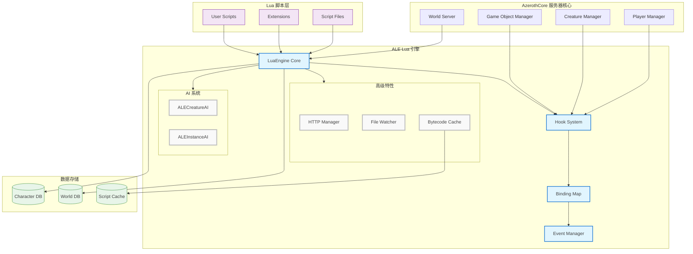
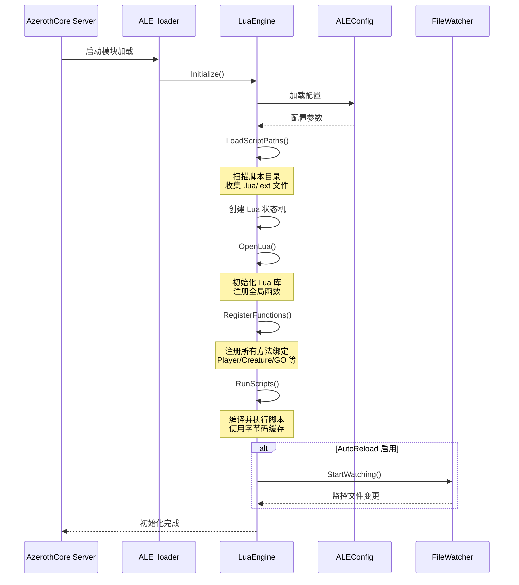
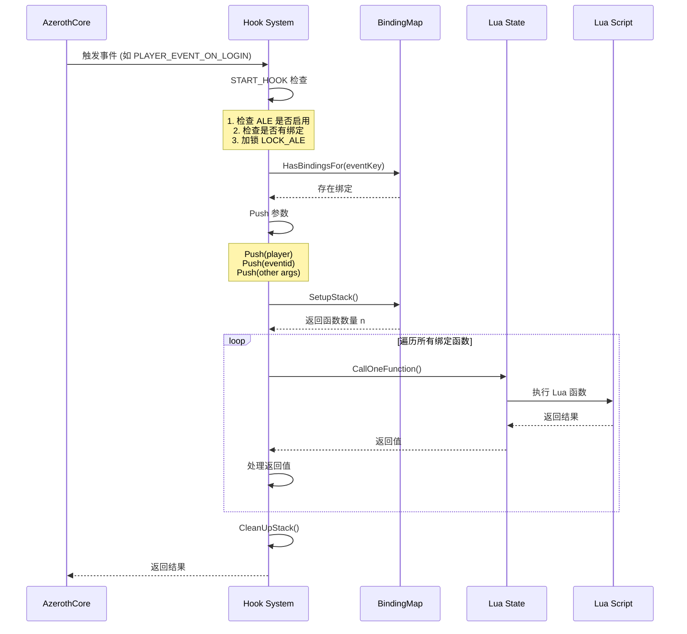
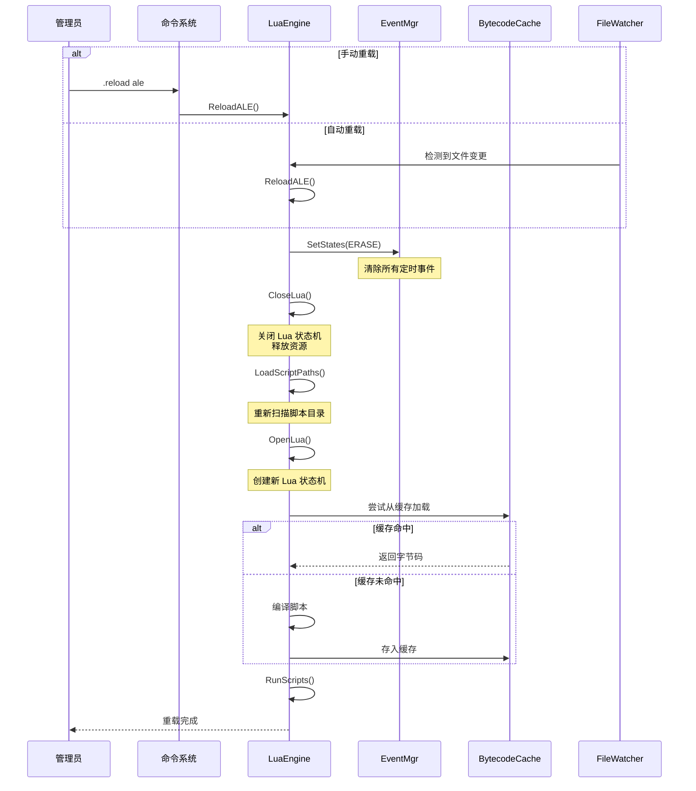
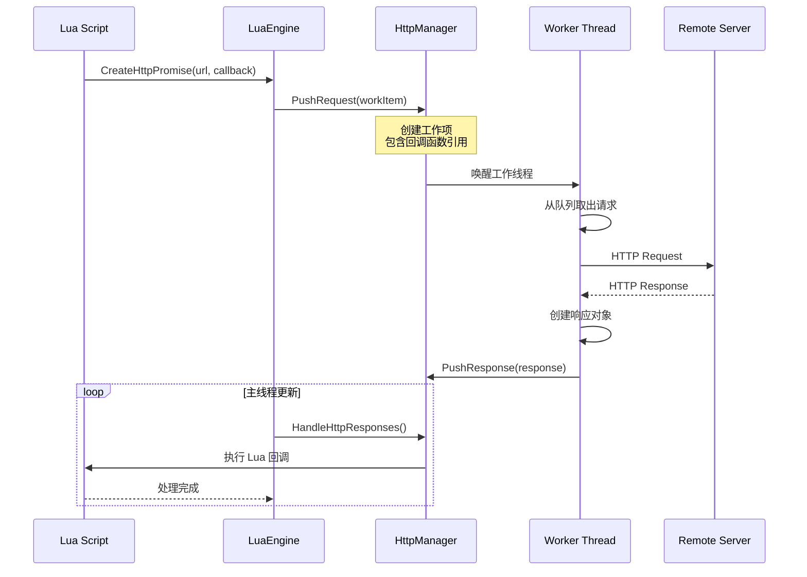
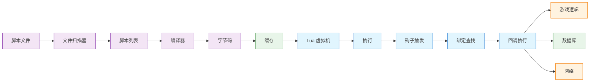
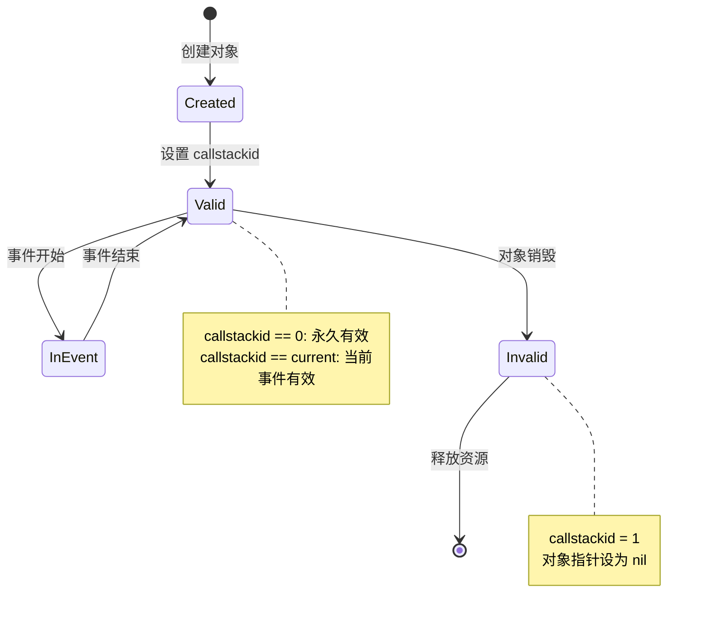
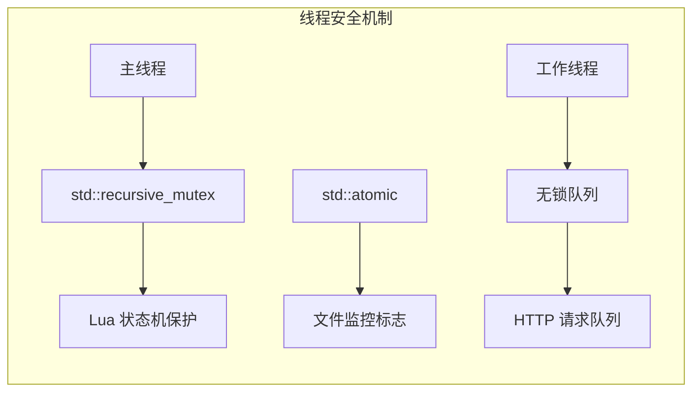
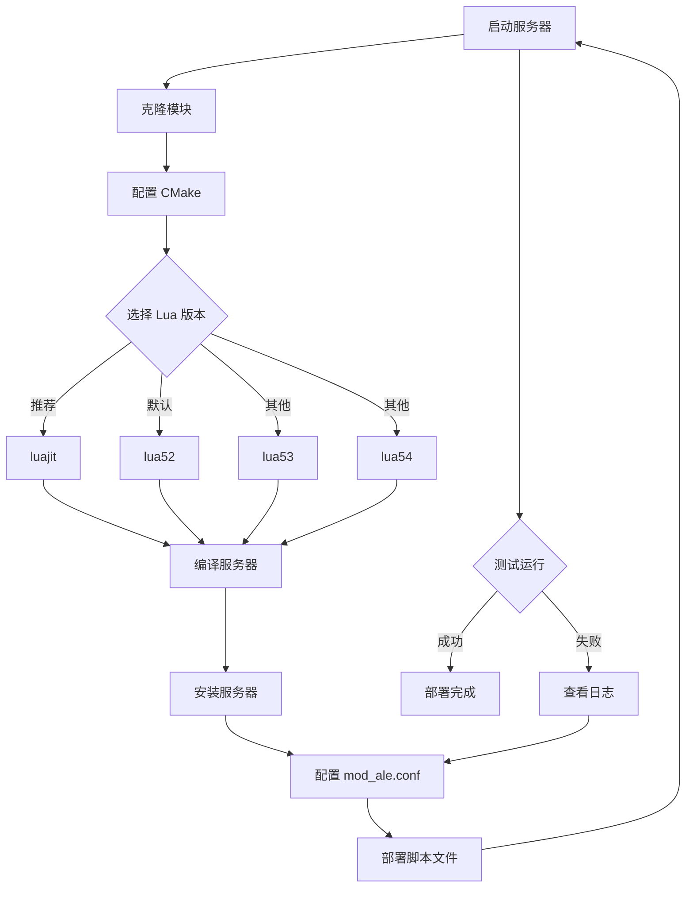

# ALE (AzerothCore Lua Engine) 架构分析报告

## 1. 项目概述

**项目名称**：ALE - AzerothCore Lua Engine  
**技术栈**：C++ / Lua 5.1-5.4 / LuaJIT / CMake  
**项目类型**：游戏服务器脚本引擎模块  
**许可证**：GNU GPL v3.0

ALE 是一个专为 AzerothCore 设计的 Lua 脚本引擎，允许服务器管理员和开发者在不修改核心服务器代码的情况下创建自定义游戏功能、事件和机制。该项目从原始 Eluna 项目独立分支，针对 AzerothCore 进行了特定增强和 API 改进。

### 核心特性

- **原生 AzerothCore 集成**：专为 AzerothCore 架构构建
- **增强的 API**：扩展了原始 Eluna 规范之外的功能
- **多版本 Lua 支持**：LuaJIT（推荐）、Lua 5.1、5.2（默认）、5.3、5.4
- **热重载机制**：支持脚本自动重载和字节码缓存
- **HTTP 支持**：内置异步 HTTP 请求处理
- **完整的事件系统**：覆盖玩家、生物、物品、游戏对象等所有游戏实体

## 2. 目录结构

```
mod-ale/
├── .github/                    # GitHub 配置
│   ├── images/                 # 文档图片
│   └── workflows/              # CI/CD 工作流
│       ├── build-lua51.yml     # Lua 5.1 构建配置
│       ├── build-lua52.yml     # Lua 5.2 构建配置
│       ├── build-lua53.yml     # Lua 5.3 构建配置
│       ├── build-lua54.yml     # Lua 5.4 构建配置
│       ├── build-luajit.yml    # LuaJIT 构建配置
│       └── core-build-base.yml # 基础构建配置
├── conf/                       # 配置文件
│   └── mod_ale.conf.dist       # ALE 配置模板
├── docs/                       # 文档
│   ├── CONTRIBUTING.md         # 贡献指南
│   ├── IMPL_DETAILS.md         # 实现细节
│   ├── INSTALL.md              # 安装指南
│   ├── MERGING.md              # 合并指南
│   └── USAGE.md                # 使用指南
├── sql/                        # 数据库脚本
│   ├── auth/                   # 认证数据库
│   ├── characters/             # 角色数据库
│   └── world/                  # 世界数据库
├── src/                        # 源代码
│   ├── LuaEngine/              # Lua 引擎核心
│   │   ├── docs/               # 文档生成工具
│   │   ├── extensions/         # Lua 扩展
│   │   ├── hooks/              # 钩子实现
│   │   ├── libs/               # 第三方库
│   │   ├── methods/            # Lua 方法绑定
│   │   ├── *.cpp/h             # 核心实现文件
│   │   └── ...
│   ├── lualib/                 # Lua 库
│   │   ├── lua/                # 标准 Lua 实现
│   │   └── luajit/             # LuaJIT 实现
│   ├── ALE_SC.cpp              # 脚本注册入口
│   └── ALE_loader.cpp          # 模块加载器
├── CMakeLists.txt              # CMake 构建配置
├── README.md                   # 项目说明
└── LICENSE                     # 许可证文件
```

## 3. 技术架构

### 3.1 技术栈

| 层级 | 技术选型 |
|------|---------|
| **核心语言** | C++ (C++11/14) |
| **脚本语言** | Lua 5.1-5.4 / LuaJIT |
| **构建系统** | CMake 3.24+ |
| **依赖管理** | 内置 Lua 库 / Boost.Filesystem |
| **HTTP 库** | cpp-httplib |
| **并发模型** | std::thread / std::mutex / SPSC Queue |
| **目标平台** | AzerothCore (WoW 3.3.5a 服务器) |

### 3.2 核心依赖

- **Lua/LuaJIT** - 脚本引擎核心
- **Boost.Filesystem** - 文件系统操作
- **cpp-httplib** - HTTP 客户端/服务器库
- **rigtorp::SPSCQueue** - 单生产者单消费者无锁队列
- **AzerothCore** - 目标服务器核心

## 4. 系统架构



### 4.1 架构分层

#### **表现层 (Presentation Layer)**
- **Lua 脚本接口**：提供用户友好的 Lua API
- **全局函数**：`RegisterPlayerEvent`, `GetPlayerByGUID` 等
- **对象方法**：`Player:GetName()`, `Creature:Kill()` 等

#### **业务层 (Business Layer)**
- **LuaEngine 核心**：管理 Lua 状态机、脚本加载和执行
- **Hook 系统**：事件分发和处理机制
- **BindingMap**：事件到 Lua 函数的映射管理
- **EventMgr**：定时事件和延迟事件管理
- **AI 系统**：`ALECreatureAI` 和 `ALEInstanceAI` 实现

#### **数据层 (Data Layer)**
- **数据库集成**：Character/World 数据库操作
- **字节码缓存**：编译后的 Lua 字节码缓存
- **文件系统**：脚本文件监控和加载

### 4.2 核心模块

| 模块 | 职责 | 文件位置 |
|------|------|---------|
| **LuaEngine** | Lua 状态机管理、脚本加载执行 | [LuaEngine.h](file:///Users/kanlianhui/workspace/git/azerothcore-wotlk/modules/mod-ale/src/LuaEngine/LuaEngine.h) |
| **HookSystem** | 事件钩子定义和分发 | [Hooks.h](file:///Users/kanlianhui/workspace/git/azerothcore-wotlk/modules/mod-ale/src/LuaEngine/Hooks.h) |
| **BindingMap** | 事件-函数绑定关系管理 | [BindingMap.h](file:///Users/kanlianhui/workspace/git/azerothcore-wotlk/modules/mod-ale/src/LuaEngine/BindingMap.h) |
| **EventMgr** | 定时事件调度 | [ALEEventMgr.h](file:///Users/kanlianhui/workspace/git/azerothcore-wotlk/modules/mod-ale/src/LuaEngine/ALEEventMgr.h) |
| **CreatureAI** | 生物 AI 行为控制 | [ALECreatureAI.h](file:///Users/kanlianhui/workspace/git/azerothcore-wotlk/modules/mod-ale/src/LuaEngine/ALECreatureAI.h) |
| **InstanceAI** | 副本脚本控制 | [ALEInstanceAI.h](file:///Users/kanlianhui/workspace/git/azerothcore-wotlk/modules/mod-ale/src/LuaEngine/ALEInstanceAI.h) |
| **HttpManager** | 异步 HTTP 请求处理 | [HttpManager.h](file:///Users/kanlianhui/workspace/git/azerothcore-wotlk/modules/mod-ale/src/LuaEngine/HttpManager.h) |
| **FileWatcher** | 脚本文件变更监控 | [ALEFileWatcher.h](file:///Users/kanlianhui/workspace/git/azerothcore-wotlk/modules/mod-ale/src/LuaEngine/ALEFileWatcher.h) |
| **MethodBindings** | Lua API 方法绑定 | [methods/*.h](file:///Users/kanlianhui/workspace/git/azerothcore-wotlk/modules/mod-ale/src/LuaEngine/methods/) |

## 5. 关键流程

### 5.1 引擎初始化流程



### 5.2 事件处理流程



### 5.3 脚本热重载流程



### 5.4 HTTP 异步请求流程



## 6. 数据流分析

### 6.1 数据模型

| 数据实体 | 说明 | 存储位置 |
|---------|------|---------|
| **LuaScript** | 脚本文件元数据 | 内存 (ScriptList) |
| **Binding** | 事件-函数绑定关系 | 内存 (BindingMap) |
| **LuaEvent** | 定时事件定义 | 内存 (EventMgr) |
| **GlobalCacheEntry** | 字节码缓存条目 | 内存 (globalBytecodeCache) |
| **InstanceData** | 副本数据 | Character DB (instance.data) |
| **HttpWorkItem** | HTTP 请求任务 | 内存 (SPSC Queue) |

### 6.2 数据流转



### 6.3 对象生命周期管理

ALE 实现了严格的 userdata 对象生命周期管理，防止悬空指针：



**关键机制**：
- **callstackid 追踪**：每个对象记录创建时的事件栈 ID
- **自动失效**：事件结束时自动将临时对象设为 `nil`
- **GUID 存储**：推荐存储 GUID 而非对象指针，需要时通过 `GetPlayerByGUID()` 重新获取

## 7. 核心 API/接口

### 7.1 全局函数

| 接口 | 参数 | 说明 |
|------|------|------|
| `RegisterPlayerEvent(event, callback)` | event: 事件ID, callback: 函数 | 注册玩家事件 |
| `RegisterCreatureEvent(entry, event, callback)` | entry: 生物ID, event: 事件ID, callback: 函数 | 注册生物事件 |
| `RegisterGameObjectEvent(entry, event, callback)` | entry: 游戏对象ID, event: 事件ID, callback: 函数 | 注册游戏对象事件 |
| `GetPlayerByGUID(guid)` | guid: 玩家GUID | 通过 GUID 获取玩家对象 |
| `GetPlayerByName(name)` | name: 玩家名称 | 通过名称获取玩家对象 |
| `GetPlayersInWorld()` | 无 | 获取所有在线玩家 |
| `GetGameTime()` | 无 | 获取游戏时间 |
| `PrintInfo(msg)` | msg: 消息 | 输出信息日志 |
| `PrintError(msg)` | msg: 消息 | 输出错误日志 |

### 7.2 对象方法示例

#### Player 对象
```lua
-- 获取信息
player:GetName()              -- 获取玩家名称
player:GetGUID()              -- 获取玩家 GUID
player:GetLevel()             -- 获取玩家等级
player:GetClass()             -- 获取玩家职业

-- 操作方法
player:SendBroadcastMessage(msg)  -- 发送广播消息
player:GiveXP(amount, victim)     -- 给予经验值
player:SetMoney(amount)           -- 设置金币
player:LearnSpell(spellId)        -- 学习技能
player:AddItem(itemId, count)     -- 添加物品

-- 查询方法
player:HasAchieved(achievementId) -- 是否完成成就
player:HasQuest(questId)          -- 是否有任务
player:HasSpell(spellId)          -- 是否有技能
```

#### Creature 对象
```lua
-- AI 控制
creature:AttackStart(target)      -- 开始攻击
creature:EnterEvadeMode()         -- 进入逃避模式
creature:CallForHelp(radius)      -- 呼救

-- 属性操作
creature:SetHealth(value)         -- 设置生命值
creature:SetMaxHealth(value)      -- 设置最大生命值
creature:SetDisplayId(id)         -- 设置显示模型

-- 事件响应
creature:JustDied(killer)         -- 死亡事件
creature:JustRespawned()          -- 重生事件
```

### 7.3 事件类型

#### 玩家事件 (PlayerEvents)
```cpp
PLAYER_EVENT_ON_LOGIN = 3              // 玩家登录
PLAYER_EVENT_ON_LOGOUT = 4             // 玩家登出
PLAYER_EVENT_ON_SPELL_CAST = 5         // 施法
PLAYER_EVENT_ON_KILL_CREATURE = 7      // 击杀生物
PLAYER_EVENT_ON_LEVEL_CHANGE = 13      // 等级变化
PLAYER_EVENT_ON_CHAT = 18              // 聊天消息
PLAYER_EVENT_ON_QUEST_ABANDON = 43     // 放弃任务
```

#### 服务器事件 (ServerEvents)
```cpp
SERVER_EVENT_ON_STARTUP = 14           // 服务器启动
SERVER_EVENT_ON_SHUTDOWN = 15          // 服务器关闭
WORLD_EVENT_ON_UPDATE = 13             // 世界更新
GAME_EVENT_START = 34                  // 游戏事件开始
GAME_EVENT_STOP = 35                   // 游戏事件结束
```

## 8. 安全架构

### 8.1 认证与授权

- **GM 命令限制**：`.reload ale` 命令需要 `SEC_ADMINISTRATOR` 权限
- **配置保护**：配置文件通过 AzerothCore 配置系统管理，支持权限控制
- **脚本隔离**：每个脚本在独立的 Lua 环境中运行，避免全局污染

### 8.2 敏感数据处理

- **密码保护**：不暴露任何密码相关 API
- **GUID 管理**：使用 GUID 而非直接指针，避免内存泄露
- **SQL 注入防护**：所有数据库查询使用参数化查询
- **对象验证**：自动验证对象有效性，防止悬空指针访问

### 8.3 并发安全



**关键机制**：
- **LOCK_ALE 宏**：使用 `std::recursive_mutex` 保护 Lua 状态机
- **原子操作**：文件监控使用 `std::atomic_bool` 控制运行状态
- **无锁队列**：HTTP 请求使用 SPSC 队列实现线程间通信

## 9. 监控与可观测性

### 9.1 日志方案

**日志框架**：AzerothCore 内置日志系统

**日志级别**：
- **DISABLED (0)**: 禁用
- **FATAL (1)**: 致命错误
- **ERROR (2)**: 错误
- **WARNING (3)**: 警告
- **INFO (4)**: 信息
- **DEBUG (5)**: 调试
- **TRACE (6)**: 跟踪

**日志输出**：
```cpp
ALE_LOG_INFO("[ALE]: Loaded {} scripts in {} ms", count, time);
ALE_LOG_ERROR("[ALE]: Failed to load script: {}", filepath);
ALE_LOG_DEBUG("[ALE]: Compiling script: {}", filename);
```

**日志配置**：
```
Appender.ALELog=2,5,0,ALE.log,w
Appender.ALEConsole=1,4,0,"0 9 0 3 5 0"
Logger.ALE=4,ALELog ALEConsole
```

### 9.2 监控指标

| 指标 | 说明 | 获取方式 |
|------|------|---------|
| **脚本数量** | 已加载的 Lua 脚本数量 | `lua_scripts.size()` |
| **缓存大小** | 字节码缓存占用内存 | `GetGlobalCacheSize()` |
| **事件绑定数** | 各类事件的绑定数量 | `BindingMap::Size()` |
| **HTTP 队列长度** | 待处理的 HTTP 请求数 | `workQueue.size()` |
| **文件监控状态** | 文件监控是否运行 | `fileWatcher->IsWatching()` |

### 9.3 性能监控

```lua
-- 脚本性能监控示例
local startTime = GetCurrTime()

-- 执行耗时操作
PerformExpensiveOperation()

local elapsed = GetTimeDiff(startTime)
PrintInfo(string.format("Operation took %d ms", elapsed))
```

## 10. 配置与部署

### 10.1 环境配置

| 配置项 | 说明 | 默认值 | 可选值 |
|--------|------|--------|--------|
| `ALE.Enabled` | 启用/禁用 ALE | `true` | `true/false` |
| `ALE.TraceBack` | 使用 debug.traceback | `false` | `true/false` |
| `ALE.ScriptPath` | 脚本文件夹路径 | `"lua_scripts"` | 任意路径 |
| `ALE.PlayerAnnounceReload` | 重载时通知玩家 | `false` | `true/false` |
| `ALE.RequirePaths` | 额外 require 路径 | `""` | Lua 路径模式 |
| `ALE.RequireCPaths` | 额外 C 模块路径 | `""` | Lua C 路径模式 |
| `ALE.AutoReload` | 自动重载脚本 | `false` | `true/false` |
| `ALE.AutoReloadInterval` | 自动重载检查间隔 | `1` | 秒数 |
| `ALE.BytecodeCache` | 字节码缓存 | `true` | `true/false` |

### 10.2 部署流程



### 10.3 构建选项

```bash
# 使用 LuaJIT 构建（推荐）
cmake ../ -DLUA_VERSION=luajit

# 使用 Lua 5.2 构建（默认）
cmake ../ -DLUA_VERSION=lua52

# 静态链接 Lua
cmake ../ -DLUA_STATIC=ON

# 动态链接 Lua
cmake ../ -DLUA_STATIC=OFF

# 编译
make -j$(nproc)
```

## 11. 开发工作流

### 11.1 开发环境搭建

**前置要求**：
- AzerothCore 开发环境
- CMake 3.24+
- C++11/14 编译器
- Git

**搭建步骤**：
```bash
# 1. 进入模块目录
cd <azerothcore>/modules

# 2. 克隆 ALE 模块
git clone https://github.com/azerothcore/mod-ale.git

# 3. 配置构建
cd <build-directory>
cmake ../ -DLUA_VERSION=luajit

# 4. 编译
make -j$(nproc)

# 5. 配置文件
cp modules/mod-ale/conf/mod_ale.conf.dist <server-config>/mod_ale.conf

# 6. 创建脚本目录
mkdir lua_scripts
```

### 11.2 构建与测试

**构建命令**：
```bash
# 完整构建
make -j$(nproc)

# 仅编译 ALE 模块
make mod-ale -j$(nproc)

# 清理构建
make clean
```

**测试方法**：
```bash
# 1. 启动服务器
./worldserver

# 2. 测试脚本加载
# 查看日志中的 "ALE: Loaded X scripts" 消息

# 3. 测试热重载
.reload ale

# 4. 测试脚本功能
# 创建测试脚本并登录游戏验证
```

### 11.3 典型使用场景

#### 场景 1：自定义 NPC 对话

```lua
local NPC_ENTRY = 12345

local function OnGossipHello(event, player, creature)
    player:GossipMenuAddItem(0, "你好，旅行者！", 0, 1)
    player:GossipMenuAddItem(0, "我想学习技能", 0, 2)
    player:GossipSendMenu(1, creature)
end

local function OnGossipSelect(event, player, creature, sender, action)
    if action == 1 then
        player:SendBroadcastMessage("欢迎来到我们的村庄！")
    elseif action == 2 then
        player:LearnSpell(12345)  -- 学习技能
        player:SendBroadcastMessage("你学会了新技能！")
    end
    player:CloseGossip()
end

RegisterCreatureGossipEvent(NPC_ENTRY, 1, OnGossipHello)
RegisterCreatureGossipEvent(NPC_ENTRY, 2, OnGossipSelect)
```

#### 场景 2：自定义副本机制

```lua
local INSTANCE_ID = 123

local function OnInstanceInitialize(event, instance)
    -- 初始化副本数据
    instance:SetData("boss1_killed", 0)
    instance:SetData("boss2_killed", 0)
end

local function OnCreatureDeath(event, creature, killer)
    local instance = creature:GetMap()
    
    if creature:GetEntry() == 10001 then
        instance:SetData("boss1_killed", 1)
        -- 开启通往下一个区域的门
        instance:DoUseDoorOrButton(12345)
    end
end

RegisterInstanceEvent(INSTANCE_ID, 1, OnInstanceInitialize)
RegisterInstanceEvent(INSTANCE_ID, 5, OnCreatureDeath)
```

#### 场景 3：HTTP 集成

```lua
local function OnPlayerLogin(event, player)
    -- 发送 HTTP 请求到外部 API
    local url = "https://api.example.com/player/" .. player:GetGUID()
    
    CreateHttpPromise("GET", url, nil, nil, function(status, body)
        if status == 200 then
            PrintInfo("Player data synced: " .. body)
        else
            PrintError("Failed to sync player data")
        end
    end)
end

RegisterPlayerEvent(3, OnPlayerLogin)
```

## 12. 关键设计决策

| 决策项 | 选择方案 | 备选方案 | 决策理由 |
|--------|---------|---------|---------|
| **Lua 版本支持** | 多版本支持 (5.1-5.4, LuaJIT) | 仅支持单一版本 | 兼顾性能和灵活性，LuaJIT 提供最佳性能 |
| **事件系统** | BindingMap + Hook 宏 | 直接回调注册 | 性能优化，支持批量事件处理 |
| **对象生命周期** | callstackid 自动管理 | 手动引用计数 | 防止悬空指针，自动内存安全 |
| **字节码缓存** | 全局缓存跨重载 | 每次重载清空 | 提升重载性能，减少编译开销 |
| **HTTP 处理** | 异步工作线程 | 同步请求 | 避免阻塞主线程，提升响应性 |
| **文件监控** | 独立线程轮询 | 操作系统事件 | 跨平台兼容，实现简单可靠 |
| **AI 系统** | 继承 ScriptedAI | 完全自定义 AI | 兼容现有 AI 框架，渐进式增强 |

## 13. 风险与注意事项

### 13.1 已知风险

| 风险 | 影响 | 应对措施 |
|------|------|---------|
| **脚本错误导致崩溃** | 服务器崩溃 | 使用 `pcall` 包装关键代码，完善错误处理 |
| **内存泄漏** | 长期运行内存增长 | 定期监控内存，使用弱引用表 |
| **性能瓶颈** | 服务器卡顿 | 避免在频繁事件中执行耗时操作，使用缓存 |
| **并发冲突** | 数据竞争 | 严格遵守 LOCK_ALE 规则，避免跨线程对象访问 |
| **API 不兼容** | 脚本失效 | 版本迁移时检查 API 变更，提供兼容层 |

### 13.2 技术债务

| 债务项 | 说明 | 改进计划 |
|--------|------|---------|
| **部分 Hook 未实现** | 部分 MaNGOS/TrinityCore 的 Hook 未移植 | 逐步补全缺失的 Hook |
| **文档不完整** | 部分 API 缺少文档 | 完善文档生成工具，补充示例 |
| **测试覆盖不足** | 缺少自动化测试 | 建立单元测试框架，增加集成测试 |
| **性能监控缺失** | 缺少详细的性能指标 | 添加性能分析工具，记录关键指标 |

### 13.3 限制与约束

| 限制 | 说明 |
|------|------|
| **不兼容原版 Eluna** | API 差异导致脚本不互通 |
| **仅支持 AzerothCore** | 无法直接用于其他核心 |
| **Lua 版本限制** | 不同 Lua 版本特性差异 |
| **单线程 Lua 状态机** | 无法利用多核并行 |
| **重载限制** | 重载不会重新触发实体事件 |

## 14. 架构总结

### 14.1 架构优势

#### **1. 高度模块化设计**
- 清晰的分层架构：表现层（Lua API）、业务层（引擎核心）、数据层（存储）
- 模块间松耦合，易于扩展和维护
- 支持插件式扩展机制

#### **2. 强大的事件驱动系统**
- 完整的 Hook 系统覆盖所有游戏实体
- BindingMap 提供高效的事件分发
- 支持事件优先级和返回值处理

#### **3. 优秀的性能优化**
- 字节码缓存减少编译开销
- LuaJIT 支持提供接近原生的执行速度
- 无锁队列实现高效的异步处理

#### **4. 安全可靠的对象管理**
- callstackid 机制防止悬空指针
- 自动类型转换简化开发
- 严格的生命周期管理

#### **5. 开发者友好**
- 丰富的 API 文档和示例
- 热重载支持快速迭代
- 详细的错误日志和调试信息

### 14.2 改进建议

#### **短期改进（1-3 个月）**
1. **完善测试体系**
   - 建立单元测试框架
   - 添加 API 兼容性测试
   - 实现自动化回归测试

2. **性能监控增强**
   - 添加脚本执行时间统计
   - 记录内存使用情况
   - 提供性能分析工具

3. **文档完善**
   - 补充缺失的 API 文档
   - 增加更多使用示例
   - 提供最佳实践指南

#### **中期改进（3-6 个月）**
1. **多线程 Lua 支持**
   - 探索多 Lua 状态机方案
   - 实现负载均衡机制
   - 提供线程安全 API

2. **调试工具增强**
   - 开发远程调试支持
   - 实现断点和单步执行
   - 提供变量监视功能

3. **性能优化**
   - 优化事件分发机制
   - 减少内存拷贝
   - 实现更智能的缓存策略

#### **长期改进（6-12 个月）**
1. **可视化开发环境**
   - 开发 Web IDE
   - 提供脚本编辑器
   - 实现可视化调试

2. **云原生支持**
   - 支持容器化部署
   - 实现配置中心集成
   - 提供监控告警集成

3. **生态系统建设**
   - 建立脚本市场
   - 提供包管理器
   - 构建开发者社区

---

**文档版本**：1.0  
**生成日期**：2026-05-09  
**分析范围**：mod-ale 模块完整架构  
**参考文件**：源代码、配置文件、文档
