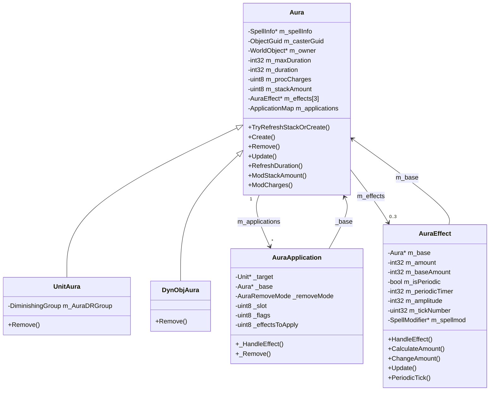
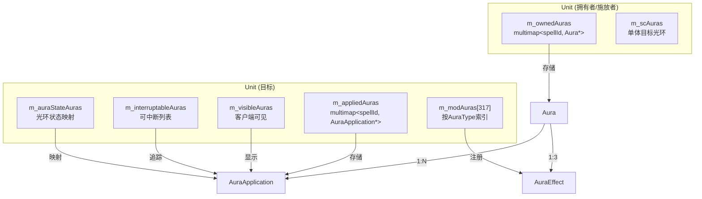
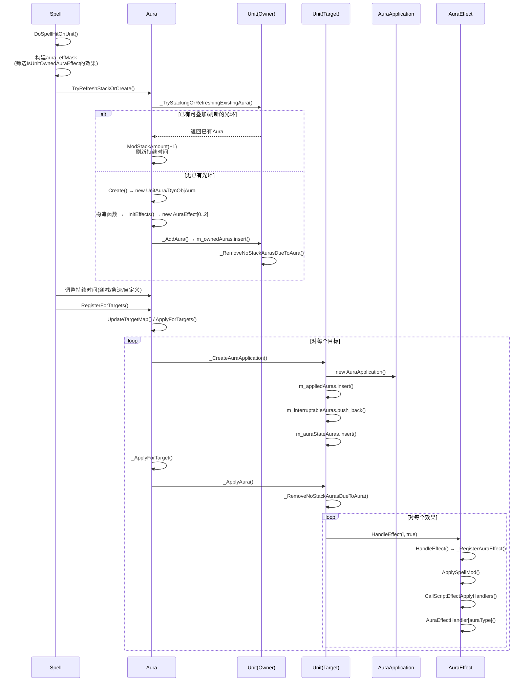
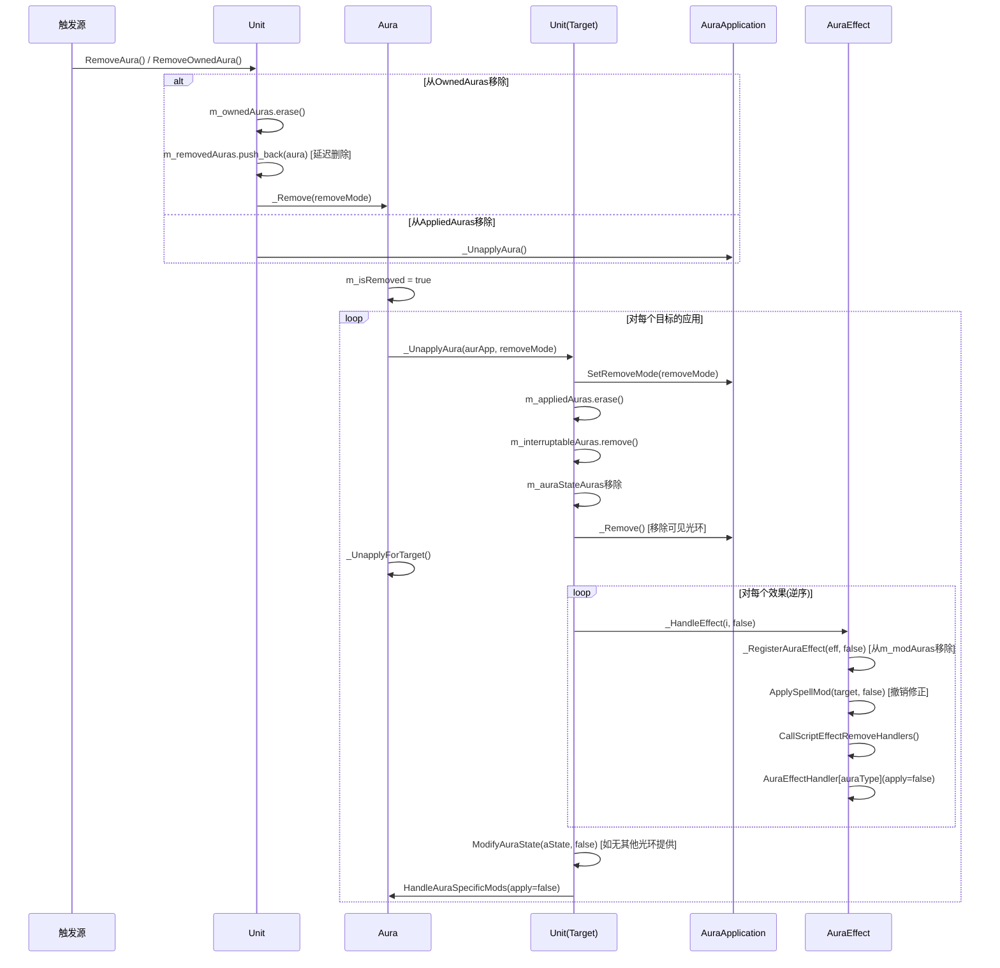
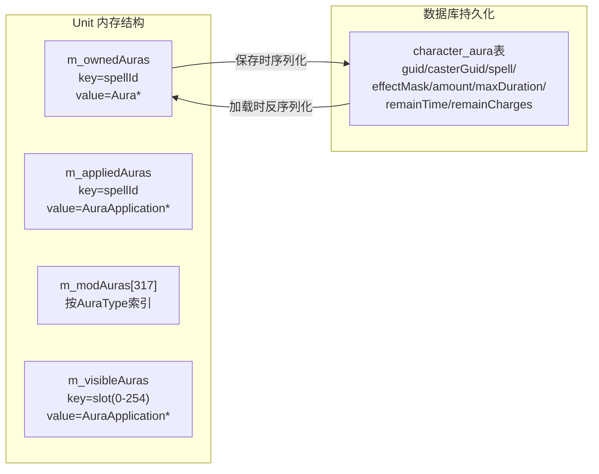
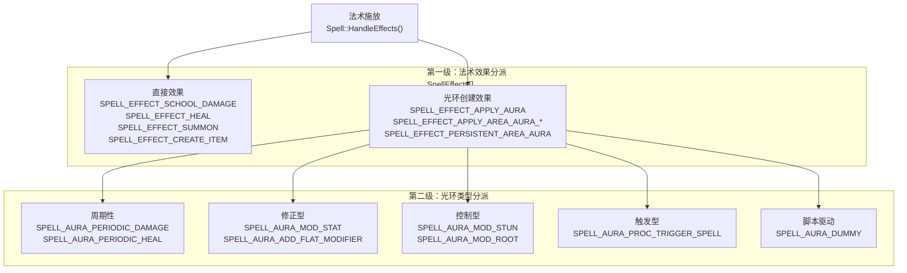
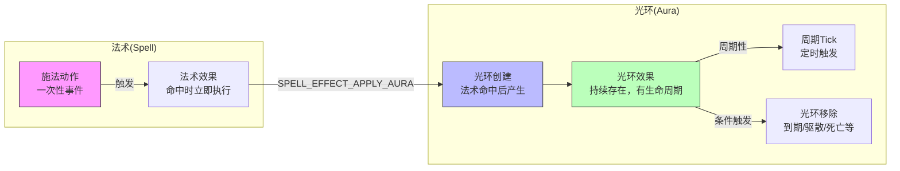
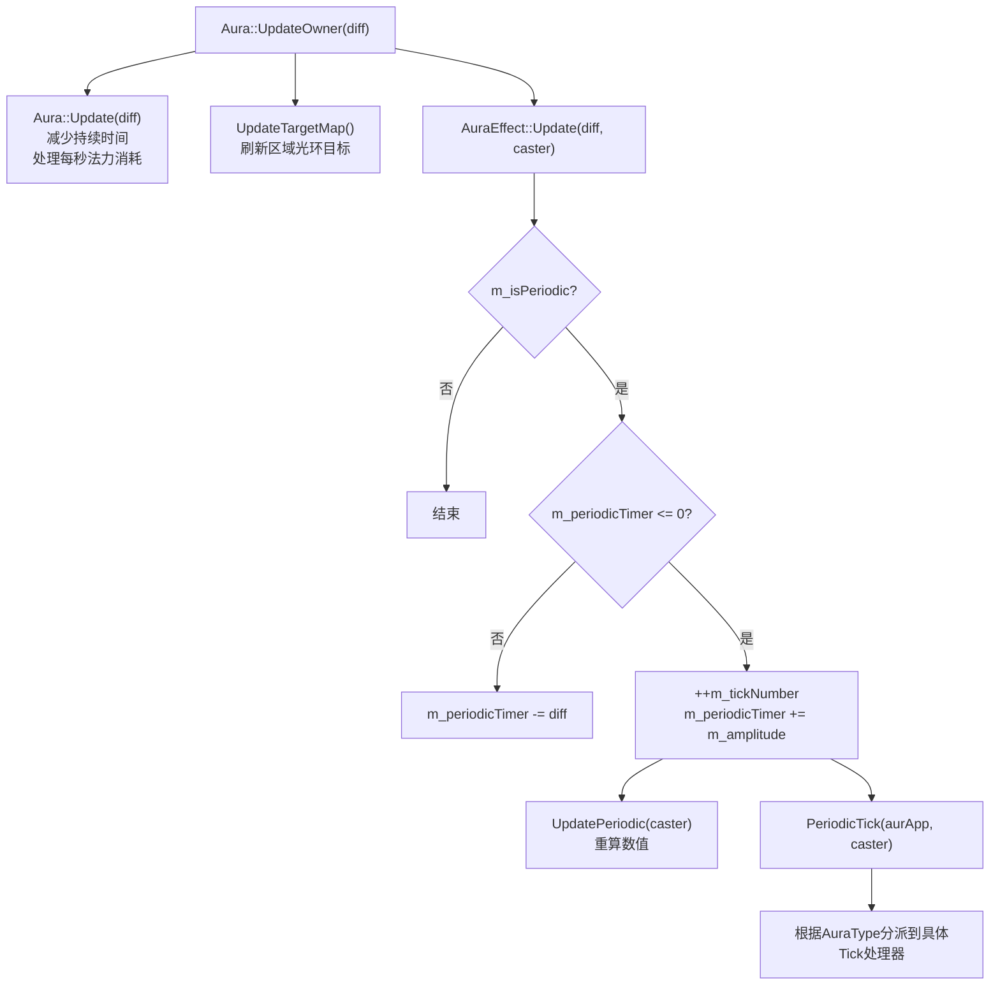
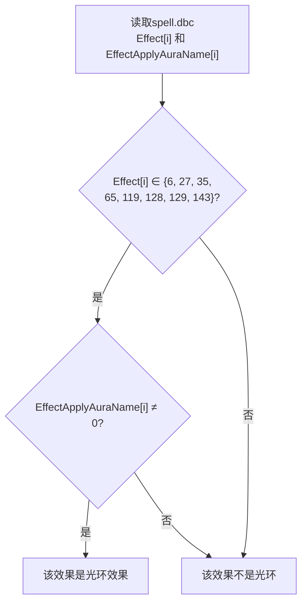

# AzerothCore 光环(Aura)系统深度分析

## 目录

- [1. 概述](#1-概述)
- [2. 核心类架构](#2-核心类架构)
- [3. 光环的产生](#3-光环的产生)
- [4. 光环的消除](#4-光环的消除)
- [5. 光环的记录与持久化](#5-光环的记录与持久化)
- [6. 光环与法术的区分](#6-光环与法术的区分)
- [7. 光环叠加与刷新机制](#7-光环叠加与刷新机制)
- [8. 周期性光环的Tick系统](#8-周期性光环的tick系统)
- [9. 关键枚举定义](#9-关键枚举定义)
- [10. 从spell.dbc筛选有光环效果的法术](#10-从spelldbc筛选有光环效果的法术)

---

## 1. 概述

在 AzerothCore（WoW 3.3.5a 模拟器）中，**光环(Aura)是法术的持久化效果**。一个法术(Spell)是一次性的施法动作，而光环是法术命中后留在目标上的持续效果。例如：施放"真言术·盾"是一个法术，而盾的吸收效果就是一个光环。

### 核心设计理念

- **法术(Spell)** = 施法动作，一次性事件
- **光环(Aura)** = 法术的持久化结果，有时间生命周期
- 一个法术可以产生最多3个光环效果(AuraEffect)
- 一个光环可以影响多个目标（区域光环）

---

## 2. 核心类架构

### 2.1 三层类结构

```
Aura (光环本体)          → 持有法术信息、持续时间、叠加层数、充能次数
  ├── UnitAura           → 绑定在Unit上的光环（绝大多数情况）
  └── DynObjAura         → 绑定在DynamicObject上的区域光环（地面效果）

AuraApplication (光环应用) → 光环在单个目标上的应用实例
                            → 管理客户端显示槽位、正/负标志、移除原因

AuraEffect (光环效果)     → 光环的单个效果，处理具体逻辑
                            → 属性修改、周期触发、控制效果等
```

### 2.2 类关系图



### 2.3 Unit类中的光环容器

```cpp
// Unit.h:2167-2183
AuraMap m_ownedAuras;                      // 此单位"拥有"的光环（作为owner）
AuraApplicationMap m_appliedAuras;         // 应用在此单位上的光环实例
AuraList m_removedAuras;                   // 待删除的光环列表
AuraEffectList m_modAuras[TOTAL_AURAS];    // 按AuraType索引的效果列表(317个桶)
AuraList m_scAuras;                        // 单体目标光环列表
AuraApplicationList m_interruptableAuras;  // 可中断的光环列表
AuraStateAurasMap m_auraStateAuras;        // 按AuraStateType索引的光环
VisibleAuraMap m_visibleAuras;             // 客户端可见光环(slot → AuraApplication)
float m_auraFlatModifiersGroup[UNIT_MOD_END][MODIFIER_TYPE_FLAT_END];  // 平面修正
float m_auraPctModifiersGroup[UNIT_MOD_END][MODIFIER_TYPE_PCT_END];    // 百分比修正
```

**关键区别**：
- `m_ownedAuras` — 此单位是光环的**拥有者**(owner)，通常是施放者自身
- `m_appliedAuras` — 此单位是光环的**目标**(target)，被光环影响的单位
- `m_modAuras[317]` — 按 `AuraType` 索引的快速查找表，O(1)定位同类型所有效果

### 2.4 数据流向图



---

## 3. 光环的产生

### 3.1 完整产生流程



### 3.2 入口：法术命中触发光环创建

**文件**: `src/server/game/Spells/Spell.cpp:2945`

当法术命中目标时，`Spell::DoSpellHitOnUnit()` 被调用。在该方法中：

1. **构建光环效果掩码** — 筛选出所有 `IsUnitOwnedAuraEffect()` 的效果：
```cpp
// Spell.cpp:3040-3042
for (uint8 i = 0; i < MAX_SPELL_EFFECTS; ++i)
    if (m_spellInfo->Effects[i].IsUnitOwnedAuraEffect())
        aura_effmask |= 1 << i;
```

2. **创建或刷新光环**：
```cpp
// Spell.cpp:3099
m_spellAura = Aura::TryRefreshStackOrCreate(m_spellInfo, aura_effmask, unitTarget, m_caster, ...);
```

3. **调整持续时间**（递减、急速、自定义）后注册目标：
```cpp
// Spell.cpp:3175
m_spellAura->_RegisterForTargets();
```

### 3.3 工厂方法：Aura::Create

**文件**: `src/server/game/Spells/Auras/SpellAuras.cpp:303-346`

```cpp
Aura* Aura::Create(SpellInfo const* spellproto, uint8 effMask, WorldObject* owner,
                   Unit* caster, int32* baseAmount, Item* castItem,
                   ObjectGuid casterGUID, ObjectGuid itemGUID)
{
    // 1. 解析施法者
    // 2. 有效性检查
    // 3. 根据owner类型创建子类
    switch (owner->GetTypeId()) {
        case TYPEID_UNIT:
        case TYPEID_PLAYER:
            aura = new UnitAura(...);  // 绑定在Unit上
            break;
        case TYPEID_DYNAMICOBJECT:
            aura = new DynObjAura(...);  // 绑定在DynamicObject上(地面效果)
            break;
    }
    // 4. 如果在_AddAura中被移除则返回nullptr
    if (aura->IsRemoved()) return nullptr;
    return aura;
}
```

### 3.4 UnitAura构造函数

**文件**: `src/server/game/Spells/Auras/SpellAuras.cpp:2775`

```cpp
UnitAura::UnitAura(SpellInfo const* spellproto, uint8 effMask, WorldObject* owner,
                   Unit* caster, int32* baseAmount, Item* castItem, ...)
    : Aura(spellproto, owner, caster, castItem, casterGUID, itemGUID)
{
    m_AuraDRGroup = DIMINISHING_NONE;
    LoadScripts();                          // 加载AuraScript
    _InitEffects(effMask, caster, baseAmount); // 为每个效果创建AuraEffect
    GetUnitOwner()->_AddAura(this, caster);    // 注册到owner的m_ownedAuras
}
```

### 3.5 Aura基类构造函数（初始化持续时间/充能）

**文件**: `src/server/game/Spells/Auras/SpellAuras.cpp:348`

```cpp
Aura::Aura(SpellInfo const* spellproto, WorldObject* owner, Unit* caster, ...)
{
    m_maxDuration = CalcMaxDuration(caster);  // 计算最大持续时间(含法术修正)
    m_duration = m_maxDuration;                // 当前持续时间 = 最大持续时间
    m_procCharges = CalcMaxCharges(caster);    // 计算充能次数
    m_isUsingCharges = m_procCharges != 0;     // 是否使用充能
    m_stackAmount = 1;                          // 初始叠加层数=1
}
```

### 3.6 注册到Owner：_AddAura

**文件**: `src/server/game/Entities/Unit/Unit.cpp:4682`

```cpp
void Unit::_AddAura(UnitAura* aura, Unit* caster)
{
    m_ownedAuras.insert(AuraMap::value_type(aura->GetId(), aura));
    _RemoveNoStackAurasDueToAura(aura, true);  // 移除不可叠加的已有光环

    // 注册单体目标光环
    if (aura->IsSingleTarget()) {
        caster->GetSingleCastAuras().push_back(aura);
        // 移除其他冲突的单体目标光环
    }
}
```

### 3.7 创建应用实例：_CreateAuraApplication

**文件**: `src/server/game/Entities/Unit/Unit.cpp:4721`

```cpp
AuraApplication* Unit::_CreateAuraApplication(Aura* aura, uint8 effMask)
{
    // 死亡检查、幽灵检查
    AuraApplication* aurApp = new AuraApplication(this, caster, aura, effMask);
    m_appliedAuras.insert(AuraApplicationMap::value_type(auraId, aurApp));

    // 注册可中断列表
    if (aurSpellInfo->AuraInterruptFlags && this == aura->GetOwner()) {
        m_interruptableAuras.push_back(aurApp);
        AddInterruptMask(aurSpellInfo->AuraInterruptFlags);
    }
    // 注册光环状态映射
    if (AuraStateType aState = aura->GetSpellInfo()->GetAuraState())
        m_auraStateAuras.insert(AuraStateAurasMap::value_type(aState, aurApp));

    aura->_ApplyForTarget(this, caster, aurApp);
    return aurApp;
}
```

### 3.8 应用效果：_ApplyAura

**文件**: `src/server/game/Entities/Unit/Unit.cpp:4773`

```cpp
void Unit::_ApplyAura(AuraApplication* aurApp, uint8 effMask)
{
    _RemoveNoStackAurasDueToAura(aura, false);  // 移除不可叠加的已应用光环

    // 更新光环状态标志
    if (AuraStateType aState = spellInfo->GetAuraState())
        ModifyAuraState(aState, true);

    // 处理特定法术修正（关联法术等）
    aura->HandleAuraSpecificMods(aurApp, caster, true, false);

    // 逐个应用效果
    for (uint8 i = 0; i < MAX_SPELL_EFFECTS; ++i)
        if (effMask & 1 << i)
            aurApp->_HandleEffect(i, true);  // → AuraEffect::HandleEffect()
}
```

### 3.9 便捷API：Unit::AddAura

**文件**: `src/server/game/Entities/Unit/Unit.cpp:15115`

```cpp
Aura* Unit::AddAura(uint32 spellId, Unit* target) {
    SpellInfo const* spellInfo = sSpellMgr->GetSpellInfo(spellId);
    // 免疫检查
    if (target->IsImmunedToSpell(spellInfo, effMask, this)) return nullptr;
    // 创建或刷新光环
    if (Aura* aura = Aura::TryRefreshStackOrCreate(spellInfo, effMask, target, this)) {
        aura->ApplyForTargets();
        return aura;
    }
    return nullptr;
}
```

---

## 4. 光环的消除

### 4.1 消除原因枚举

```cpp
// SpellAuraDefines.h:389-397
enum AuraRemoveMode : uint8
{
    AURA_REMOVE_NONE         = 0,  // 未移除
    AURA_REMOVE_BY_DEFAULT   = 1,  // 脚本移除/叠加冲突/单体目标冲突
    AURA_REMOVE_BY_CANCEL    = 2,  // 玩家主动取消(右键点击)
    AURA_REMOVE_BY_ENEMY_SPELL = 3, // 驱散/法术偷取
    AURA_REMOVE_BY_EXPIRE   = 4,  // 持续时间结束
    AURA_REMOVE_BY_DEATH    = 5,  // 目标死亡
};
```

### 4.2 消除触发条件总览

| 触发条件 | 调用方法 | RemoveMode |
|---------|---------|-----------|
| **持续时间到期** | `Aura::Update()` → duration减至0 | `AURA_REMOVE_BY_EXPIRE` |
| **目标死亡** | `Unit::RemoveAllAurasOnDeath()` | `AURA_REMOVE_BY_DEATH` |
| **驱散** | `Unit::RemoveAurasDueToSpellByDispel()` | `AURA_REMOVE_BY_ENEMY_SPELL` |
| **法术偷取** | `Unit::RemoveAurasDueToSpellBySteal()` | `AURA_REMOVE_BY_DEFAULT` |
| **玩家取消** | 客户端 → `Unit::RemoveAura()` | `AURA_REMOVE_BY_CANCEL` |
| **中断标志触发** | `Unit::RemoveAurasWithInterruptFlags()` | `AURA_REMOVE_BY_DEFAULT` |
| **叠加层数耗尽** | `Aura::ModStackAmount()` → stacks ≤ 0 | 由调用者指定 |
| **充能次数耗尽** | `Aura::ModCharges()` → charges ≤ 0 | 由调用者指定 |
| **不可叠加冲突** | `Unit::_RemoveNoStackAurasDueToAura()` | `AURA_REMOVE_BY_DEFAULT` |
| **每秒法力消耗不足** | `Aura::Update()` → 施法者法力不足 | `AURA_REMOVE_BY_DEFAULT` |
| **递减归零** | `Spell::DoSpellHitOnUnit()` → duration=0 | `AURA_REMOVE_BY_DEFAULT` |
| **NPC脱战** | `Unit::RemoveEvadeAuras()` | `AURA_REMOVE_BY_DEFAULT` |
| **竞技场准备** | `Unit::RemoveArenaAuras()` | `AURA_REMOVE_BY_DEFAULT` |
| **复活** | `Unit::RemoveAllAurasRequiringDeadTarget()` | `AURA_REMOVE_BY_DEFAULT` |

### 4.3 核心消除流程



### 4.4 关键消除方法详解

#### _UnapplyAura — 从目标移除光环应用

**文件**: `src/server/game/Entities/Unit/Unit.cpp:4819`

```cpp
void Unit::_UnapplyAura(AuraApplicationMap::iterator& i, AuraRemoveMode removeMode)
{
    AuraApplication* aurApp = i->second;
    aurApp->SetRemoveMode(removeMode);

    // 1. 从m_appliedAuras移除
    m_appliedAuras.erase(i);

    // 2. 从可中断列表移除
    m_interruptableAuras.remove(aurApp);
    UpdateInterruptMask();

    // 3. 从光环状态映射移除
    // (如果无其他光环提供相同状态，则ModifyAuraState(aState, false))

    // 4. 移除客户端可见光环
    aurApp->_Remove();

    // 5. 从Aura的应用映射中移除
    aura->_UnapplyForTarget(this, caster, aurApp);

    // 6. 逐个移除效果
    for (uint8 itr = 0; itr < MAX_SPELL_EFFECTS; ++itr)
        if (aurApp->HasEffect(itr))
            aurApp->_HandleEffect(itr, false);  // → AuraEffect::HandleEffect(apply=false)

    // 7. 图腾到期死亡
    if (removeMode == AURA_REMOVE_BY_EXPIRE && IsTotem() && ...)

    // 8. 更新光环状态
    // 9. 处理关联法术
    aura->HandleAuraSpecificMods(aurApp, caster, false, false);

    // 10. 脚本回调
    sScriptMgr->OnAuraRemove(this, aurApp, removeMode);
}
```

#### RemoveOwnedAura — 从拥有者移除光环

**文件**: `src/server/game/Entities/Unit/Unit.cpp:4967`

```cpp
void Unit::RemoveOwnedAura(AuraMap::iterator& i, AuraRemoveMode removeMode)
{
    Aura* aura = i->second;
    m_ownedAuras.erase(i);
    m_removedAuras.push_back(aura);  // 延迟删除，避免迭代器失效

    if (aura->IsSingleTarget())
        aura->UnregisterSingleTarget();

    aura->_Remove(removeMode);  // 从所有目标移除
}
```

#### Aura::_Remove — 从所有目标移除

**文件**: `src/server/game/Spells/Auras/SpellAuras.cpp:513`

```cpp
void Aura::_Remove(AuraRemoveMode removeMode)
{
    m_isRemoved = true;
    for (auto appItr = m_applications.begin(); appItr != m_applications.end();)
    {
        AuraApplication* aurApp = appItr->second;
        Unit* target = aurApp->GetTarget();
        target->_UnapplyAura(aurApp, removeMode);  // 对每个目标执行Unapply
        appItr = m_applications.begin();  // 重置迭代器(因为Unapply会修改map)
    }
}
```

#### 驱散逻辑

**文件**: `src/server/game/Entities/Unit/Unit.cpp:5204`

```cpp
void Unit::RemoveAurasDueToSpellByDispel(uint32 spellId, uint32 dispellerSpellId,
    ObjectGuid casterGUID, Unit* dispeller, uint8 chargesRemoved)
{
    DispelInfo dispelInfo(dispeller, dispellerSpellId, chargesRemoved);
    aura->CallScriptDispel(&dispelInfo);

    // 根据法术属性决定减少充能还是叠加层数
    if (aura->GetSpellInfo()->HasAttribute(SPELL_ATTR7_DISPEL_REMOVES_CHARGES))
        aura->ModCharges(-chargesRemoved, AURA_REMOVE_BY_ENEMY_SPELL);
    else
        aura->ModStackAmount(-chargesRemoved, AURA_REMOVE_BY_ENEMY_SPELL);
}
```

#### 死亡时移除光环

**文件**: `src/server/game/Entities/Unit/Unit.cpp:5624`

```cpp
void Unit::RemoveAllAurasOnDeath()
{
    // 移除非被动、非死亡持久的光环
    for (auto iter = m_appliedAuras.begin(); iter != m_appliedAuras.end();)
    {
        Aura const* aura = iter->second->GetBase();
        if ((!aura->IsPassive() || ...) && !aura->IsDeathPersistent())
            _UnapplyAura(iter, AURA_REMOVE_BY_DEATH);
        else ++iter;
    }
    // 同样处理m_ownedAuras
}
```

---

## 5. 光环的记录与持久化

### 5.1 数据库表结构

**表名**: `character_aura`
**文件**: `data/sql/base/db_characters/character_aura.sql`

| 列名 | 类型 | 说明 |
|------|------|------|
| `guid` | int unsigned | 目标角色GUID |
| `casterGuid` | bigint unsigned | 施法者GUID |
| `itemGuid` | bigint unsigned | 施法物品GUID |
| `spell` | int unsigned | 法术ID |
| `effectMask` | tinyint unsigned | 激活的效果掩码(位0/1/2) |
| `recalculateMask` | tinyint unsigned | 可重算的效果掩码 |
| `stackCount` | tinyint unsigned | 叠加层数 |
| `amount0/1/2` | int | 每个效果的当前计算值 |
| `base_amount0/1/2` | int | 每个效果的基础值 |
| `maxDuration` | int | 最大持续时间(-1=永久) |
| `remainTime` | int | 剩余持续时间 |
| `remainCharges` | tinyint unsigned | 剩余充能次数 |

### 5.2 保存逻辑

**文件**: `src/server/game/Entities/Player/PlayerStorage.cpp:7255-7311`

```cpp
void Player::_SaveAuras(CharacterDatabaseTransaction trans)
{
    // 1. 删除该角色的所有现有光环记录
    // 2. 遍历m_ownedAuras
    for (AuraMap::const_iterator itr = m_ownedAuras.begin(); itr != m_ownedAuras.end(); ++itr)
    {
        Aura* aura = itr->second;
        if (!aura->CanBeSaved()) continue;  // 跳过不可保存的光环

        // 跳过短持续时间光环(< 60秒)，除非正在登出
        if (!isLoggingOut && aura->GetMaxDuration() > 0 &&
            aura->GetMaxDuration() < 60 * IN_MILLISECONDS)
            continue;

        // 插入光环记录
        stmt = CharacterDatabase.GetPreparedStatement(CHAR_REP_AURA);
        stmt->SetData(0, GetGUID().GetCounter());        // guid
        stmt->SetData(1, aura->GetCasterGUID().GetRawValue()); // casterGuid
        stmt->SetData(2, aura->GetCastItemGUID().GetRawValue()); // itemGuid
        stmt->SetData(3, aura->GetId());                  // spell
        stmt->SetData(4, aura->GetEffectMask());          // effectMask
        // ... amount0/1/2, base_amount0/1/2, maxDuration, remainTime, remainCharges
        trans->Append(stmt);
    }
}
```

### 5.3 加载逻辑

**文件**: `src/server/game/Entities/Player/PlayerStorage.cpp:5765-5846`

```cpp
void Player::_LoadAuras(PreparedQueryResult result)
{
    if (!result) return;

    do {
        // 读取每行数据
        uint32 spell = fields[3].Get<uint32>();
        int32 remainTime = fields[11].Get<int32>();
        // ...

        // 对负面光环，扣除离线时间
        if (neg_effect && remainTime > 0 && remainTime != -1) {
            int32 offTime = time(nullptr) - GetLastSavedTime();
            remainTime -= offTime * IN_MILLISECONDS;
            if (remainTime < 0) remainTime = 0;
        }

        // 创建光环
        Aura* aura = Aura::TryCreate(spellInfo, effMask, this, nullptr, baseAmount, ...);
        if (aura) {
            aura->SetLoadedState(maxDuration, remainTime, remainCharges, stackCount, ...);
            aura->ApplyForTargets();
        }
    } while (result->NextRow());
}
```

### 5.4 哪些光环可以被保存

`Aura::CanBeSaved()` 决定光环是否可持久化：

- **不可保存**：被动光环、区域光环、某些特殊标记的光环
- **可保存**：有持续时间的主动光环、带充能的光环
- **短持续时间光环**(< 60秒)：仅在登出时保存，正常下线不保存

### 5.5 内存中的记录结构



---

## 6. 光环与法术的区分

### 6.1 两级分派架构

AzerothCore 使用**两级分派**来区分法术效果和光环效果：



### 6.2 第一级分派：法术效果类型

**文件**: `src/server/game/Spells/SpellEffects.cpp:70`

法术效果类型决定了**法术命中时做什么**：

| 法术效果 | 值 | 是否产生光环 | 说明 |
|---------|---|-----------|------|
| `SPELL_EFFECT_SCHOOL_DAMAGE` | 2 | 否 | 直接伤害 |
| `SPELL_EFFECT_HEAL` | 10 | 否 | 直接治疗 |
| `SPELL_EFFECT_SUMMON` | 28 | 否 | 召唤生物 |
| `SPELL_EFFECT_CREATE_ITEM` | 24 | 否 | 创建物品 |
| `SPELL_EFFECT_APPLY_AURA` | 6 | **是** | 单体目标光环 |
| `SPELL_EFFECT_PERSISTENT_AREA_AURA` | 27 | **是** | 地面区域光环(DynObjAura) |
| `SPELL_EFFECT_APPLY_AREA_AURA_PARTY` | 35 | **是** | 小队区域光环 |
| `SPELL_EFFECT_APPLY_AREA_AURA_RAID` | 65 | **是** | 团队区域光环 |
| `SPELL_EFFECT_APPLY_AREA_AURA_FRIEND` | 128 | **是** | 友方区域光环 |
| `SPELL_EFFECT_APPLY_AREA_AURA_ENEMY` | 129 | **是** | 敌方区域光环 |
| `SPELL_EFFECT_APPLY_AREA_AURA_PET` | 119 | **是** | 宠物区域光环 |
| `SPELL_EFFECT_APPLY_AREA_AURA_OWNER` | 143 | **是** | 所有者区域光环 |

判断方法：
```cpp
// SpellInfo.cpp:404-407
bool SpellEffectInfo::IsUnitOwnedAuraEffect() const {
    return IsAreaAuraEffect() || Effect == SPELL_EFFECT_APPLY_AURA;
}
```

### 6.3 第二级分派：光环类型(AuraType)

**文件**: `src/server/game/Spells/Auras/SpellAuraDefines.h:61-381`

当法术效果是 `SPELL_EFFECT_APPLY_AURA` 时，具体的**光环行为**由 `SpellEffectInfo` 中的 `ApplyAuraName` 字段决定，它是一个 `AuraType` 枚举值（共317种）。

```cpp
// SpellAuraEffects.cpp:63-182
pAuraEffectHandler AuraEffectHandler[TOTAL_AURAS] = {
    &AuraEffect::HandleNULL,                    //  0 SPELL_AURA_NONE
    &AuraEffect::HandleBindSight,               //  1 SPELL_AURA_BIND_SIGHT
    &AuraEffect::HandleNoImmediateEffect,       //  3 SPELL_AURA_PERIODIC_DAMAGE
    &AuraEffect::HandleAuraDummy,               //  4 SPELL_AURA_DUMMY
    &AuraEffect::HandleModConfuse,              //  5 SPELL_AURA_MOD_CONFUSE
    &AuraEffect::HandleAuraModStun,             // 12 SPELL_AURA_MOD_STUN
    &AuraEffect::HandleModStealth,              // 16 SPELL_AURA_MOD_STEALTH
    &AuraEffect::HandleAuraModStat,             // 29 SPELL_AURA_MOD_STAT
    &AuraEffect::HandleAuraModShapeshift,       // 36 SPELL_AURA_MOD_SHAPESHIFT
    &AuraEffect::HandleAuraMounted,             // 78 SPELL_AURA_MOUNTED
    &AuraEffect::HandlePhase,                   //261 SPELL_AURA_PHASE
    // ... 317个处理器
};
```

### 6.4 光环类型的分类

#### A. 周期性光环（Tick驱动）

应用/移除时不执行任何操作（`HandleNoImmediateEffect`），逻辑在 `PeriodicTick` 中实现：

| AuraType | 值 | Tick处理器 |
|----------|---|-----------|
| `SPELL_AURA_PERIODIC_DAMAGE` | 3 | `HandlePeriodicDamageAurasTick` |
| `SPELL_AURA_PERIODIC_HEAL` | 8 | `HandlePeriodicHealAurasTick` |
| `SPELL_AURA_PERIODIC_TRIGGER_SPELL` | 23 | `HandlePeriodicTriggerSpellAuraTick` |
| `SPELL_AURA_PERIODIC_ENERGIZE` | 24 | `HandlePeriodicEnergizeAuraTick` |
| `SPELL_AURA_PERIODIC_LEECH` | 53 | `HandlePeriodicHealthLeechAuraTick` |
| `SPELL_AURA_POWER_BURN` | 162 | `HandlePeriodicPowerBurnAuraTick` |
| `SPELL_AURA_PERIODIC_DUMMY` | 226 | `HandlePeriodicDummyAuraTick` |

#### B. 修正型光环（属性修改）

应用时添加修正，移除时撤销修正：

- `SPELL_AURA_MOD_STAT`(29) — 修改属性值
- `SPELL_AURA_MOD_RESISTANCE`(22) — 修改抗性
- `SPELL_AURA_MOD_ATTACKSPEED`(9) — 修改攻击速度
- `SPELL_AURA_ADD_FLAT_MODIFIER`(107) — 添加平面修正（影响其他法术）
- `SPELL_AURA_ADD_PCT_MODIFIER`(108) — 添加百分比修正

#### C. 控制型光环（状态改变）

- `SPELL_AURA_MOD_STUN`(12) — 眩晕
- `SPELL_AURA_MOD_ROOT`(26) — 定身
- `SPELL_AURA_MOD_CONFUSE`(5) — 迷惑
- `SPELL_AURA_MOD_FEAR`(7) — 恐惧
- `SPELL_AURA_MOD_CHARM`(6) — 魅惑
- `SPELL_AURA_MOD_SILENCE`(27) — 沉默

#### D. 触发型光环（事件驱动）

- `SPELL_AURA_PROC_TRIGGER_SPELL`(42) — 触发法术
- `SPELL_AURA_PROC_TRIGGER_DAMAGE`(43) — 触发伤害
- 逻辑在 `Aura::TriggerProcOnEvent` 中处理

#### E. 脚本驱动光环

- `SPELL_AURA_DUMMY`(4) — 完全由脚本控制
- `SPELL_AURA_PERIODIC_DUMMY`(226) — 周期性脚本触发

#### F. 惰性查询光环

许多光环在应用/移除时不做任何事（`HandleNoImmediateEffect`），其存在在需要时被**惰性查询**：

- `SPELL_AURA_SCHOOL_ABSORB`(69) — 在 `Unit::CalcAbsorbResist` 中查询
- `SPELL_AURA_DAMAGE_SHIELD`(42) — 在 `Unit::DoAttackDamage` 中查询
- `SPELL_AURA_REFLECT_SPELLS`(91) — 在法术命中时查询

### 6.5 区分总结



**核心区别**：

| 维度 | 法术(Spell) | 光环(Aura) |
|------|-----------|-----------|
| 生命周期 | 一次性 | 持续性（有duration） |
| 效果执行 | 命中时立即执行 | 应用时+持续期间+移除时 |
| 分派表 | `SpellEffects[]` | `AuraEffectHandler[]` |
| 效果类型 | `SpellEffects` 枚举 | `AuraType` 枚举 |
| 数据存储 | 无需持久化 | 需要持久化到`character_aura` |
| 目标 | 施法时确定 | 可动态变化（区域光环） |
| 典型例子 | 火球术(伤害) | 火球术(DOT) |

---

## 7. 光环叠加与刷新机制

### 7.1 叠加/刷新优先策略

**文件**: `src/server/game/Spells/Auras/SpellAuras.cpp:265`

```cpp
Aura* Aura::TryRefreshStackOrCreate(...)
{
    // 优先尝试叠加/刷新已有光环
    if (Aura* foundAura = owner->_TryStackingOrRefreshingExistingAura(...))
        return foundAura;  // 叠加成功，返回已有光环
    else
        return Create(...);  // 无可叠加光环，创建新的
}
```

### 7.2 叠加规则

**文件**: `src/server/game/Entities/Unit/Unit.cpp:4623`

```cpp
Aura* Unit::_TryStackingOrRefreshingExistingAura(...)
{
    // 多槽位光环(如多个DOT)总是创建新的
    if (!newAura->IsMultiSlotAura())
    {
        // 查找同法术+同施法者的已有光环
        if (Aura* foundAura = GetOwnedAura(newAura->Id, casterGUID, ...))
        {
            // 效果掩码必须匹配
            if (effMask != foundAura->GetEffectMask())
                return nullptr;  // 效果不同，重新创建

            // 更新基础值
            // 增加叠加层数(+1)，同时刷新持续时间
            foundAura->ModStackAmount(1, AURA_REMOVE_BY_DEFAULT, periodicReset);
            return foundAura;
        }
    }
    return nullptr;
}
```

### 7.3 CanStackWith 规则

**文件**: `src/server/game/Spells/Auras/SpellAuras.cpp:1934`

叠加规则（按优先级）：

1. **同一光环** → 总是可叠加
2. **DynObj光环** → 总是叠加（同施法者同法术的周期伤害除外）
3. **被动光环，同施法者，同等级** → 不叠加（不同物品除外）
4. **触发/被触发关系** → 总是叠加
5. **互斥法术组** → 不叠加（`SPELL_GROUP_STACK_RULE_EXCLUSIVE`）
6. **不同法术族** → 叠加
7. **不同施法者** → 周期效果(DOT/HOT)叠加；引导叠加；`SPELL_ATTR3_DOT_STACKING_RULE`叠加
8. **同等级，同施法者** → 不叠加（多槽位非区域光环除外）

### 7.4 不可叠加冲突移除

**文件**: `src/server/game/Entities/Unit/Unit.cpp:4935`

```cpp
void Unit::_RemoveNoStackAurasDueToAura(Aura* aura, bool owned)
{
    // 如果新光环不是互斥组中最强的，移除新光环
    if (!IsHighestExclusiveAura(aura)) {
        aura->Remove();
        return;
    }
    // 否则移除与新光环不可叠加的已有光环
    if (owned)
        RemoveOwnedAuras([aura](Aura const* ownedAura) {
            return !aura->CanStackWith(ownedAura);
        });
    else
        RemoveAppliedAuras([aura](AuraApplication const* appliedAura) {
            return !aura->CanStackWith(appliedAura->GetBase());
        });
}
```

### 7.5 持续时间刷新

**文件**: `src/server/game/Spells/Auras/SpellAuras.cpp:822`

```cpp
void Aura::RefreshDuration(bool withMods)
{
    if (withMods) {
        int32 duration = m_spellInfo->GetMaxDuration();
        // 急速影响周期性光环
        if (caster->HasAuraTypeWithAffectMask(SPELL_AURA_PERIODIC_HASTE, m_spellInfo) ||
            m_spellInfo->HasAttribute(SPELL_ATTR5_SPELL_HASTE_AFFECTS_PERIODIC))
            duration = int32(duration * caster->GetFloatValue(UNIT_MOD_CAST_SPEED));
        SetMaxDuration(duration);
        SetDuration(duration);
    } else
        SetDuration(GetMaxDuration());

    // 重置每秒法力消耗计时器
    // 重置周期性Tick计数器
    for (uint8 i = 0; i < MAX_SPELL_EFFECTS; ++i)
        if (AuraEffect* aurEff = m_effects[i])
            aurEff->ResetTicks();
}
```

### 7.6 叠加层数修改

**文件**: `src/server/game/Spells/Auras/SpellAuras.cpp:963`

```cpp
bool Aura::ModStackAmount(int32 num, AuraRemoveMode removeMode, bool periodicReset)
{
    int32 stackAmount = m_stackAmount + num;

    // 上限检查
    if (num > 0 && stackAmount > m_spellInfo->StackAmount)
        stackAmount = m_spellInfo->StackAmount;

    // 层数耗尽 → 移除光环
    if (stackAmount <= 0) {
        Remove(removeMode);
        return true;
    }

    // 层数增加时刷新
    bool refresh = stackAmount >= GetStackAmount();
    if (refresh) {
        RefreshSpellMods();
        RefreshTimers(periodicReset);  // 刷新持续时间+周期计时器
        SetCharges(CalcMaxCharges());  // 重置充能
    }

    SetStackAmount(stackAmount);  // 重新计算效果数值
    return false;
}
```

---

## 8. 周期性光环的Tick系统

### 8.1 Tick循环



### 8.2 AuraEffect::Update

**文件**: `src/server/game/Spells/Auras/SpellAuraEffects.cpp:924-952`

```cpp
void AuraEffect::Update(uint32 diff, Unit* caster)
{
    if (m_isPeriodic && (GetBase()->GetDuration() >= 0 || GetBase()->IsPassive()))
    {
        m_periodicTimer -= int32(diff);
        while (m_periodicTimer <= 0) {
            if (!GetBase()->IsPermanent() && (m_tickNumber + 1) > totalTicks)
                break;
            ++m_tickNumber;
            m_periodicTimer += m_amplitude;  // 重置计时器
            UpdatePeriodic(caster);          // 重算数值
            for (each AuraApplication)
                PeriodicTick(aurApp, caster); // 分派到Tick处理器
        }
    }
}
```

### 8.3 周期计时器初始化

**文件**: `src/server/game/Spells/Auras/SpellAuraEffects.cpp`

```cpp
void AuraEffect::CalculatePeriodic(Unit* caster, bool create, bool load)
{
    m_amplitude = m_spellInfo->Effects[m_effIndex].Amplitude;  // Tick间隔

    // 如果Amplitude=0，使用默认值
    if (!m_amplitude)
        m_amplitude = ...;  // 根据AuraType设置默认间隔

    // 急速影响
    if (m_spellInfo->HasAttribute(SPELL_ATTR5_SPELL_HASTE_AFFECTS_PERIODIC))
        m_amplitude = int32(m_amplitude * caster->GetFloatValue(UNIT_MOD_CAST_SPEED));

    m_isPeriodic = true;
    if (create)
        m_periodicTimer = 0;  // 首次立即触发
}
```

---

## 9. 关键枚举定义

### 9.1 AuraType（光环类型，317种）

```cpp
// SpellAuraDefines.h:61-381
enum AuraType
{
    SPELL_AURA_NONE = 0,
    SPELL_AURA_BIND_SIGHT = 1,
    SPELL_AURA_MOD_POSSESS = 2,
    SPELL_AURA_PERIODIC_DAMAGE = 3,
    SPELL_AURA_DUMMY = 4,
    SPELL_AURA_MOD_CONFUSE = 5,
    SPELL_AURA_MOD_CHARM = 6,
    SPELL_AURA_MOD_FEAR = 7,
    SPELL_AURA_PERIODIC_HEAL = 8,
    SPELL_AURA_MOD_STUN = 12,
    SPELL_AURA_MOD_STEALTH = 16,
    SPELL_AURA_MOD_INVISIBILITY = 18,
    SPELL_AURA_PERIODIC_TRIGGER_SPELL = 23,
    SPELL_AURA_MOD_ROOT = 26,
    SPELL_AURA_MOD_SILENCE = 27,
    SPELL_AURA_MOD_STAT = 29,
    SPELL_AURA_MOD_SHAPESHIFT = 36,
    SPELL_AURA_SCHOOL_ABSORB = 69,
    SPELL_AURA_MOUNTED = 78,
    SPELL_AURA_FLY = 201,
    SPELL_AURA_PHASE = 261,
    // ... 总计 317 种
    TOTAL_AURAS = 317
};
```

### 9.2 AuraRemoveMode（移除原因）

```cpp
enum AuraRemoveMode : uint8
{
    AURA_REMOVE_NONE = 0,
    AURA_REMOVE_BY_DEFAULT = 1,     // 脚本移除/叠加移除
    AURA_REMOVE_BY_CANCEL,          // 玩家取消
    AURA_REMOVE_BY_ENEMY_SPELL,     // 驱散/法术偷取
    AURA_REMOVE_BY_EXPIRE,          // 持续时间结束
    AURA_REMOVE_BY_DEATH            // 目标死亡
};
```

### 9.3 AuraStateType（光环状态）

```cpp
enum AuraStateType
{
    AURA_STATE_NONE = 0,
    AURA_STATE_DEFENSE = 1,
    AURA_STATE_HEALTHLESS_20_PERCENT = 2,
    AURA_STATE_BERSERKING = 3,
    AURA_STATE_FROZEN = 4,
    AURA_STATE_JUDGEMENT = 5,
    AURA_STATE_HUNTER_PARRY = 7,
    AURA_STATE_BANISHED = 8,
    AURA_STATE_WARRIOR_VICTORY_RUSH = 10,
    AURA_STATE_FAERIE_FIRE = 12,
    AURA_STATE_HEALTHLESS_35_PERCENT = 13,
    AURA_STATE_CONFLAGRATE = 14,
    AURA_STATE_SWIFTMEND = 15,
    AURA_STATE_DEADLY_POISON = 16,
    AURA_STATE_ENRAGE = 17,
    AURA_STATE_BLEEDING = 18,
};
```

### 9.4 AURA_FLAGS（客户端标志）

```cpp
enum AURA_FLAGS
{
    AFLAG_NONE = 0x00,
    AFLAG_EFF_INDEX_0 = 0x01,      // 效果0激活
    AFLAG_EFF_INDEX_1 = 0x02,      // 效果1激活
    AFLAG_EFF_INDEX_2 = 0x04,      // 效果2激活
    AFLAG_CASTER = 0x08,           // 自己施放的
    AFLAG_POSITIVE = 0x10,         // 正面效果
    AFLAG_DURATION = 0x20,         // 有持续时间
    AFLAG_ANY_EFFECT_AMOUNT_SENT = 0x40,
    AFLAG_NEGATIVE = 0x80          // 负面效果
};
```

### 9.5 AuraEffectHandleModes（效果处理模式）

```cpp
enum AuraEffectHandleModes
{
    AURA_EFFECT_HANDLE_DEFAULT = 0x0,
    AURA_EFFECT_HANDLE_REAL = 0x01,              // 真正应用/移除效果
    AURA_EFFECT_HANDLE_SEND_FOR_CLIENT = 0x02,   // 发送客户端包
    AURA_EFFECT_HANDLE_CHANGE_AMOUNT = 0x04,     // 数值变化时更新
    AURA_EFFECT_HANDLE_REAPPLY = 0x08,           // 重新应用时更新
    AURA_EFFECT_HANDLE_STAT = 0x10,              // 属性重算
    AURA_EFFECT_HANDLE_SKILL = 0x20,             // 技能重算
};
```

---

## 10. 从spell.dbc筛选有光环效果的法术

### 10.1 spell.dbc 关键列映射

spell.dbc 的原始结构定义在 `src/server/shared/DataStores/DBCStructure.h:1641-1750`（`SpellEntry` 结构体）。与光环判断直接相关的列：

| DBC列号 | 字段名 | 说明 |
|---------|--------|------|
| 0 | `Id` | 法术ID |
| **71-73** | `Effect[0..2]` | 每个效果的类型（SpellEffects枚举值） |
| **95-97** | `EffectApplyAuraName[0..2]` | 每个效果的光环类型（AuraType枚举值） |
| 83-85 | `EffectMechanic[0..2]` | 每个效果的机制类型 |
| 98-100 | `EffectAmplitude[0..2]` | 周期性效果的Tick间隔(ms) |
| 110-112 | `EffectMiscValue[0..2]` | 效果的附加参数（如属性类型、法术学校） |
| 49 | `StackAmount` | 最大叠加层数 |
| 36 | `ProcCharges` | 充能次数 |
| 40 | `DurationIndex` | 持续时间索引（关联SpellDuration.dbc） |

### 10.2 筛选条件

一个法术效果是光环，需**同时满足**两个条件：

1. **Effect** 值为以下之一（产生光环的效果类型）：

| 值 | 枚举 | 说明 |
|----|------|------|
| 6 | `SPELL_EFFECT_APPLY_AURA` | 单体目标光环 |
| 27 | `SPELL_EFFECT_PERSISTENT_AREA_AURA` | 地面区域光环（DynObjAura） |
| 35 | `SPELL_EFFECT_APPLY_AREA_AURA_PARTY` | 小队区域光环 |
| 65 | `SPELL_EFFECT_APPLY_AREA_AURA_RAID` | 团队区域光环 |
| 119 | `SPELL_EFFECT_APPLY_AREA_AURA_PET` | 宠物区域光环 |
| 128 | `SPELL_EFFECT_APPLY_AREA_AURA_FRIEND` | 友方区域光环 |
| 129 | `SPELL_EFFECT_APPLY_AREA_AURA_ENEMY` | 敌方区域光环 |
| 143 | `SPELL_EFFECT_APPLY_AREA_AURA_OWNER` | 所有者区域光环 |

2. **EffectApplyAuraName** 不为 0（即不是 `SPELL_AURA_NONE`）

### 10.3 代码中的判断方法

**文件**: `src/server/game/Spells/SpellInfo.cpp:363-407`

```cpp
// 判断效果是否是光环（最严格的判断）
bool SpellEffectInfo::IsAura() const
{
    return (IsUnitOwnedAuraEffect() || Effect == SPELL_EFFECT_PERSISTENT_AREA_AURA)
           && ApplyAuraName != 0;
}

// 判断效果是否是单位拥有的光环（单体+区域）
bool SpellEffectInfo::IsUnitOwnedAuraEffect() const
{
    return IsAreaAuraEffect() || Effect == SPELL_EFFECT_APPLY_AURA;
}

// 判断效果是否是区域光环
bool SpellEffectInfo::IsAreaAuraEffect() const
{
    return Effect == SPELL_EFFECT_APPLY_AREA_AURA_PARTY    // 35
        || Effect == SPELL_EFFECT_APPLY_AREA_AURA_RAID     // 65
        || Effect == SPELL_EFFECT_APPLY_AREA_AURA_FRIEND   // 128
        || Effect == SPELL_EFFECT_APPLY_AREA_AURA_ENEMY    // 129
        || Effect == SPELL_EFFECT_APPLY_AREA_AURA_PET      // 119
        || Effect == SPELL_EFFECT_APPLY_AREA_AURA_OWNER;   // 143
}
```

### 10.4 判断流程图



### 10.5 SQL筛选示例（DBC已导入数据库时）

```sql
-- 筛选任意一个效果是光环的法术
SELECT Id,
       Effect_1, Effect_2, Effect_3,
       EffectApplyAuraName_1, EffectApplyAuraName_2, EffectApplyAuraName_3
FROM spell_dbc
WHERE (Effect_1 IN (6, 27, 35, 65, 119, 128, 129, 143) AND EffectApplyAuraName_1 != 0)
   OR (Effect_2 IN (6, 27, 35, 65, 119, 128, 129, 143) AND EffectApplyAuraName_2 != 0)
   OR (Effect_3 IN (6, 27, 35, 65, 119, 128, 129, 143) AND EffectApplyAuraName_3 != 0);

-- 筛选仅含单体光环的法术（Effect=6）
SELECT Id, EffectApplyAuraName_1, EffectApplyAuraName_2, EffectApplyAuraName_3
FROM spell_dbc
WHERE (Effect_1 = 6 AND EffectApplyAuraName_1 != 0)
   OR (Effect_2 = 6 AND EffectApplyAuraName_2 != 0)
   OR (Effect_3 = 6 AND EffectApplyAuraName_3 != 0);

-- 筛选区域光环法术
SELECT Id, Effect_1, Effect_2, Effect_3
FROM spell_dbc
WHERE Effect_1 IN (35, 65, 119, 128, 129, 143)
   OR Effect_2 IN (35, 65, 119, 128, 129, 143)
   OR Effect_3 IN (35, 65, 119, 128, 129, 143);

-- 按光环类型筛选（如筛选所有DoT法术，AuraType=3）
SELECT Id, EffectApplyAuraName_1, EffectApplyAuraName_2, EffectApplyAuraName_3
FROM spell_dbc
WHERE (Effect_1 IN (6, 27, 35, 65, 119, 128, 129, 143) AND EffectApplyAuraName_1 = 3)
   OR (Effect_2 IN (6, 27, 35, 65, 119, 128, 129, 143) AND EffectApplyAuraName_2 = 3)
   OR (Effect_3 IN (6, 27, 35, 65, 119, 128, 129, 143) AND EffectApplyAuraName_3 = 3);
```

### 10.6 EffectApplyAuraName 常见值速查

| 值 | AuraType | 说明 | 典型法术 |
|----|----------|------|---------|
| 3 | `SPELL_AURA_PERIODIC_DAMAGE` | 周期性伤害(DoT) | 腐蚀术、暗言术：痛 |
| 4 | `SPELL_AURA_DUMMY` | 虚拟效果(脚本驱动) | 各种特殊效果 |
| 5 | `SPELL_AURA_MOD_CONFUSE` | 迷惑 | 精神控制 |
| 7 | `SPELL_AURA_MOD_FEAR` | 恐惧 | 心灵尖啸 |
| 8 | `SPELL_AURA_PERIODIC_HEAL` | 周期性治疗(HoT) | 恢复、回春术 |
| 12 | `SPELL_AURA_MOD_STUN` | 眩晕 | 肾击、冲锋 |
| 22 | `SPELL_AURA_MOD_RESISTANCE` | 抗性修改 | 魔甲术 |
| 26 | `SPELL_AURA_MOD_ROOT` | 定身 | 冰霜陷阱 |
| 27 | `SPELL_AURA_MOD_SILENCE` | 沉默 | 沉默 |
| 29 | `SPELL_AURA_MOD_STAT` | 属性修改 | 真言术：韧 |
| 36 | `SPELL_AURA_MOD_SHAPESHIFT` | 变形 | 熊形态 |
| 42 | `SPELL_AURA_PROC_TRIGGER_SPELL` | 触发法术 | 复苏之风 |
| 69 | `SPELL_AURA_SCHOOL_ABSORB` | 法术吸收 | 真言术：盾 |
| 77 | `SPELL_AURA_MECHANIC_IMMUNITY` | 机制免疫 | 自由祝福 |
| 78 | `SPELL_AURA_MOUNTED` | 骑乘 | 各种坐骑 |
| 107 | `SPELL_AURA_ADD_FLAT_MODIFIER` | 平面修正 | 天赋加成 |
| 108 | `SPELL_AURA_ADD_PCT_MODIFIER` | 百分比修正 | 天赋加成 |

完整317种AuraType定义见 `src/server/game/Spells/Auras/SpellAuraDefines.h:61-381`。

### 10.7 C++代码中遍历筛选示例

```cpp
// 遍历所有法术，筛选有光环效果的
for (uint32 spellId = 1; spellId < sSpellMgr->GetSpellInfoStoreSize(); ++spellId)
{
    SpellInfo const* spellInfo = sSpellMgr->GetSpellInfo(spellId);
    if (!spellInfo) continue;

    for (uint8 i = 0; i < MAX_SPELL_EFFECTS; ++i)
    {
        SpellEffectInfo const& effect = spellInfo->Effects[i];
        if (effect.IsAura())
        {
            // effect.ApplyAuraName 是 AuraType 枚举值
            // effect.Effect 是 SpellEffects 枚举值
            printf("Spell %u Effect[%u]: Effect=%u AuraType=%u\n",
                   spellId, i, effect.Effect, effect.ApplyAuraName);
        }
    }
}
```

### 10.8 特殊情况

- **混合法术**：一个法术可以同时有光环效果和直接效果。如火球术可能有效果0=直接伤害(Effect=2)和效果1=DoT(Effect=6, ApplyAuraName=3)
- **EffectApplyAuraName=0 但 Effect=6**：理论上不应出现，但DBC数据可能存在脏数据，此时 `IsAura()` 返回 false
- **被动光环**：被动法术(Attributes含SPELL_ATTR0_PASSIVE)的光环在登录时自动应用，不需要手动施放
- **地面区域光环(Effect=27)**：创建DynamicObject，光环owner是DynObj而非Unit，使用DynObjAura子类

---

## 附录：关键文件索引

| 文件路径 | 说明 |
|---------|------|
| `src/server/game/Spells/Auras/SpellAuras.h` | Aura/AuraApplication类定义 |
| `src/server/game/Spells/Auras/SpellAuras.cpp` | Aura核心实现(创建/移除/更新) |
| `src/server/game/Spells/Auras/SpellAuraEffects.h` | AuraEffect类定义 |
| `src/server/game/Spells/Auras/SpellAuraEffects.cpp` | AuraEffect实现(效果处理/Tick) |
| `src/server/game/Spells/Auras/SpellAuraDefines.h` | 光环相关枚举定义 |
| `src/server/game/Entities/Unit/Unit.h` | Unit类中的光环容器定义 |
| `src/server/game/Entities/Unit/Unit.cpp` | 光环应用/移除/叠加逻辑 |
| `src/server/game/Spells/Spell.cpp` | 法术命中→光环创建流程 |
| `src/server/game/Spells/SpellEffects.cpp` | EffectApplyAura等法术效果 |
| `src/server/game/Entities/Player/PlayerStorage.cpp` | 光环数据库保存/加载 |
| `src/server/game/SharedDefines.h` | AuraStateType等共享枚举 |
