# Entities 实体系统代码分析报告

## 1. 分析概述

**分析目标**：`src/server/game/Entities` 目录
**分析范围**：AzerothCore (WoW 3.3.5) 服务端实体系统的完整代码架构
**分析重点**：类继承体系、核心数据流、更新机制、可见性系统、实体间关系

AzerothCore 的 Entities 模块是整个游戏服务端的核心，定义了游戏中所有可交互实体的类型体系。该系统基于 WoW 3.3.5 客户端协议，通过一套精心设计的继承层次和更新机制，实现了从底层网络同步到高层游戏逻辑的完整实体管理。

---

## 2. 代码结构

### 2.1 文件清单

| 文件路径 | 说明 | 主要内容 |
|---------|------|---------|
| **Object/** | 基础对象层 | Object, WorldObject, ObjectGuid, Position, UpdateData, UpdateMask |
| **Unit/** | 单元层 | Unit, CharmInfo, StatSystem, UnitDefines |
| **Player/** | 玩家层 | Player, KillRewarder, PlayerTaxi, TradeData, SocialMgr, CinematicMgr |
| **Creature/** | 生物层 | Creature, TempSummon, CreatureGroups, GossipDef, Trainer |
| **Pet/** | 宠物层 | Pet, PetDefines |
| **Totem/** | 图腾层 | Totem |
| **GameObject/** | 游戏对象层 | GameObject, GameObjectData |
| **Item/** | 物品层 | Item, Bag, ItemEnchantmentMgr, ItemTemplate |
| **Transport/** | 传送工具层 | Transport (MotionTransport, StaticTransport) |
| **Vehicle/** | 载具层 | Vehicle, VehicleDefines |
| **DynamicObject/** | 动态对象层 | DynamicObject |
| **Corpse/** | 尸体层 | Corpse |

### 2.2 核心类概览

| 类名 | 类型 | 位置 | 说明 |
|------|------|------|------|
| `Object` | 基类 | Object/Object.h:104 | 所有实体的根基类，管理字段值数组与更新掩码 |
| `WorldObject` | 基类 | Object/Object.h:474 | 带位置的世界对象，管理可见性、距离、地图关联 |
| `Unit` | 核心类 | Unit/Unit.h:663 | 战斗单元，管理生命/法力/光环/战斗/移动/法术 |
| `Player` | 核心类 | Player/Player.h:1083 | 玩家角色，管理背包/任务/天赋/技能/社交 |
| `Creature` | 核心类 | Creature/Creature.h:46 | NPC/怪物，管理AI/重生/掉落/阵营 |
| `GameObject` | 核心类 | GameObject/GameObject.h | 游戏对象（门/箱子/传送门等） |
| `Item` | 核心类 | Item/Item.h | 物品，管理附魔/堆叠/绑定 |
| `Vehicle` | 组件类 | Vehicle/Vehicle.h | 载具组件（非独立实体，挂载于Unit） |

---

## 3. 类继承体系

### 3.1 完整继承图

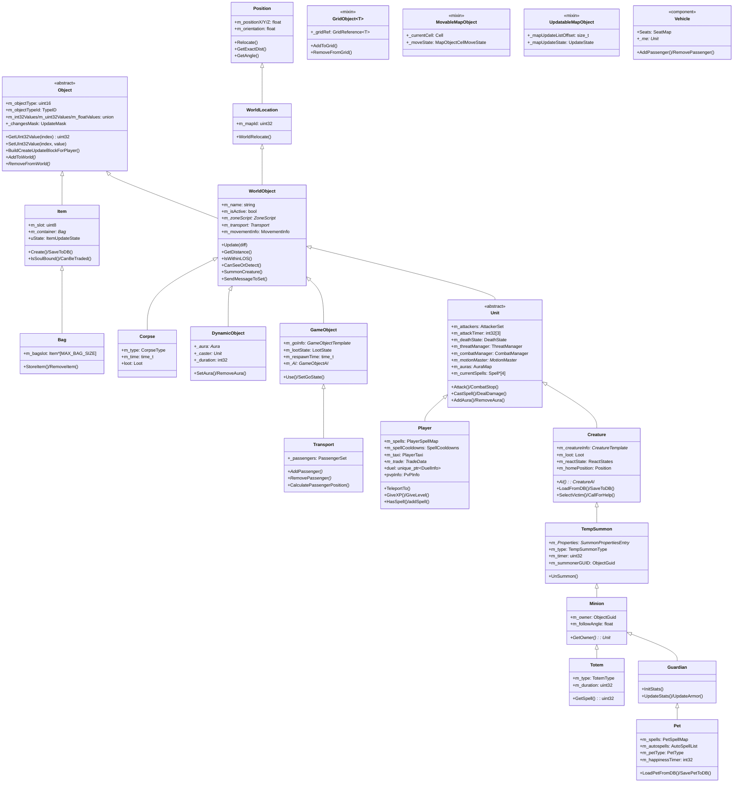
```mermaid
classDiagram
    class Object {
        <<abstract>>
        +m_objectType: uint16
        +m_objectTypeId: TypeID
        +m_int32Values/m_uint32Values/m_floatValues: union
        +_changesMask: UpdateMask
        +GetUInt32Value(index) uint32
        +SetUInt32Value(index, value)
        +BuildCreateUpdateBlockForPlayer()
        +AddToWorld()*
        +RemoveFromWorld()*
    }

    class WorldLocation {
        +m_mapId: uint32
        +WorldRelocate()
    }

    class Position {
        +m_positionX/Y/Z: float
        +m_orientation: float
        +Relocate()
        +GetExactDist()
        +GetAngle()
    }

    class WorldObject {
        +m_name: string
        +m_isActive: bool
        +m_zoneScript: ZoneScript*
        +m_transport: Transport*
        +m_movementInfo: MovementInfo
        +Update(diff)
        +GetDistance()
        +IsWithinLOS()
        +CanSeeOrDetect()
        +SummonCreature()
        +SendMessageToSet()
    }

    class GridObject~T~ {
        <<mixin>>
        +_gridRef: GridReference~T~
        +AddToGrid()
        +RemoveFromGrid()
    }

    class MovableMapObject {
        <<mixin>>
        +_currentCell: Cell
        +_moveState: MapObjectCellMoveState
    }

    class UpdatableMapObject {
        <<mixin>>
        +_mapUpdateListOffset: size_t
        +_mapUpdateState: UpdateState
    }

    class Unit {
        <<abstract>>
        +m_attackers: AttackerSet
        +m_attackTimer: int32[3]
        +m_deathState: DeathState
        +m_threatManager: ThreatManager
        +m_combatManager: CombatManager
        +m_motionMaster: MotionMaster*
        +m_auras: AuraMap
        +m_currentSpells: Spell*[4]
        +Attack()/CombatStop()
        +CastSpell()/DealDamage()
        +AddAura()/RemoveAura()
    }

    class Creature {
        +m_creatureInfo: CreatureTemplate*
        +m_loot: Loot
        +m_reactState: ReactStates
        +m_homePosition: Position
        +AI(): CreatureAI*
        +LoadFromDB()/SaveToDB()
        +SelectVictim()/CallForHelp()
    }

    class TempSummon {
        +m_Properties: SummonPropertiesEntry*
        +m_type: TempSummonType
        +m_timer: uint32
        +m_summonerGUID: ObjectGuid
        +UnSummon()
    }

    class Minion {
        +m_owner: ObjectGuid
        +m_followAngle: float
        +GetOwner(): Unit*
    }

    class Guardian {
        +InitStats()
        +UpdateStats()/UpdateArmor()
    }

    class Pet {
        +m_spells: PetSpellMap
        +m_autospells: AutoSpellList
        +m_petType: PetType
        +m_happinessTimer: int32
        +LoadPetFromDB()/SavePetToDB()
    }

    class Totem {
        +m_type: TotemType
        +m_duration: uint32
        +GetSpell(): uint32
    }

    class Player {
        +m_spells: PlayerSpellMap
        +m_spellCooldowns: SpellCooldowns
        +m_taxi: PlayerTaxi
        +m_trade: TradeData*
        +duel: unique_ptr~DuelInfo~
        +pvpInfo: PvPInfo
        +TeleportTo()
        +GiveXP()/GiveLevel()
        +HasSpell()/addSpell()
    }

    class GameObject {
        +m_goInfo: GameObjectTemplate*
        +m_lootState: LootState
        +m_respawnTime: time_t
        +m_AI: GameObjectAI*
        +Use()/SetGoState()
    }

    class Transport {
        +_passengers: PassengerSet
        +AddPassenger()*
        +RemovePassenger()*
        +CalculatePassengerPosition()
    }

    class Item {
        +m_slot: uint8
        +m_container: Bag*
        +uState: ItemUpdateState
        +Create()/SaveToDB()
        +IsSoulBound()/CanBeTraded()
    }

    class Bag {
        +m_bagslot: Item*[MAX_BAG_SIZE]
        +StoreItem()/RemoveItem()
    }

    class DynamicObject {
        +_aura: Aura*
        +_caster: Unit*
        +_duration: int32
        +SetAura()/RemoveAura()
    }

    class Corpse {
        +m_type: CorpseType
        +m_time: time_t
        +loot: Loot
    }

    class Vehicle {
        <<component>>
        +Seats: SeatMap
        +_me: Unit*
        +AddPassenger()/RemovePassenger()
    }

    Object <|-- WorldObject
    Position <|-- WorldLocation
    WorldLocation <|-- WorldObject
    WorldObject <|-- Unit
    WorldObject <|-- GameObject
    WorldObject <|-- DynamicObject
    WorldObject <|-- Corpse
    Unit <|-- Creature
    Unit <|-- Player
    Creature <|-- TempSummon
    TempSummon <|-- Minion
    Minion <|-- Guardian
    Minion <|-- Totem
    Guardian <|-- Pet
    GameObject <|-- Transport
    Object <|-- Item
    Item <|-- Bag
```

### 3.2 混入(Mixin)体系

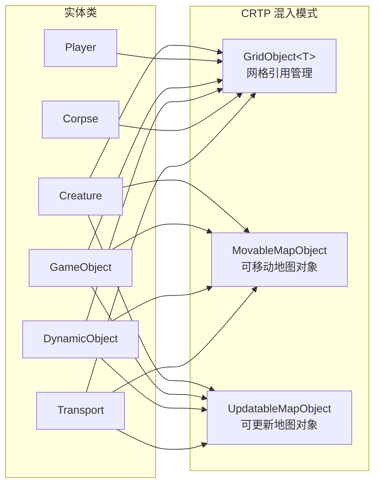
```mermaid
flowchart LR
    subgraph "CRTP 混入模式"
        GridObject["GridObject&lt;T&gt;<br/>网格引用管理"]
        MovableMapObject["MovableMapObject<br/>可移动地图对象"]
        UpdatableMapObject["UpdatableMapObject<br/>可更新地图对象"]
    end

    subgraph "实体类"
        Creature
        Player
        GameObject
        DynamicObject
        Corpse
        Transport
    end

    Creature --> GridObject
    Creature --> MovableMapObject
    Creature --> UpdatableMapObject
    Player --> GridObject
    GameObject --> GridObject
    GameObject --> MovableMapObject
    GameObject --> UpdatableMapObject
    DynamicObject --> GridObject
    DynamicObject --> MovableMapObject
    DynamicObject --> UpdatableMapObject
    Corpse --> GridObject
    Transport --> GridObject
    Transport --> MovableMapObject
    Transport --> UpdatableMapObject
```

**关键设计决策**：
- `Corpse` 不可移动，因此不继承 `MovableMapObject`
- `Player` 不继承 `MovableMapObject`（玩家移动由客户端驱动，走不同的更新路径）
- `GridObject<T>` 使用 CRTP 模式实现类型安全的网格引用

### 3.3 Vehicle 组件模式

Vehicle 是一个特殊的**组件类**，而非独立实体：

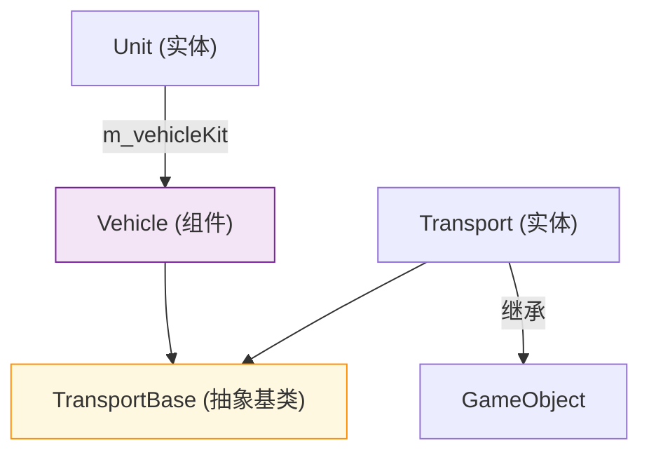
```mermaid
flowchart TB
    Unit["Unit (实体)"]
    Vehicle["Vehicle (组件)"]
    TransportBase["TransportBase (抽象基类)"]
    Transport["Transport (实体)"]

    Unit -->|"m_vehicleKit"| Vehicle
    Vehicle --> TransportBase
    Transport --> TransportBase
    Transport -->|"继承"| GameObject

    style Vehicle fill:#f3e5f5,stroke:#7b1fa2
    style TransportBase fill:#fff8e1,stroke:#ff8f00
```

- `Vehicle` 通过 `Unit::CreateVehicleKit()` 创建，存储在 `Unit::m_vehicleKit`
- `Vehicle` 通过 `_me` 指针反向引用宿主 Unit
- `TransportBase` 提供统一的乘客位置计算接口，被 `Transport` 和 `Vehicle` 共享

---

## 4. GUID 标识系统

### 4.1 GUID 位布局

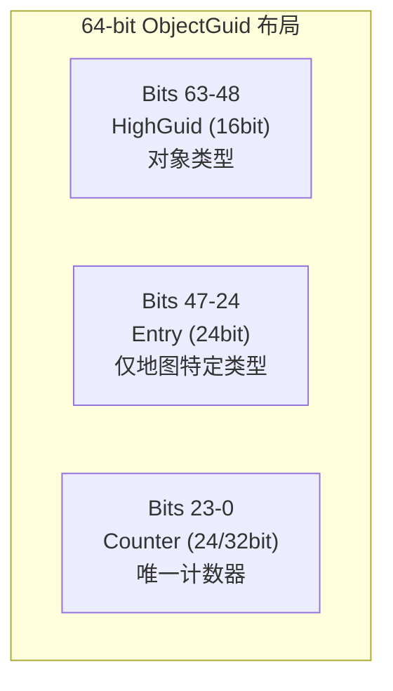
```mermaid
flowchart LR
    subgraph "64-bit ObjectGuid 布局"
        direction LR
        High["Bits 63-48<br/>HighGuid (16bit)<br/>对象类型"]
        Entry["Bits 47-24<br/>Entry (24bit)<br/>仅地图特定类型"]
        Counter["Bits 23-0<br/>Counter (24/32bit)<br/>唯一计数器"]
    end
```

### 4.2 HighGuid 类型映射

| HighGuid | 值 | TypeID | HasEntry | 说明 |
|----------|------|--------|----------|------|
| Player | 0x0000 | TYPEID_PLAYER | No | 全局唯一 |
| Item | 0x4000 | TYPEID_ITEM | No | 全局唯一 |
| GameObject | 0xF110 | TYPEID_GAMEOBJECT | Yes | 地图内+Entry |
| Transport | 0xF120 | TYPEID_GAMEOBJECT | Yes | 客户端视为GO |
| DynamicObject | 0xF100 | TYPEID_DYNAMICOBJECT | No | 地图内唯一 |
| Corpse | 0xF101 | TYPEID_CORPSE | No | 地图内唯一 |
| Unit | 0xF130 | TYPEID_UNIT | Yes | 地图内+Entry |
| Pet | 0xF140 | TYPEID_UNIT | Yes | 客户端视为Unit |
| Vehicle | 0xF150 | TYPEID_UNIT | Yes | 客户端视为Unit |
| Mo_Transport | 0x1FC0 | TYPEID_GAMEOBJECT | No | 移动运输工具 |

**关键点**：客户端协议只有 8 种 TypeID，Pet/Vehicle 在客户端侧都映射为 `TYPEID_UNIT`，Mo_Transport 映射为 `TYPEID_GAMEOBJECT`。

---

## 5. 更新系统（Update System）

### 5.1 更新数据流

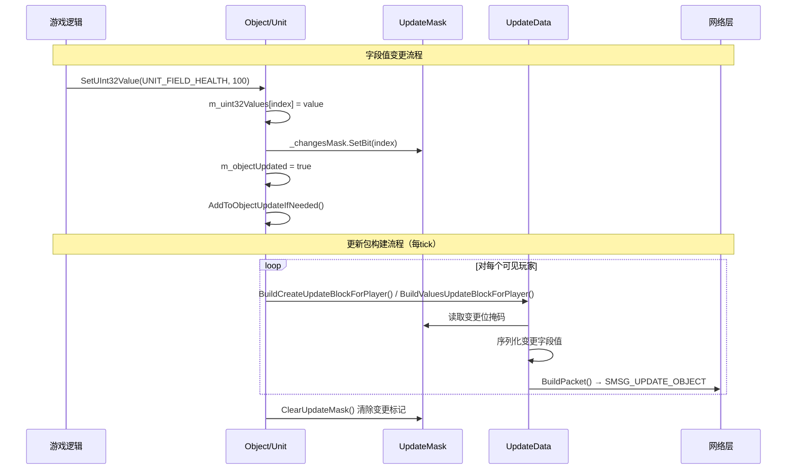
```mermaid
sequenceDiagram
    participant GameLogic as 游戏逻辑
    participant Object as Object/Unit
    participant UpdateMask as UpdateMask
    participant UpdateData as UpdateData
    participant Network as 网络层

    Note over GameLogic,Network: 字段值变更流程

    GameLogic->>Object: SetUInt32Value(UNIT_FIELD_HEALTH, 100)
    Object->>Object: m_uint32Values[index] = value
    Object->>UpdateMask: _changesMask.SetBit(index)
    Object->>Object: m_objectUpdated = true
    Object->>Object: AddToObjectUpdateIfNeeded()

    Note over GameLogic,Network: 更新包构建流程（每tick）

    loop 对每个可见玩家
        Object->>UpdateData: BuildCreateUpdateBlockForPlayer() / BuildValuesUpdateBlockForPlayer()
        UpdateData->>UpdateMask: 读取变更位掩码
        UpdateData->>UpdateData: 序列化变更字段值
        UpdateData->>Network: BuildPacket() → SMSG_UPDATE_OBJECT
    end

    Object->>UpdateMask: ClearUpdateMask() 清除变更标记
```

### 5.2 UpdateFields 层次结构

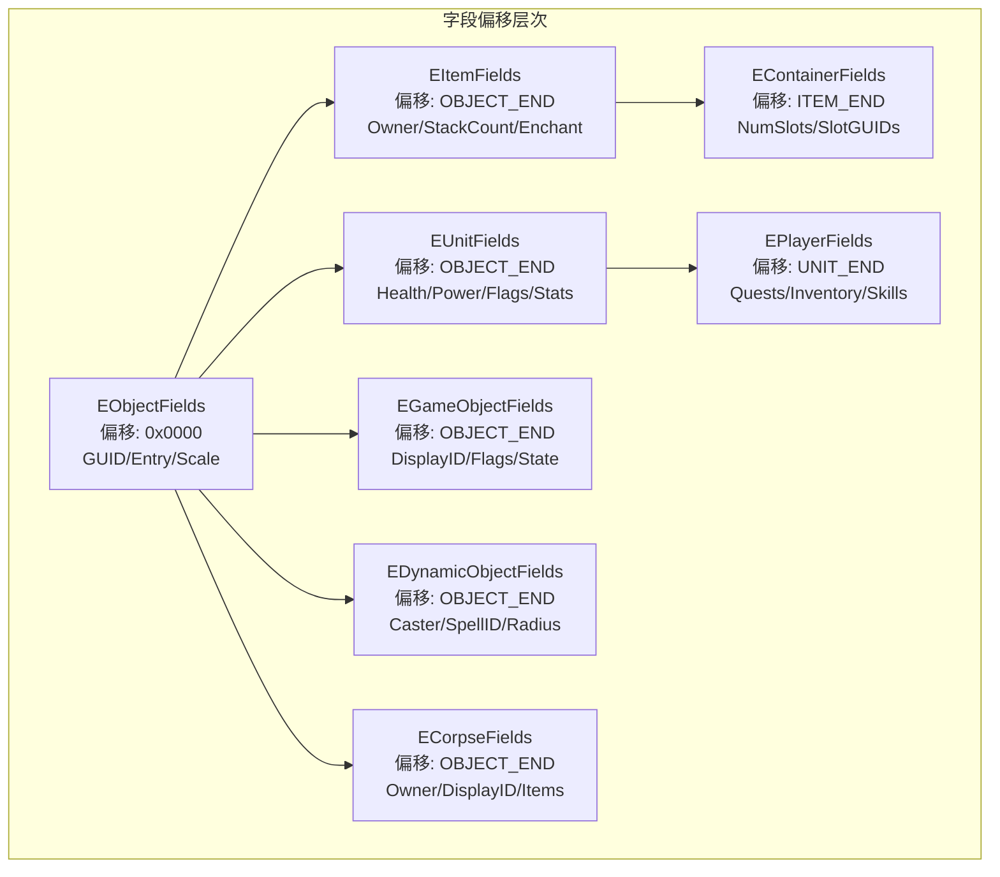
```mermaid
flowchart TB
    subgraph "字段偏移层次"
        EObjectFields["EObjectFields<br/>偏移: 0x0000<br/>GUID/Entry/Scale"]
        EItemFields["EItemFields<br/>偏移: OBJECT_END<br/>Owner/StackCount/Enchant"]
        EContainerFields["EContainerFields<br/>偏移: ITEM_END<br/>NumSlots/SlotGUIDs"]
        EUnitFields["EUnitFields<br/>偏移: OBJECT_END<br/>Health/Power/Flags/Stats"]
        EPlayerFields["EPlayerFields<br/>偏移: UNIT_END<br/>Quests/Inventory/Skills"]
        EGameObjectFields["EGameObjectFields<br/>偏移: OBJECT_END<br/>DisplayID/Flags/State"]
        EDynamicObjectFields["EDynamicObjectFields<br/>偏移: OBJECT_END<br/>Caster/SpellID/Radius"]
        ECorpseFields["ECorpseFields<br/>偏移: OBJECT_END<br/>Owner/DisplayID/Items"]
    end

    EObjectFields --> EItemFields
    EItemFields --> EContainerFields
    EObjectFields --> EUnitFields
    EUnitFields --> EPlayerFields
    EObjectFields --> EGameObjectFields
    EObjectFields --> EDynamicObjectFields
    EObjectFields --> ECorpseFields
```

**字段可见性控制**：

| 标志 | 说明 | 典型用途 |
|------|------|---------|
| PUBLIC | 所有客户端可见 | 生命值、等级、名称 |
| PRIVATE | 仅自己可见 | 经验值、金币 |
| OWNER | 物品所有者可见 | 物品充能、冷却 |
| PARTY_MEMBER | 队友可见 | 队友光环 |
| DYNAMIC | 动态计算 | 动态标志 |

### 5.3 更新包类型

| 类型 | 值 | 说明 |
|------|---|------|
| VALUES | 0 | 仅字段值变更 |
| MOVEMENT | 1 | 仅移动数据变更 |
| CREATE_OBJECT | 2 | 创建对象（首次可见） |
| CREATE_OBJECT2 | 3 | 创建对象（带更多数据） |
| OUT_OF_RANGE_OBJECTS | 4 | 对象离开可见范围 |
| NEAR_OBJECTS | 5 | 附近对象查询响应 |

---

## 6. 可见性系统

### 6.1 可见性关系图

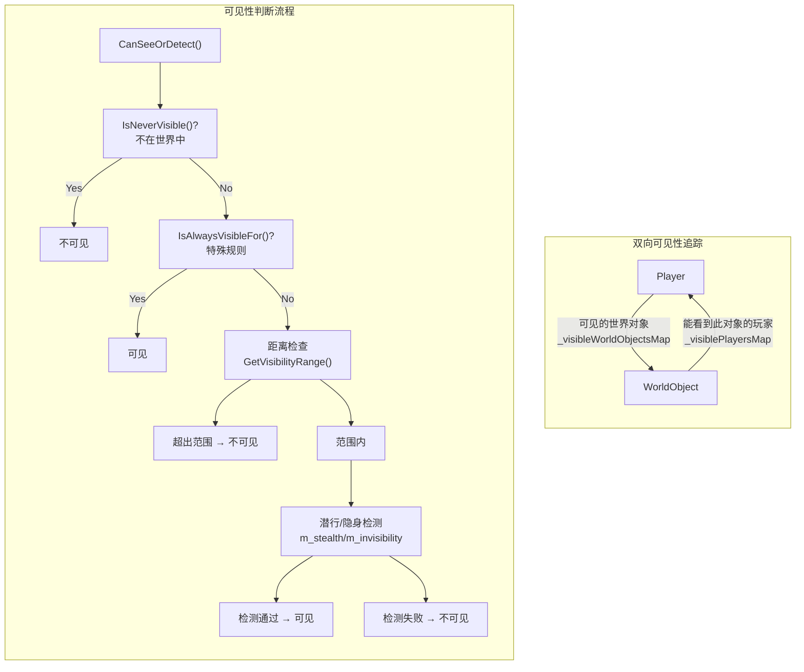
```mermaid
flowchart TB
    subgraph "双向可见性追踪"
        direction TB
        Player["Player"]
        WorldObj["WorldObject"]

        Player -->|"可见的世界对象<br/>_visibleWorldObjectsMap"| WorldObj
        WorldObj -->|"能看到此对象的玩家<br/>_visiblePlayersMap"| Player
    end

    subgraph "可见性判断流程"
        direction TB
        Start["CanSeeOrDetect()"] --> NeverVisible["IsNeverVisible()?<br/>不在世界中"]
        NeverVisible -->|Yes| Invisible["不可见"]
        NeverVisible -->|No| AlwaysVisible["IsAlwaysVisibleFor()?<br/>特殊规则"]
        AlwaysVisible -->|Yes| Visible["可见"]
        AlwaysVisible -->|No| DistanceCheck["距离检查<br/>GetVisibilityRange()"]
        DistanceCheck --> OutOfRange["超出范围 → 不可见"]
        DistanceCheck --> InRange["范围内"]
        InRange --> StealthCheck["潜行/隐身检测<br/>m_stealth/m_invisibility"]
        StealthCheck --> Detected["检测通过 → 可见"]
        StealthCheck --> Undetected["检测失败 → 不可见"]
    end
```

### 6.2 可见性距离层级

| 层级 | 距离 | 用途 |
|------|------|------|
| Tiny | 25yd | 小型物体 |
| Small | 50yd | 普通物体 |
| Normal | 100yd | 大陆默认 |
| Large | 200yd | 大型NPC/BOSS |
| Gigantic | 400yd | 超大视距 |
| Infinite | 533yd | 全图可见 |

### 6.3 潜行/隐身系统

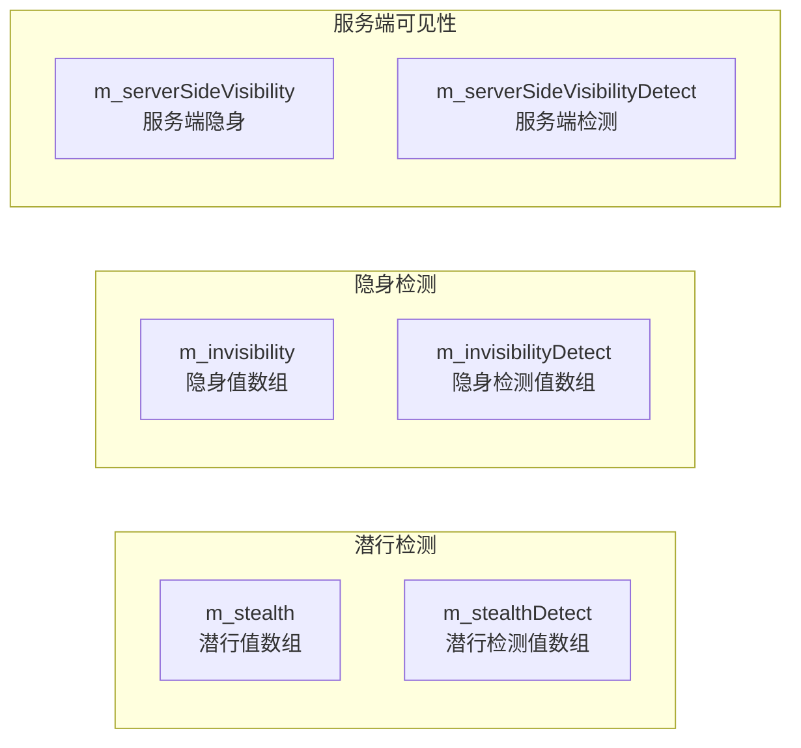
```mermaid
flowchart LR
    subgraph "潜行检测"
        Stealth["m_stealth<br/>潜行值数组"]
        StealthDetect["m_stealthDetect<br/>潜行检测值数组"]
    end

    subgraph "隐身检测"
        Invisibility["m_invisibility<br/>隐身值数组"]
        InvisibilityDetect["m_invisibilityDetect<br/>隐身检测值数组"]
    end

    subgraph "服务端可见性"
        ServerSide["m_serverSideVisibility<br/>服务端隐身"]
        ServerSideDetect["m_serverSideVisibilityDetect<br/>服务端检测"]
    end
```

每种类型都使用 `FlaggedValuesArray32` 模板，支持按类型（如潜行/隐身的不同子类型）分别存储值和检测值。

---

## 7. 战斗系统核心链路

### 7.1 近战攻击流程

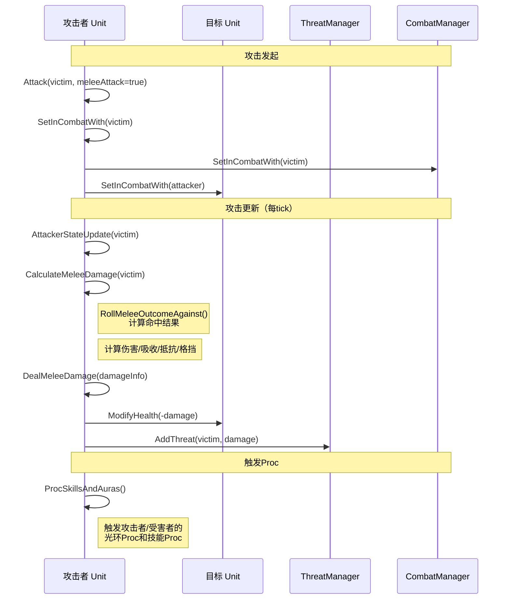
```mermaid
sequenceDiagram
    participant Attacker as 攻击者 Unit
    participant Victim as 目标 Unit
    participant ThreatMgr as ThreatManager
    participant CombatMgr as CombatManager

    Note over Attacker,CombatMgr: 攻击发起

    Attacker->>Attacker: Attack(victim, meleeAttack=true)
    Attacker->>Attacker: SetInCombatWith(victim)
    Attacker->>CombatMgr: SetInCombatWith(victim)
    Attacker->>Victim: SetInCombatWith(attacker)

    Note over Attacker,CombatMgr: 攻击更新（每tick）

    Attacker->>Attacker: AttackerStateUpdate(victim)
    Attacker->>Attacker: CalculateMeleeDamage(victim)
    Note right of Attacker: RollMeleeOutcomeAgainst()<br/>计算命中结果
    Note right of Attacker: 计算伤害/吸收/抵抗/格挡
    Attacker->>Attacker: DealMeleeDamage(damageInfo)
    Attacker->>Victim: ModifyHealth(-damage)
    Attacker->>ThreatMgr: AddThreat(victim, damage)

    Note over Attacker,CombatMgr: 触发Proc

    Attacker->>Attacker: ProcSkillsAndAuras()
    Note right of Attacker: 触发攻击者/受害者的<br/>光环Proc和技能Proc
```

### 7.2 法术施放流程

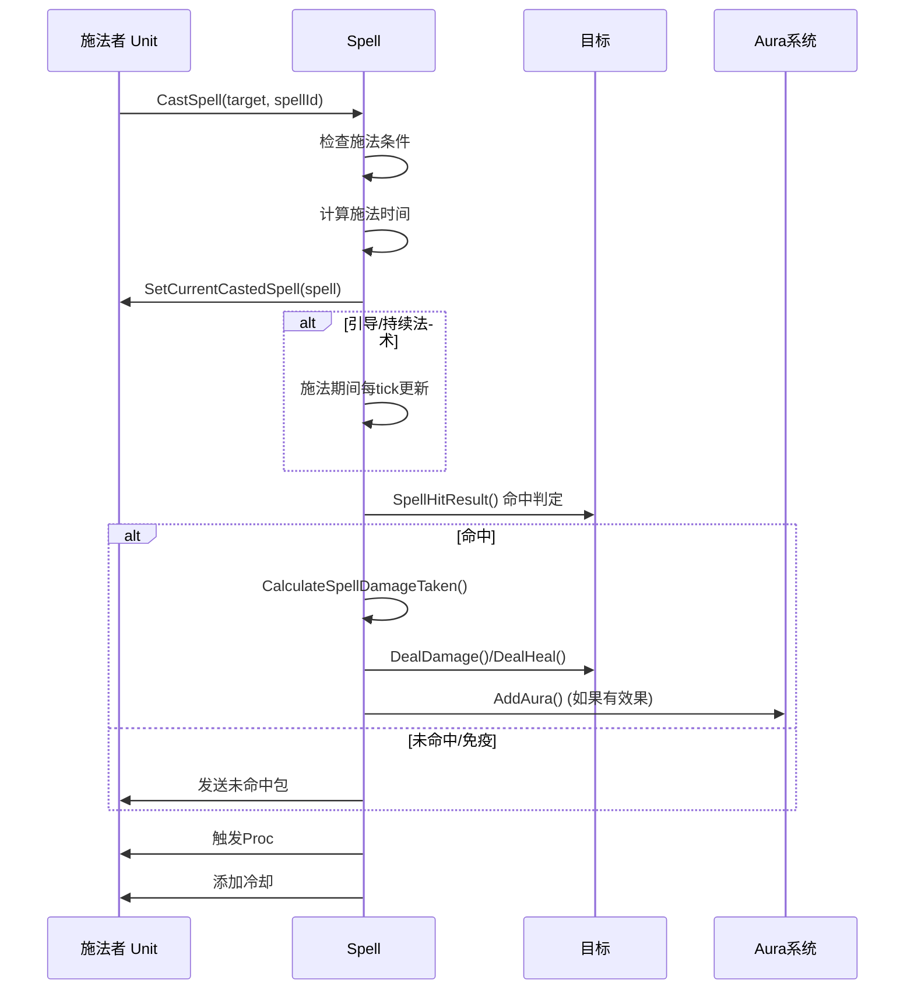
```mermaid
sequenceDiagram
    participant Caster as 施法者 Unit
    participant Spell as Spell
    participant Target as 目标
    participant Aura as Aura系统

    Caster->>Spell: CastSpell(target, spellId)
    Spell->>Spell: 检查施法条件
    Spell->>Spell: 计算施法时间
    Spell->>Caster: SetCurrentCastedSpell(spell)

    alt 引导/持续法术
        Spell->>Spell: 施法期间每tick更新
    end

    Spell->>Target: SpellHitResult() 命中判定
    alt 命中
        Spell->>Spell: CalculateSpellDamageTaken()
        Spell->>Target: DealDamage()/DealHeal()
        Spell->>Aura: AddAura() (如果有效果)
    else 未命中/免疫
        Spell->>Caster: 发送未命中包
    end

    Spell->>Caster: 触发Proc
    Spell->>Caster: 添加冷却
```

### 7.3 伤害计算链路

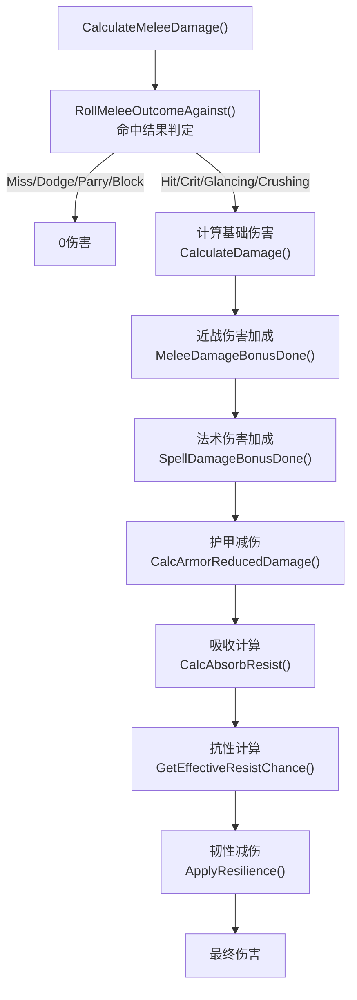
```mermaid
flowchart TB
    Start["CalculateMeleeDamage()"] --> RollOutcome["RollMeleeOutcomeAgainst()<br/>命中结果判定"]
    RollOutcome --> |"Miss/Dodge/Parry/Block"| NoDamage["0伤害"]
    RollOutcome --> |"Hit/Crit/Glancing/Crushing"| CalcBase["计算基础伤害<br/>CalculateDamage()"]

    CalcBase --> MeleeBonus["近战伤害加成<br/>MeleeDamageBonusDone()"]
    MeleeBonus --> SchoolBonus["法术伤害加成<br/>SpellDamageBonusDone()"]

    SchoolBonus --> ArmorReduction["护甲减伤<br/>CalcArmorReducedDamage()"]
    ArmorReduction --> Absorb["吸收计算<br/>CalcAbsorbResist()"]
    Absorb --> Resistance["抗性计算<br/>GetEffectiveResistChance()"]
    Resistance --> Resilience["韧性减伤<br/>ApplyResilience()"]

    Resilience --> Final["最终伤害"]
```

---

## 8. 光环(Aura)系统

### 8.1 光环数据结构

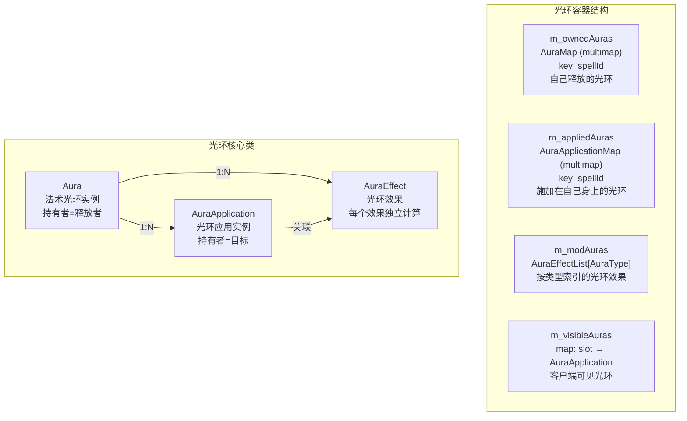
```mermaid
flowchart TB
    subgraph "光环容器结构"
        OwnedAuras["m_ownedAuras<br/>AuraMap (multimap)<br/>key: spellId<br/>自己释放的光环"]
        AppliedAuras["m_appliedAuras<br/>AuraApplicationMap (multimap)<br/>key: spellId<br/>施加在自己身上的光环"]
        ModAuras["m_modAuras<br/>AuraEffectList[AuraType]<br/>按类型索引的光环效果"]
        VisibleAuras["m_visibleAuras<br/>map: slot → AuraApplication<br/>客户端可见光环"]
    end

    subgraph "光环核心类"
        Aura["Aura<br/>法术光环实例<br/>持有者=释放者"]
        AuraApp["AuraApplication<br/>光环应用实例<br/>持有者=目标"]
        AuraEffect["AuraEffect<br/>光环效果<br/>每个效果独立计算"]
    end

    Aura -->|"1:N"| AuraEffect
    Aura -->|"1:N"| AuraApp
    AuraApp -->|"关联"| AuraEffect
```

### 8.2 光环应用/移除流程

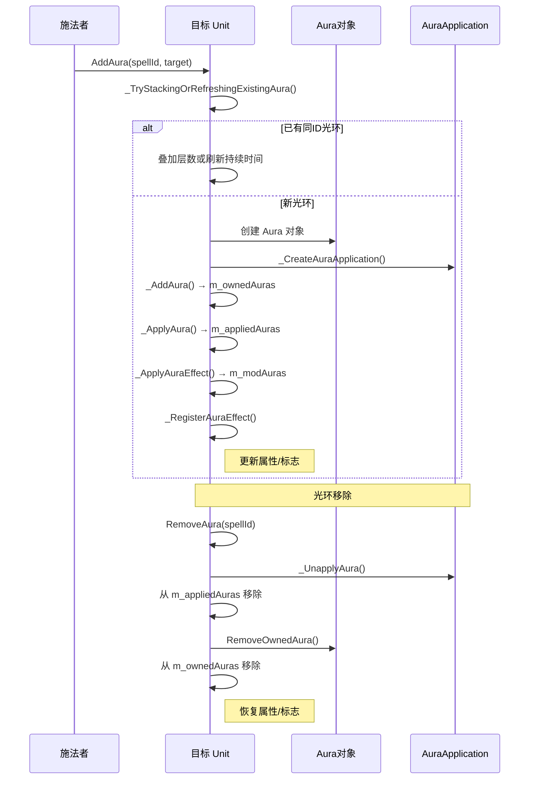
```mermaid
sequenceDiagram
    participant Caster as 施法者
    participant Target as 目标 Unit
    participant Aura as Aura对象
    participant AuraApp as AuraApplication

    Caster->>Target: AddAura(spellId, target)
    Target->>Target: _TryStackingOrRefreshingExistingAura()
    alt 已有同ID光环
        Target->>Target: 叠加层数或刷新持续时间
    else 新光环
        Target->>Aura: 创建 Aura 对象
        Target->>AuraApp: _CreateAuraApplication()
        Target->>Target: _AddAura() → m_ownedAuras
        Target->>Target: _ApplyAura() → m_appliedAuras
        Target->>Target: _ApplyAuraEffect() → m_modAuras
        Target->>Target: _RegisterAuraEffect()
        Note right of Target: 更新属性/标志
    end

    Note over Target,AuraApp: 光环移除

    Target->>Target: RemoveAura(spellId)
    Target->>AuraApp: _UnapplyAura()
    Target->>Target: 从 m_appliedAuras 移除
    Target->>Aura: RemoveOwnedAura()
    Target->>Target: 从 m_ownedAuras 移除
    Note right of Target: 恢复属性/标志
```

---

## 9. 移动系统

### 9.1 移动信息结构

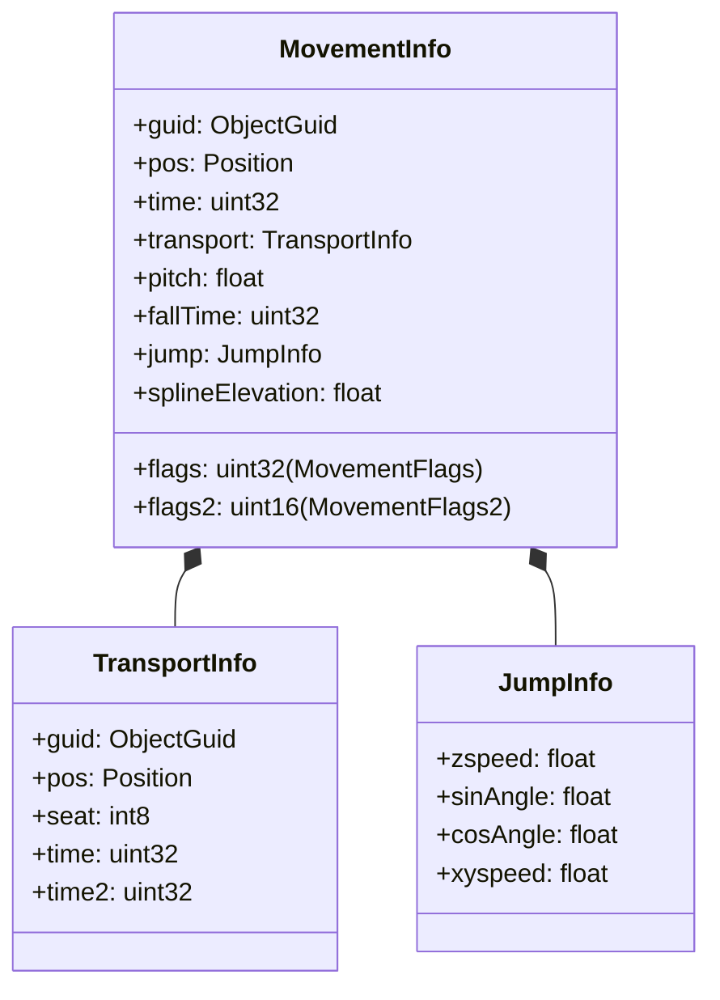
```mermaid
classDiagram
    class MovementInfo {
        +guid: ObjectGuid
        +flags: uint32 (MovementFlags)
        +flags2: uint16 (MovementFlags2)
        +pos: Position
        +time: uint32
        +transport: TransportInfo
        +pitch: float
        +fallTime: uint32
        +jump: JumpInfo
        +splineElevation: float
    }

    class TransportInfo {
        +guid: ObjectGuid
        +pos: Position
        +seat: int8
        +time: uint32
        +time2: uint32
    }

    class JumpInfo {
        +zspeed: float
        +sinAngle: float
        +cosAngle: float
        +xyspeed: float
    }

    MovementInfo *-- TransportInfo
    MovementInfo *-- JumpInfo
```

### 9.2 速度系统

| 移动类型 | 索引 | 说明 |
|---------|------|------|
| Walk | 0 | 步行 |
| Run | 1 | 跑步 |
| RunBack | 2 | 后退 |
| Swim | 3 | 游泳 |
| SwimBack | 4 | 游泳后退 |
| TurnRate | 5 | 转向速率 |
| Flight | 6 | 飞行 |
| FlightBack | 7 | 飞行后退 |
| PitchRate | 8 | 俯仰速率 |

速度更新通过 `SetSpeed()` → `UpdateSpeed()` → 客户端同步包 的链路完成。

---

## 10. 实体间关系

### 10.1 所有者/控制关系

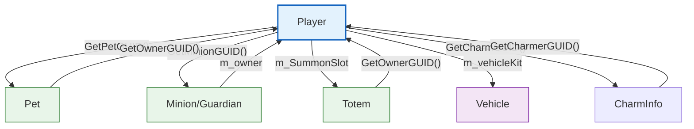
```mermaid
flowchart TB
    Player["Player"]
    Pet["Pet"]
    Minion["Minion/Guardian"]
    Totem["Totem"]
    Vehicle["Vehicle"]
    CharmInfo["CharmInfo"]

    Player -->|"GetPetGUID()"| Pet
    Player -->|"GetMinionGUID()"| Minion
    Player -->|"m_SummonSlot"| Totem
    Player -->|"m_vehicleKit"| Vehicle

    Pet -->|"GetOwnerGUID()"| Player
    Minion -->|"m_owner"| Player
    Totem -->|"GetOwnerGUID()"| Player

    Player -->|"GetCharmGUID()"| CharmInfo
    CharmInfo -->|"GetCharmerGUID()"| Player

    style Player fill:#e3f2fd,stroke:#1565c0,stroke-width:2px
    style Pet fill:#e8f5e9,stroke:#2e7d32
    style Minion fill:#e8f5e9,stroke:#2e7d32
    style Totem fill:#e8f5e9,stroke:#2e7d32
    style Vehicle fill:#f3e5f5,stroke:#7b1fa2
```

### 10.2 召唤类型

| 类型 | 值 | 说明 |
|------|---|------|
| TIMED_OR_DEAD_DESPAWN | 1 | 定时或死亡后消失 |
| TIMED_OR_CORPSE_DESPAWN | 2 | 定时或尸体后消失 |
| TIMED_DESPAWN | 3 | 定时消失 |
| TIMED_DESPAWN_OUT_OF_COMBAT | 4 | 脱战后定时消失 |
| CORPSE_DESPAWN | 5 | 死亡后立即消失 |
| CORPSE_TIMED_DESPAWN | 6 | 死亡后定时消失 |
| DEAD_DESPAWN | 7 | 尸体消失时消失 |
| MANUAL_DESPAWN | 8 | 手动消失 |
| TIMED_DESPAWN_OOC_ALIVE | 10 | 脱战且存活时定时消失 |

---

## 11. 模块依赖分析

### 11.1 依赖关系图

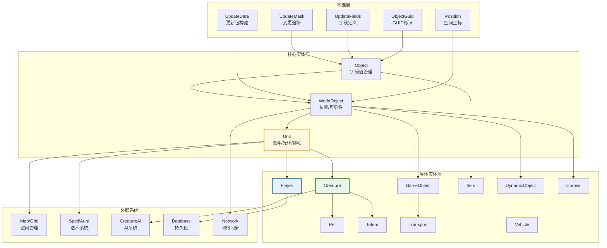
```mermaid
flowchart TB
    subgraph "基础层"
        ObjectGuid["ObjectGuid<br/>GUID标识"]
        Position["Position<br/>空间坐标"]
        UpdateFields["UpdateFields<br/>字段定义"]
        UpdateMask["UpdateMask<br/>变更追踪"]
        UpdateData["UpdateData<br/>更新包构建"]
    end

    subgraph "核心实体层"
        Object["Object<br/>字段值管理"]
        WorldObject["WorldObject<br/>位置/可见性"]
        Unit["Unit<br/>战斗/光环/移动"]
    end

    subgraph "具体实体层"
        Player["Player"]
        Creature["Creature"]
        GameObject["GameObject"]
        Item["Item"]
        Pet["Pet"]
        Totem["Totem"]
        DynamicObject["DynamicObject"]
        Corpse["Corpse"]
        Transport["Transport"]
        Vehicle["Vehicle"]
    end

    subgraph "外部系统"
        MapSystem["Map/Grid<br/>空间管理"]
        SpellSystem["Spell/Aura<br/>法术系统"]
        AISystem["CreatureAI<br/>AI系统"]
        DBSystem["Database<br/>持久化"]
        NetworkSystem["Network<br/>网络同步"]
    end

    ObjectGuid --> Object
    Position --> WorldObject
    UpdateFields --> Object
    UpdateMask --> Object
    UpdateData --> WorldObject

    Object --> WorldObject
    WorldObject --> Unit

    Unit --> Player
    Unit --> Creature
    WorldObject --> GameObject
    WorldObject --> DynamicObject
    WorldObject --> Corpse
    Object --> Item
    Creature --> Pet
    Creature --> Totem
    GameObject --> Transport

    Unit --> MapSystem
    Unit --> SpellSystem
    Creature --> AISystem
    Player --> DBSystem
    WorldObject --> NetworkSystem

    style Unit fill:#fff8e1,stroke:#ff8f00,stroke-width:2px
    style Player fill:#e3f2fd,stroke:#1565c0,stroke-width:2px
    style Creature fill:#e8f5e9,stroke:#2e7d32,stroke-width:2px
```

### 11.2 关键外部依赖

| 系统 | 调用位置 | 调用方式 | 说明 |
|------|---------|---------|------|
| Map/Grid | WorldObject | 直接调用 | 空间分区、可见性更新 |
| Spell/Aura | Unit | 直接调用 | 法术施放、光环管理 |
| ThreatManager | Unit | 组合 | 仇恨管理 |
| CombatManager | Unit | 组合 | 战斗状态管理 |
| MotionMaster | Unit | 组合 | 移动生成器 |
| CreatureAI | Creature | 指针 | AI行为 |
| Database | Player/Pet/Creature | 直接调用 | 持久化存储 |
| Network | WorldObject | 直接调用 | 数据包广播 |

---

## 12. 性能关键点

### 12.1 I/O 操作

| 类型 | 位置 | 操作描述 | 优化建议 |
|------|------|---------|---------|
| 数据库 | Player::SaveToDB | 角色全量保存，涉及多表 | 已使用事务批量提交 |
| 数据库 | Player::LoadFromDB | 角色登录加载，38+查询 | 已使用 PreparedQuery 并行化 |
| 网络 | WorldObject::SendMessageToSet | 广播数据包到附近玩家 | 通过可见性容器过滤 |

### 12.2 计算密集型操作

| 类型 | 位置 | 操作描述 | 优化建议 |
|------|------|---------|---------|
| 光环遍历 | Unit::GetTotalAuraModifier | 遍历所有指定类型光环 | 使用 m_modAuras 按类型索引，O(1)查找 |
| 距离计算 | WorldObject::GetDistance | 频繁调用 | 使用距离平方比较避免开方 |
| 更新掩码 | Object::BuildValuesUpdate | 每tick遍历所有字段 | 仅发送变更字段 |
| 仇恨排序 | ThreatManager::getThreatList | 每次选择目标排序 | 使用缓存机制 |

### 12.3 内存布局

| 数据 | 位置 | 说明 |
|------|------|------|
| 字段值数组 | Object::m_int32Values | 联合体，通过索引直接访问，缓存友好 |
| 光环容器 | Unit::m_ownedAuras/m_appliedAuras | multimap，按spellId排序 |
| 可见性容器 | WorldObject::_objectVisibilityContainer | 双向追踪，玩家额外维护可见世界对象 |

---

## 13. 代码质量评估

### 13.1 代码优点

- **清晰的继承层次**：Object → WorldObject → Unit → Creature/Player 的分层设计职责明确
- **CRTP混入模式**：GridObject<T> 实现类型安全的网格管理，避免虚函数开销
- **字段值系统**：统一的索引访问 + 变更掩码，高效支持网络同步
- **双向可见性追踪**：ObjectVisibilityContainer 维护玩家↔世界对象的双向关系，避免悬挂引用
- **组件模式**：Vehicle 作为 Unit 的组件而非独立实体，设计灵活

### 13.2 潜在问题

| 问题 | 位置 | 影响 | 建议 |
|------|------|------|------|
| reinterpret_cast 类型转换 | Object.h:202-224 | 不安全，依赖类型正确性 | 使用 dynamic_cast 或确保类型检查前置 |
| 联合体字段值访问 | Object.h:257-262 | 类型安全无保障 | 严格通过类型化访问器方法 |
| Player 类过于庞大 | Player.h (2000+行) | 可维护性差 | 按功能拆分为子模块 |
| Unit 类职责过多 | Unit.h (2000+行) | 违反单一职责 | 考虑将战斗/光环/移动拆分 |
| 线程安全 | 多处成员变量 | 非线程安全 | 确保单线程访问或加锁 |

### 13.3 改进建议

- 将 Player 拆分为 PlayerCombat、PlayerTrade、PlayerQuest 等子模块（部分已通过 PlayerGossip.cpp/PlayerQuest.cpp 等文件拆分实现）
- 将 Unit 的战斗逻辑抽取到 CombatComponent，光环逻辑抽取到 AuraComponent
- 为 reinterpret_cast 转换添加编译期类型检查
- 考虑使用 ECS（Entity-Component-System）模式重构，提升数据局部性和缓存命中率

---

## 14. 关键代码片段

### 14.1 字段值设置与变更追踪

```cpp
// Object.cpp - 字段值设置，自动标记变更
void Object::SetUInt32Value(uint16 index, uint32 value)
{
    ASSERT(index < m_valuesCount || PrintIndexError(index, true));

    if (m_uint32Values[index] != value)
    {
        m_uint32Values[index] = value;
        _changesMask.SetBit(index);  // 标记变更位
        // 触发对象更新
        AddToObjectUpdateIfNeeded();
    }
}
```

### 14.2 可见性判断核心逻辑

```cpp
// Object.cpp - 可见性判断链
bool WorldObject::CanSeeOrDetect(WorldObject const* obj, bool ignoreStealth,
                                  bool distanceCheck, bool checkAlert) const
{
    if (obj->IsNeverVisible())
        return false;

    if (CanNeverSee(obj))
        return false;

    if (obj->IsAlwaysVisibleFor(this))
        return true;

    if (CanAlwaysSee(obj))
        return true;

    bool distanceChecked = false;
    if (distanceCheck) {
        if (!IsWithinDist(obj, GetVisibilityRange(), false))
            return false;
        distanceChecked = true;
    }

    // 潜行/隐身检测
    if (!CanDetect(obj, ignoreStealth, distanceChecked, checkAlert))
        return false;

    return true;
}
```

### 14.3 双向可见性链接

```cpp
// ObjectVisibilityContainer.cpp - 建立双向可见性关系
void ObjectVisibilityContainer::LinkWorldObjectVisibility(WorldObject* obj)
{
    // 对方能看到我 → 添加到我的 _visiblePlayersMap
    DirectInsertVisiblePlayerReference(obj);

    // 我能看到对方 → 添加到对方的 _visibleWorldObjectsMap（仅玩家）
    if (_selfObject->IsPlayer())
        obj->GetObjectVisibilityContainer().DirectInsertVisiblePlayerReference(_selfObject);
}
```

---

## 15. 总结

### 15.1 分析结论

AzerothCore 的 Entities 模块是一个成熟的 MMO 游戏实体系统，具有以下特点：

1. **层次清晰的继承体系**：Object → WorldObject → Unit → Creature/Player 的四层架构，每层职责明确
2. **高效的网络同步机制**：基于 UpdateMask 的变更追踪 + UpdateData 的批量打包，最小化网络带宽
3. **灵活的混入模式**：GridObject/MovableMapObject/UpdatableMapObject 通过 CRTP 实现类型安全的横切关注点
4. **完整的可见性管理**：双向追踪 + 潜行/隐身/服务端隐身三层检测体系
5. **组件化设计**：Vehicle 作为 Unit 的组件而非独立实体，TransportBase 抽象统一载具和运输工具

主要不足在于 Player/Unit 类过于庞大（各2000+行），部分使用了不安全的 reinterpret_cast，以及缺乏线程安全保护。

### 15.2 后续行动建议

- 深入分析 Unit 的战斗/光环/移动子系统的实现细节
- 分析 Player 的登录加载流程和保存机制
- 研究 Map/Grid 系统与 Entities 的交互方式
- 分析法术系统（Spell）与 Unit 的集成点
- 研究 CreatureAI 与 Creature 的交互模式
