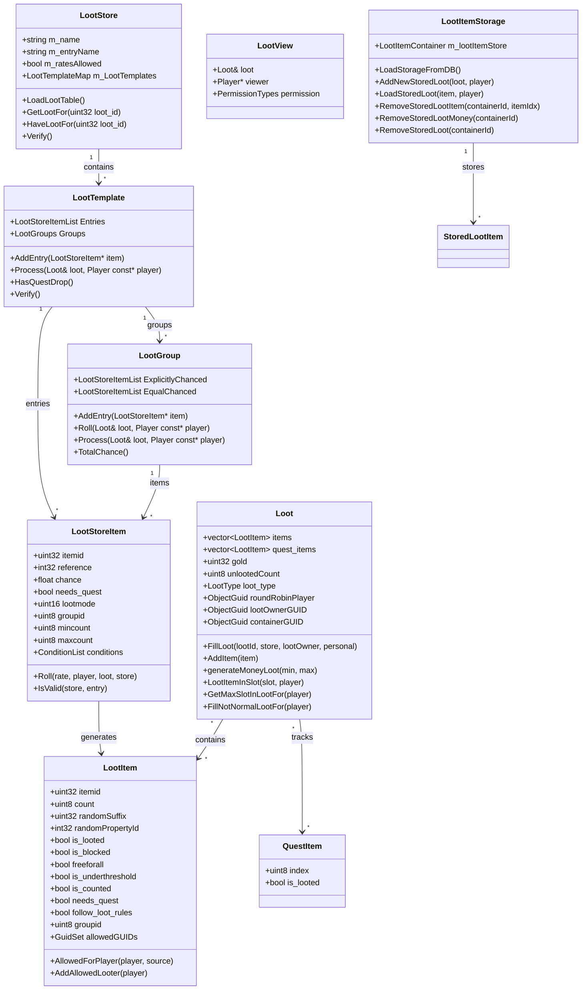
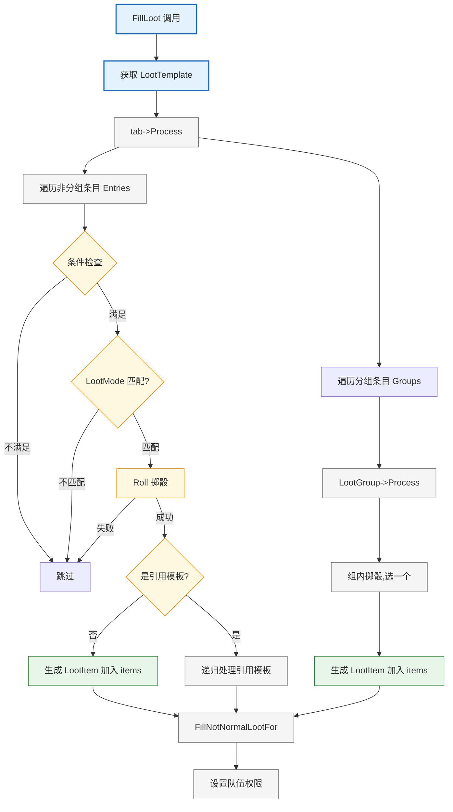
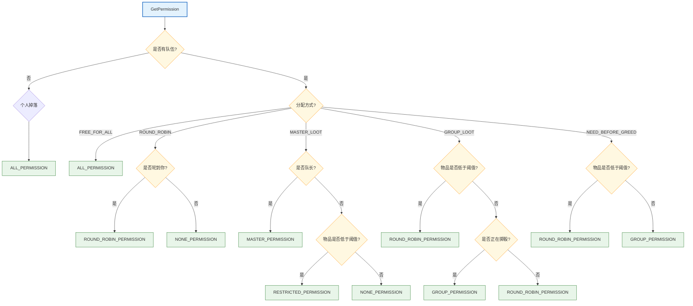

# Loot 战利品系统深度分析

## 1. 系统概述

**分析目标**：Loot 战利品系统
**分析范围**：`src/server/game/Loot/`、`src/server/game/Handlers/LootHandler.cpp`
**分析重点**：掉落模板、掷骰系统、分配规则、数据流转、Pickpocket（偷盗）机制

战利品系统是 WoW 游戏的核心系统之一，负责管理怪物掉落、宝箱开箱、钓鱼收获、分解产物等各种物品获取场景。系统支持多种分配方式（自由拾取/轮流/队长分配/队伍分配/需求优先），支持条件化掉落、任务物品掉落、引用模板等高级特性。

---

## 2. 目录结构与文件清单

`src/server/game/Loot/` 目录包含 4 个文件：

| 文件 | 用途 |
|------|------|
| `LootMgr.h` (462行) | Loot 系统核心头文件，定义所有核心枚举、类和全局变量 |
| `LootMgr.cpp` (2320行) | Loot 系统核心实现，包含所有模板加载、掷骰逻辑和数据处理 |
| `LootItemStorage.h` (75行) | 持久化拾取物品存储的头文件，用于跨会话保存已打开但未拾取完的容器 |
| `LootItemStorage.cpp` (290行) | 持久化拾取物品存储的实现，与 character 数据库交互 |

---

## 3. 核心枚举类型

### 3.1 RollType — 掷骰类型
```cpp
ROLL_PASS       = 0   // 放弃
ROLL_NEED       = 1   // 需求
ROLL_GREED      = 2   // 贪婪
ROLL_DISENCHANT = 3   // 分解
```

### 3.2 LootMethod — 分配方式
```cpp
FREE_FOR_ALL     = 0  // 自由拾取
ROUND_ROBIN      = 1  // 轮流拾取
MASTER_LOOT      = 2  // 团长分配
GROUP_LOOT       = 3  // 队伍拾取
NEED_BEFORE_GREED = 4 // 需求优先
```

### 3.3 PermissionTypes — 拾取权限
```cpp
ALL_PERMISSION          = 0  // 全部权限
GROUP_PERMISSION        = 1  // 队伍权限
MASTER_PERMISSION       = 2  // 团长权限
RESTRICTED_PERMISSION   = 3  // 限制权限
ROUND_ROBIN_PERMISSION  = 4  // 轮流权限
OWNER_PERMISSION        = 5  // 所有者权限
NONE_PERMISSION         = 6  // 无权限
```

### 3.4 LootType — 掉落类型（关键枚举）
```cpp
LOOT_NONE            = 0   // 无
LOOT_CORPSE          = 1   // 尸体拾取
LOOT_PICKPOCKETING    = 2   // 偷盗/扒窃
LOOT_FISHING          = 3   // 钓鱼
LOOT_DISENCHANTING    = 4   // 分解
LOOT_SKINNING         = 6   // 剥皮
LOOT_PROSPECTING      = 7   // 采矿(选矿)
LOOT_MILLING          = 8   // 草药研磨
LOOT_FISHINGHOLE      = 20  // 钓鱼点
LOOT_INSIGNIA         = 21  // 徽记拾取
LOOT_FISHING_JUNK     = 22  // 钓垃圾
```

### 3.5 LootError — 掉落错误码
```cpp
LOOT_ERROR_ALREADY_PICKPOCKETED = 15  // "Your target has already had its pockets picked"
LOOT_ERROR_DIDNT_KILL           = 2   // 未击杀
LOOT_ERROR_TOO_FAR              = 4   // 距离太远
LOOT_ERROR_TARGET_NO_POCKETS    = 11  // 目标没有口袋
```

### 3.6 LootSlotType — 拾取槽位类型
```cpp
LOOT_SLOT_TYPE_ALLOW_LOOT  = 0  // 可拾取
LOOT_SLOT_TYPE_ROLL_ONGOING = 1 // 正在掷骰
LOOT_SLOT_TYPE_MASTER       = 2 // 团长分配
LOOT_SLOT_TYPE_LOCKED       = 3 // 锁定（红色显示）
LOOT_SLOT_TYPE_OWNER        = 4 // 所有者专用
```

---

## 4. 核心类及其关系

### 4.1 类图



### 4.2 LootStoreItem — 数据库模板条目

定义一个掉落的可能性：

| 字段 | 类型 | 说明 |
|------|------|------|
| `itemid` | `uint32` | 物品ID |
| `reference` | `int32` | 引用模板ID（负数时取反后查找 reference_loot_template） |
| `chance` | `float` | 掉落概率 (0-100)，100表示必掉 |
| `needs_quest` | `bool` | 是否需要任务 |
| `lootmode` | `uint16` | 掉落模式掩码 |
| `groupid` | `uint8` | 分组ID（0=非分组，同组互斥） |
| `mincount`/`maxcount` | `uint8` | 最小/最大数量 |
| `conditions` | `ConditionList` | 额外条件列表 |

关键方法 `Roll()` — 掷骰判断是否掉落，支持脚本修改概率、品质倍率调整。

### 4.3 LootItem — 实际掉落的物品实例

由 `LootStoreItem` 构造生成，包含物品属性和状态标志（`is_looted`, `is_blocked`, `freeforall` 等），维护允许拾取的玩家GUID集合。

### 4.4 LootTemplate — 掉落模板

包含一组 `LootStoreItem` 条目，分为非分组条目和分组条目。`Process()` 方法对所有条目掷骰并生成掉落物。

### 4.5 LootTemplate::LootGroup — 掉落分组

组内物品互斥（只会掉落一个），分为有显式概率的条目和等概率条目。先尝试显式概率掷骰，失败后再尝试等概率掷骰。

### 4.6 LootStore — 掉落表存储

管理所有掉落模板的加载和查询，支持从DB加载、模板查询、引用完整性检查。

### 4.7 Loot — 核心掉落数据结构

一个具体的掉落实例，包含物品列表、金币、权限等。`FillLoot()` 是核心方法，负责填充掉落物并设置队伍分配权限。

### 4.8 LootItemStorage — 持久化存储

单例，管理可交易容器中未拾取的物品到 `item_loot_items` 数据库表，支持跨会话保存。

---

## 5. 全局 LootStore 实例（所有掉落类型）

定义在 `LootMgr.h`，实例化在 `LootMgr.cpp`：

| 全局变量 | DB 表名 | Entry 含义 | 掉率调整 |
|----------|---------|-----------|---------|
| `LootTemplates_Creature` | `creature_loot_template` | creature entry | 是 |
| `LootTemplates_Pickpocketing` | `pickpocketing_loot_template` | creature pickpocket lootid | 是 |
| `LootTemplates_Fishing` | `fishing_loot_template` | area id | 是 |
| `LootTemplates_Gameobject` | `gameobject_loot_template` | gameobject entry | 是 |
| `LootTemplates_Item` | `item_loot_template` | item entry | 是 |
| `LootTemplates_Mail` | `mail_loot_template` | mail template id | **否** |
| `LootTemplates_Milling` | `milling_loot_template` | item entry (herb) | 是 |
| `LootTemplates_Skinning` | `skinning_loot_template` | creature skinning id | 是 |
| `LootTemplates_Disenchant` | `disenchant_loot_template` | item disenchant id | 是 |
| `LootTemplates_Prospecting` | `prospecting_loot_template` | item entry (ore) | 是 |
| `LootTemplates_Spell` | `spell_loot_template` | spell id | **否** |
| `LootTemplates_Reference` | `reference_loot_template` | reference id | **否** |
| `LootTemplates_Player` | `player_loot_template` | team id | 是 |

---

## 6. 掉落生成流程

### 6.1 核心掷骰流程



### 6.2 Roll 掷骰逻辑

```
1. 脚本回调 OnItemRoll() — 可修改概率
2. chance >= 100.0 → 必掉
3. 有引用 → 使用引用倍率 (RATE_DROP_ITEM_REFERENCED)
4. 有物品 → 使用品质倍率 (qualityToRate[pProto->Quality])
5. roll_chance_f(chance * modifier) → 最终概率判定
```

### 6.3 权限检查流程



---

## 7. 特殊掉落类型

### 7.1 任务物品掉落

- `needs_quest = true` 标记为任务物品
- 只有相关任务的玩家才能看到
- 每个队员都可以拾取（独立副本）
- 可以设置 `freeforall = true` 全员可见

### 7.2 FreeForAll 物品

- `ITEM_FLAG_MULTI_DROP` 标记为 FFA
- 每个队员都可以拾取一份
- 典型例子：徽章、货币

### 7.3 条件掉落

支持阵营限制（联盟/部落）、职业限制、技能限制、任务限制等条件。由 `ConditionMgr` 系统统一管理。

---

## 8. Pickpocket（偷盗/扒窃）系统完整分析

### 8.1 概述

Pickpocket 是盗贼的专属技能（SpellID 921），允许从存活的NPC身上偷取物品和金币。该系统涉及法术系统、Loot系统和网络消息处理三个层面。

### 8.2 完整数据流

```mermaid
flowchart TB
    A[盗贼使用 Pickpocket 技能<br/>SpellID: 921] --> B[Spell::EffectPickPocket]

    B --> C{施法者是玩家?}
    C -->|否| Z[结束]
    C -->|是| D[Player::SendLoot<br/>LOOT_PICKPOCKETING]

    D --> E{目标检查}
    E --> F{是 Creature?}
    F -->|否| G[SendLootRelease]
    F -->|是| H{目标存活?}
    H -->|否| G
    H -->|是| I{在交互距离内?}
    I -->|否| G
    I -->|是| J{是友好目标?}
    J -->|是| G
    J -->|否| K{可偷盗?}

    K -->|已被偷过| L[LOOT_ERROR_ALREADY_PICKPOCKETED]
    K -->|可以偷| M[SetPickPocketLootTime]

    M --> N{有 pickpocketLootId?}
    N -->|是| O[FillLoot<br/>LootTemplates_Pickpocketing]
    N -->|否| P[仅生成金币]
    O --> Q[生成额外金币]
    P --> Q

    Q --> R[OWNER_PERMISSION]
    R --> S[打开偷盗 Loot 窗口]

    classDef entry fill:#e3f2fd,stroke:#1565c0,stroke-width:2px
    classDef decision fill:#fff8e1,stroke:#ff8f00
    classDef process fill:#f5f5f5,stroke:#757575
    classDef success fill:#e8f5e9,stroke:#2e7d32
    classDef fail fill:#ffebee,stroke:#c62828

    class A,B,D entry
    class C,F,H,I,J,K,N decision
    class M,O,P,Q,R,S process
    class success
    class G,L fail
```

### 8.3 法术系统层

#### 8.3.1 法术效果注册

`SPELL_EFFECT_PICKPOCKET`（枚举值 71）注册在 `SpellEffects.cpp:143`：

```cpp
&Spell::EffectPickPocket,  // 71 SPELL_EFFECT_PICKPOCKET
```

#### 8.3.2 EffectPickPocket 实现

`SpellEffects.cpp:2726-2735`：

```cpp
void Spell::EffectPickPocket(SpellEffIndex /*effIndex*/)
{
    if (effectHandleMode != SPELL_EFFECT_HANDLE_HIT_TARGET)
        return;

    if (!m_caster->IsPlayer())
        return;

    m_caster->ToPlayer()->SendLoot(unitTarget->GetGUID(), LOOT_PICKPOCKETING);
}
```

#### 8.3.3 自定义属性标记

`SpellInfo.h:187`：
```cpp
SPELL_ATTR0_CU_PICKPOCKET = 0x00000400,
```

`SpellMgr.cpp` 自动为含 `SPELL_EFFECT_PICKPOCKET` 的法术打标记。

#### 8.3.4 施法前条件检查

`SpellInfo.cpp:1696-1704`：
```cpp
if (HasAttribute(SPELL_ATTR0_CU_PICKPOCKET))
{
    Creature const* targetCreature = unitTarget->ToCreature();
    if (!targetCreature)
        return SPELL_FAILED_BAD_TARGETS;

    if (!LootTemplates_Pickpocketing.HaveLootFor(targetCreature->GetCreatureTemplate()->pickpocketLootId))
        return SPELL_FAILED_TARGET_NO_POCKETS;  // "Your target has no pockets to pick"
}
```

#### 8.3.5 偷盗失败处理

`Spell.cpp:2887-2892`：如果 Pickpocket 被抵抗（`SPELL_MISS_RESIST`）：
1. 移除施法者身上所有会被"交谈"打断的光环（包括隐身/Stealth）
2. 目标生物立刻进入战斗状态（`EngageWithTarget`）

```cpp
if (missInfo == SPELL_MISS_RESIST && m_spellInfo->HasAttribute(SPELL_ATTR0_CU_PICKPOCKET)
    && unitTarget->IsCreature() && m_caster)
{
    m_caster->RemoveAurasWithInterruptFlags(AURA_INTERRUPT_FLAG_TALK);
    unitTarget->ToCreature()->EngageWithTarget(m_caster);
}
```

### 8.4 Loot 生成层

#### 8.4.1 SendLoot 中的 Pickpocket 处理

`Player.cpp:8026-8062`：

```cpp
// 必须存活且在交互距离内
if (!creature || creature->IsAlive() != (loot_type == LOOT_PICKPOCKETING)
    || !creature->IsWithinDistInMap(this, INTERACTION_DISTANCE))
{
    SendLootRelease(guid);
    return;
}

// 不能偷友好单位
if (loot_type == LOOT_PICKPOCKETING && IsFriendlyTo(creature))
{
    SendLootRelease(guid);
    return;
}

loot = &creature->loot;

if (loot_type == LOOT_PICKPOCKETING)
{
    if (!loot || loot->loot_type != LOOT_PICKPOCKETING)
    {
        if (creature->CanGeneratePickPocketLoot())  // 检查冷却
        {
            creature->SetPickPocketLootTime();      // 设置冷却
            loot->clear();

            if (uint32 lootid = creature->GetCreatureTemplate()->pickpocketLootId)
                loot->FillLoot(lootid, LootTemplates_Pickpocketing, this, true);

            // 生成额外金币
            const uint32 a = urand(0, creature->GetLevel() / 2);
            const uint32 b = urand(0, GetLevel() / 2);
            loot->gold = uint32(10 * (a + b) * sWorld->getRate(RATE_DROP_MONEY));

            permission = OWNER_PERMISSION;  // 只有偷盗者可拾取
        }
        else
        {
            permission = NONE_PERMISSION;
            SendLootError(guid, LOOT_ERROR_ALREADY_PICKPOCKETED);
            return;
        }
    }
}
```

**关键点：**
- **`personal = true`**：偷盗是个人掉落，不进入队伍分配逻辑
- **`OWNER_PERMISSION`**：只有施法者可以拾取
- **金币公式**：`10 * (urand(0, creatureLevel/2) + urand(0, playerLevel/2)) * moneyRate`

#### 8.4.2 Creature 侧的 Pickpocket 控制

`Creature.h`：
```cpp
time_t lootPickPocketRestoreTime{0};
bool CanGeneratePickPocketLoot() const;
void SetPickPocketLootTime();
void ResetPickPocketLootTime() { lootPickPocketRestoreTime = 0; }
```

`Creature.cpp:3769-3777`：
```cpp
void Creature::SetPickPocketLootTime()
{
    lootPickPocketRestoreTime = GameTime::GetGameTime().count() + MINUTE + GetCorpseDelay() + GetRespawnTime();
}

bool Creature::CanGeneratePickPocketLoot() const
{
    return (lootPickPocketRestoreTime == 0 || lootPickPocketRestoreTime < GameTime::GetGameTime().count());
}
```

**冷却时间 = 1分钟 + 尸体延迟 + 重生时间**，生物重生时自动重置。

#### 8.4.3 数据来源

- `creature_template.pickpocketLootId`（`CreatureData.h:221`）— 生物的偷盗Loot表ID
- `pickpocketing_loot_template` 数据库表 — 偷盗掉落物品定义
- 在 `ObjectMgr.cpp:641` 从数据库加载

### 8.5 网络消息层 — LootHandler 职业检查（关键限制）

**`LootHandler.cpp` 中有三处盗贼职业检查：**

**第86行** — `HandleAutostoreLootItemOpcode`（拾取物品时）：
```cpp
bool lootAllowed = creature && creature->IsAlive() ==
    (player->IsClass(CLASS_ROGUE, CLASS_CONTEXT_ABILITY) && creature->loot.loot_type == LOOT_PICKPOCKETING);
```

**第165行** — `HandleLootMoneyOpcode`（拾取金币时）：
```cpp
bool lootAllowed = creature && creature->IsAlive() ==
    (player->IsClass(CLASS_ROGUE, CLASS_CONTEXT_ABILITY) && creature->loot.loot_type == LOOT_PICKPOCKETING);
```

**第385行** — `HandleLootReleaseOpcode`（释放Loot窗口时）：
```cpp
bool lootAllowed = creature && creature->IsAlive() ==
    (player->IsClass(CLASS_ROGUE, CLASS_CONTEXT_ABILITY) && creature->loot.loot_type == LOOT_PICKPOCKETING);
```

**逻辑解释：**
- 如果生物是活着的，允许 looting 的条件是：**玩家必须是盗贼** 且 loot 类型是 Pickpocketing
- 如果生物是死的，允许 looting 的条件是：loot 类型不是 Pickpocketing（即普通尸体 loot）
- 金币不参与队伍平分

### 8.6 法术本身

### 8.7 条件系统与RBAC

- 条件类型：`CONDITION_SOURCE_TYPE_PICKPOCKETING_LOOT_TEMPLATE = 8`
- GM 权限：`RBAC_PERM_COMMAND_RELOAD_PICKPOCKETING_LOOT_TEMPLATE = 675`

---

## 9. 法师角色无法偷盗的原因分析

### 9.1 问题定位

法师角色即使通过 GM 权限学习了潜行（Stealth）技能，也无法进行偷盗（Pickpocket），原因有以下几个层面：

### 9.2 法术层限制

**Pickpocket（SpellID 921）法术本身就要求盗贼职业。** 即使通过 GM 命令（如 `.learn 921`）学会了该法术，法术的 DBC 定义中包含了职业需求限制。客户端在发送施法请求前就会检查职业，如果法师尝试施放，客户端会直接拒绝。

即使绕过客户端检查，服务端 `SpellInfo.cpp:1696-1704` 中的 `SPELL_FAILED_TARGET_NO_POCKETS` 检查也需要目标生物有 `pickpocketLootId`。

### 9.3 LootHandler 层限制（最关键）

**即使成功触发了偷盗并打开了 Loot 窗口，`LootHandler.cpp` 中的三处 `player->IsClass(CLASS_ROGUE, CLASS_CONTEXT_ABILITY)` 检查也会阻止法师拾取物品和金币。**

这意味着：
- `HandleAutostoreLootItemOpcode`（第86行）— 法师无法从偷盗Loot中拾取物品
- `HandleLootMoneyOpcode`（第165行）— 法师无法从偷盗Loot中拾取金币
- `HandleLootReleaseOpcode`（第385行）— 释放逻辑也会异常

### 9.4 潜行不等于偷盗

**学习了潜行技能不等于有偷盗能力。** 潜行（Stealth, SpellID 1784）只是让角色进入隐身状态，而偷盗（Pickpocket, SpellID 921）是一个独立的技能，需要单独学习。

### 9.5 总结：法师无法偷盗的完整原因

| 限制层面 | 限制内容 | 能否通过GM绕过 |
|----------|---------|-------------|
| **法术DBC定义** | Pickpocket 法术要求盗贼职业 | `.learn 921` 可学习，但客户端可能拒绝施放 |
| **法术施法检查** | `SPELL_FAILED_TARGET_NO_POCKETS` 检查 | 需要目标有 pickpocketLootId |
| **LootHandler拾取检查** | `IsClass(CLASS_ROGUE, CLASS_CONTEXT_ABILITY)` 三处检查 | **不能绕过**，服务端硬编码检查 |
| **SendLoot生成检查** | 不能对友好目标偷盗，目标必须存活 | 可以通过GM控制 |
| **冷却检查** | `CanGeneratePickPocketLoot()` | 可以等待冷却或重生 |

### 9.6 解决方案

如果确实想让法师（或其他非盗贼职业）也能偷盗，需要修改以下代码：

1. **移除 LootHandler 中的职业检查** — 将三处 `player->IsClass(CLASS_ROGUE, CLASS_CONTEXT_ABILITY)` 改为更宽松的条件（如仅检查 `creature->loot.loot_type == LOOT_PICKPOCKETING`），或者移除职业限制
2. **使用 `.learn 921` 学习 Pickpocket 技能**
3. **确保目标生物有 `pickpocketLootId`**（大多数人形生物都有）

**注意**：以上是服务端代码修改，修改后需要重新编译。

---

## 10. 网络消息处理

### 10.1 消息类型

| 消息 | 方向 | 说明 |
|------|------|------|
| `CMSG_LOOT` | C->S | 请求打开掉落窗口 |
| `SMSG_LOOT_RESPONSE` | S->C | 返回掉落列表 |
| `CMSG_AUTOSTORE_LOOT_ITEM` | C->S | 自动拾取物品 |
| `CMSG_LOOT_MONEY` | C->S | 拾取金币 |
| `CMSG_LOOT_RELEASE` | C->S | 关闭掉落窗口 |
| `CMSG_LOOT_MASTER_GIVE` | C->S | 队长分配物品 |
| `CMSG_LOOT_ROLL` | C->S | 掷骰选择 |
| `SMSG_LOOT_START_ROLL` | S->C | 开始掷骰 |
| `SMSG_LOOT_ROLL_WON` | S->C | 掷骰结果 |
| `SMSG_LOOT_MONEY_NOTIFY` | S->C | 金币拾取通知 |

### 10.2 Handler 函数列表

| 函数 | 文件位置 | 处理消息 |
|------|---------|---------|
| `HandleLootOpcode` | LootHandler.cpp:238 | CMSG_LOOT |
| `HandleLootReleaseOpcode` | LootHandler.cpp:256 | CMSG_LOOT_RELEASE |
| `HandleAutostoreLootItemOpcode` | LootHandler.cpp:33 | CMSG_AUTOSTORE_LOOT_ITEM |
| `HandleLootMoneyOpcode` | LootHandler.cpp:114 | CMSG_LOOT_MONEY |
| `HandleLootMasterGiveOpcode` | LootHandler.cpp:421 | CMSG_LOOT_MASTER_GIVE |
| `DoLootRelease` | LootHandler.cpp:270 | 内部释放掉落 |

---

## 11. 掉落存储系统

### 11.1 数据结构

```cpp
struct StoredLootItem
{
    uint32 itemid;              // 物品ID
    uint32 itemIndex;           // 物品索引
    uint32 count;               // 数量
    int32 randomPropertyId;     // 随机属性ID
    uint32 randomSuffix;        // 随机后缀
    bool follow_loot_rules;     // 是否遵循分配规则
    bool freeforall;            // 是否FFA
    bool is_blocked;            // 是否锁定
    bool is_counted;            // 是否已计数
    bool is_underthreshold;     // 是否低于阈值
    bool needs_quest;           // 是否需要任务
    uint32 conditionLootId;     // 条件掉落ID
};
```

### 11.2 存储/读取/清理

| 操作 | 方法 | 数据库操作 |
|------|------|-----------|
| 保存新掉落 | `AddNewStoredLoot` | INSERT INTO item_loot_items |
| 加载已存掉落 | `LoadStoredLoot` | SELECT FROM item_loot_items |
| 拾取后移除物品 | `RemoveStoredLootItem` | DELETE FROM item_loot_items |
| 拾取后移除金币 | `RemoveStoredLootMoney` | UPDATE item_loot_items |
| 完全移除 | `RemoveStoredLoot` | DELETE FROM item_loot_items |

---

## 12. 关键代码片段

### 12.1 填充掉落

`LootMgr.cpp:522`：
```cpp
bool Loot::FillLoot(uint32 lootId, LootStore const& store, Player* lootOwner,
                    bool personal, bool noEmptyError, uint16 lootMode, WorldObject* lootSource)
{
    if (!lootOwner)
        return false;

    lootOwnerGUID = lootOwner->GetGUID();

    LootTemplate const* tab = store.GetLootFor(lootId);
    if (!tab)
    {
        if (!noEmptyError)
            LOG_ERROR("sql.sql", "Table '{}' loot id #{} used but it doesn't have records.",
                      store.GetName(), lootId);
        return false;
    }

    items.reserve(MAX_NR_LOOT_ITEMS);
    quest_items.reserve(MAX_NR_QUEST_ITEMS);

    tab->Process(*this, store, lootMode, lootOwner, 0, true);

    Group* group = lootOwner->GetGroup();
    if (!personal && group)
    {
        roundRobinPlayer = lootOwner->GetGUID();

        for (GroupReference* itr = group->GetFirstMember(); itr; itr = itr->next())
        {
            if (Player* player = itr->GetSource())
            {
                if (player->IsAtLootRewardDistance(lootSource ? lootSource : lootOwner))
                    FillNotNormalLootFor(player);
            }
        }

        for (uint8 i = 0; i < items.size(); ++i)
        {
            if (ItemTemplate const* proto = sObjectMgr->GetItemTemplate(items[i].itemid))
                if (proto->Quality < uint32(group->GetLootThreshold()))
                    items[i].is_underthreshold = true;
        }
    }
    else
        FillNotNormalLootFor(lootOwner);

    return true;
}
```

### 12.2 掉落掷骰

`LootMgr.cpp:311`：
```cpp
bool LootStoreItem::Roll(bool rate, Player const* player, Loot& loot, LootStore const& store) const
{
    float _chance = chance;

    if (!sScriptMgr->OnItemRoll(player, this, _chance, loot, store))
        return false;

    if (_chance >= 100.0f)
        return true;

    if (reference)
        return roll_chance_f(_chance * (rate ? sWorld->getRate(RATE_DROP_ITEM_REFERENCED) : 1.0f));

    ItemTemplate const* pProto = sObjectMgr->GetItemTemplate(itemid);
    float qualityModifier = 1.0f;
    if (pProto && pProto->Quality < ITEM_QUALITY_HEIRLOOM && rate)
        qualityModifier = sWorld->getRate(qualityToRate[pProto->Quality]);

    return roll_chance_f(_chance * qualityModifier);
}
```

### 12.3 物品可见性检查

`LootMgr.cpp:417`：
```cpp
bool LootItem::AllowedForPlayer(Player const* player, ObjectGuid source) const
{
    ItemTemplate const* pProto = sObjectMgr->GetItemTemplate(itemid);
    if (!pProto)
        return false;

    if (sDisableMgr->IsDisabledFor(DISABLE_TYPE_LOOT, itemid, nullptr))
        return false;

    if (!sConditionMgr->IsObjectMeetToConditions(const_cast<Player*>(player), conditions))
        return false;

    if (pProto->HasFlag2(ITEM_FLAG2_FACTION_HORDE) && player->GetTeamId(true) != TEAM_HORDE)
        return false;
    if (pProto->HasFlag2(ITEM_FLAG2_FACTION_ALLIANCE) && player->GetTeamId(true) != TEAM_ALLIANCE)
        return false;

    if (pProto->HasFlag(ITEM_FLAG_HIDE_UNUSABLE_RECIPE) &&
        (!player->HasSkill(pProto->RequiredSkill) || player->HasSpell(pProto->Spells[1].SpellId)))
        return false;

    if (needs_quest && !pProto->HasFlagCu(ITEM_FLAGS_CU_IGNORE_QUEST_STATUS) &&
        !player->HasQuestForItem(itemid))
        return false;

    if (!sScriptMgr->OnAllowedForPlayerLootCheck(player, source))
        return false;

    return true;
}
```

---

## 13. 常量与数据表

| 常量 | 值 | 说明 |
|------|------|------|
| `MAX_NR_LOOT_ITEMS` | 18 | 客户端最大显示物品数 |
| `MAX_NR_QUEST_ITEMS` | 32 | 任务物品预留数 |
| `INTERACTION_DISTANCE` | 5.0f | 交互距离（码） |

所有 `*_loot_template` 表的统一结构：
```
Entry, Item, Reference, Chance, QuestRequired, LootMode, GroupId, MinCount, MaxCount
```

---

## 14. 涉及的所有文件汇总

| 文件路径 | 说明 |
|---------|------|
| `src/server/game/Loot/LootMgr.h` | Loot 系统核心头文件 |
| `src/server/game/Loot/LootMgr.cpp` | Loot 系统核心实现 |
| `src/server/game/Loot/LootItemStorage.h` | 持久化存储头文件 |
| `src/server/game/Loot/LootItemStorage.cpp` | 持久化存储实现 |
| `src/server/game/Handlers/LootHandler.cpp` | 网络消息处理，含三处盗贼职业检查 |
| `src/server/game/Entities/Player/Player.cpp` | `SendLoot` 中 Pickpocket loot 生成逻辑 |
| `src/server/game/Entities/Creature/Creature.h` | `CanGeneratePickPocketLoot` 等声明 |
| `src/server/game/Entities/Creature/Creature.cpp` | 冷却时间设置与检查实现 |
| `src/server/game/Entities/Creature/CreatureData.h` | `pickpocketLootId` 模板字段 |
| `src/server/game/Globals/ObjectMgr.cpp` | `pickpocketLootId` 从 DB 加载 |
| `src/server/game/Spells/SpellEffects.cpp` | `EffectPickPocket` 实现 |
| `src/server/game/Spells/Spell.h` | `EffectPickPocket` 声明 |
| `src/server/game/Spells/Spell.cpp` | Pickpocket 失败处理 |
| `src/server/game/Spells/SpellInfo.h` | `SPELL_ATTR0_CU_PICKPOCKET` 标记 |
| `src/server/game/Spells/SpellInfo.cpp` | 施法条件检查、目标类型定义 |
| `src/server/game/Spells/SpellMgr.cpp` | 自动为 Pickpocket 法术打标记 |
| `src/server/game/Conditions/ConditionMgr.h` | `CONDITION_SOURCE_TYPE_PICKPOCKETING_LOOT_TEMPLATE` |
| `src/server/game/Conditions/ConditionMgr.cpp` | Pickpocket 条件系统处理 |
| `src/server/game/Accounts/RBAC.h` | `RBAC_PERM_COMMAND_RELOAD_PICKPOCKETING_LOOT_TEMPLATE` |

---

## 15. 总结

### 15.1 系统特点

1. **模块化设计**：掉落模板、分配规则、存储系统分离
2. **灵活的概率系统**：支持固定概率、分组概率、引用模板
3. **多种分配方式**：支持5种分配方式满足不同场景
4. **条件化掉落**：支持阵营/职业/任务/技能等条件限制
5. **持久化存储**：物品容器掉落可持久化保存
6. **Pickpocket 系统安全**：多层级盗贼职业检查防止非盗贼偷盗

### 15.2 数据流向

```
*_loot_template (数据库定义)
    ↓
LootStore (加载到内存)
    ↓
LootTemplate (模板处理)
    ↓
Loot (运行时掉落实例)
    ↓
Player::StoreLootItem (拾取到背包)
    ↓
item_loot_items (持久化存储)
```

### 15.3 Pickpocket 限制总结

Pickpocket（偷盗）在三个层面受到盗贼职业限制：
1. **法术DBC定义** — 法术本身要求盗贼职业
2. **服务端施法检查** — 目标必须有口袋（pickpocketLootId）
3. **LootHandler 硬编码检查** — 三处 `IsClass(CLASS_ROGUE)` 检查阻止非盗贼拾取

仅通过 GM 权限学习潜行和 Pickpocket 法术，**无法绕过 LootHandler 中的服务端硬编码职业检查**。

---

*本文档基于 AzerothCore WotLK 源代码分析生成*
