# Quest 任务系统深度分析

## 1. 系统概述

**分析目标**：Quest 任务系统
**分析范围**：`src/server/game/Quests/`、`src/server/game/Handlers/QuestHandler.cpp`、`src/server/game/Entities/Player/PlayerQuest.cpp`
**分析重点**：任务生命周期、数据库表关系、状态流转

任务系统是 WoW 游戏的核心玩法之一，玩家通过完成任务获得经验、金币、物品、声望等奖励。任务系统涉及任务接取、进度追踪、完成提交、奖励发放等完整流程。

---

## 2. 核心数据结构

### 2.1 类图

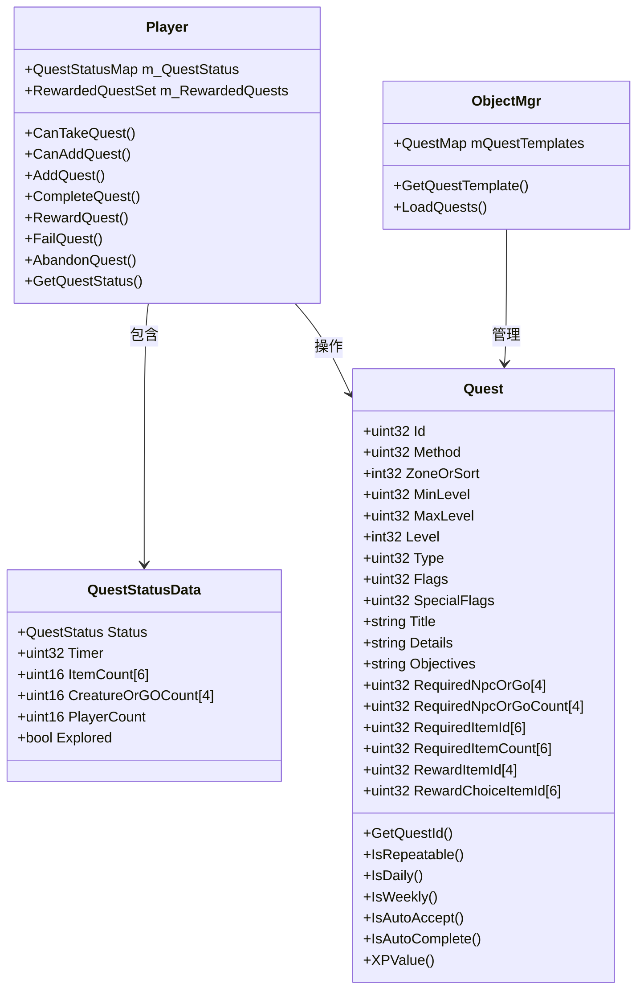

### 2.2 任务状态枚举

```cpp
enum QuestStatus : uint8
{
    QUEST_STATUS_NONE       = 0,  // 未接取
    QUEST_STATUS_COMPLETE   = 1,  // 已完成(可提交)
    QUEST_STATUS_INCOMPLETE = 3,  // 进行中
    QUEST_STATUS_FAILED     = 5,  // 失败
    QUEST_STATUS_REWARDED   = 6,  // 已领奖(仅内存使用)
};
```

### 2.3 任务标志

```cpp
enum QuestFlags
{
    QUEST_FLAGS_STAY_ALIVE          = 0x00000001,  // 完成任务期间必须存活
    QUEST_FLAGS_PARTY_ACCEPT        = 0x00000002,  // 队伍共享接受
    QUEST_FLAGS_SHARABLE            = 0x00000008,  // 可分享
    QUEST_FLAGS_RAID                = 0x00000040,  // 团队任务
    QUEST_FLAGS_HIDDEN_REWARDS      = 0x00000200,  // 隐藏奖励
    QUEST_FLAGS_TRACKING           = 0x00000400,  // 追踪任务(自动完成)
    QUEST_FLAGS_DAILY              = 0x00001000,  // 每日任务
    QUEST_FLAGS_FLAGS_PVP          = 0x00002000,  // 强制PVP
    QUEST_FLAGS_WEEKLY             = 0x00008000,  // 每周任务
    QUEST_FLAGS_AUTOCOMPLETE       = 0x00010000,  // 自动完成
    QUEST_FLAGS_AUTO_ACCEPT        = 0x00080000,  // 自动接受
};

enum QuestSpecialFlags
{
    QUEST_SPECIAL_FLAGS_REPEATABLE              = 0x0001,  // 可重复
    QUEST_SPECIAL_FLAGS_EXPLORATION_OR_EVENT    = 0x0002,  // 探索/事件
    QUEST_SPECIAL_FLAGS_AUTO_ACCEPT             = 0x0004,  // 自动接受
    QUEST_SPECIAL_FLAGS_DF_QUEST                = 0x0008,  // 随机副本任务
    QUEST_SPECIAL_FLAGS_MONTHLY                 = 0x0010,  // 每月任务
    QUEST_SPECIAL_FLAGS_CAST                    = 0x0020,  // 需要施法
    QUEST_SPECIAL_FLAGS_TIMED                   = 0x1000,  // 计时任务
};
```

---

## 3. 数据库表关系

### 3.1 数据库表关系图

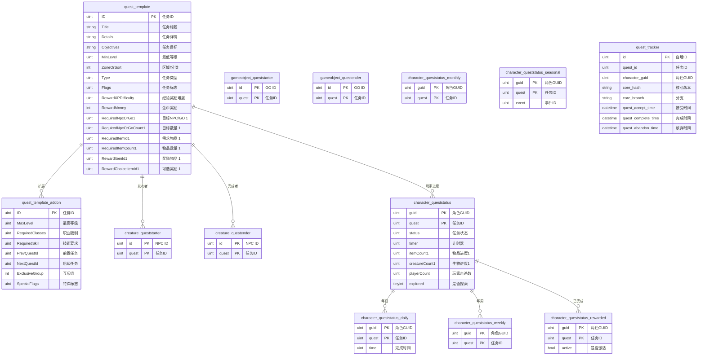

### 3.2 数据库表说明

| 数据库 | 表名 | 作用 |
|--------|------|------|
| db_world | `quest_template` | 任务模板主表，定义任务基本信息、目标、奖励 |
| db_world | `quest_template_addon` | 任务模板扩展表，定义前置任务、互斥组、特殊标志等 |
| db_world | `quest_template_locale` | 任务模板本地化表 |
| db_world | `quest_details` | 任务详情文本表 |
| db_world | `quest_offer_reward` | 任务奖励文本表 |
| db_world | `quest_request_items` | 任务请求物品文本表 |
| db_world | `quest_greeting` | 任务问候文本表 |
| db_world | `quest_poi` | 任务POI(兴趣点)表 |
| db_world | `quest_poi_points` | 任务POI坐标点表 |
| db_world | `creature_queststarter` | NPC任务发布关系表 |
| db_world | `creature_questender` | NPC任务完成关系表 |
| db_world | `gameobject_queststarter` | GO任务发布关系表 |
| db_world | `gameobject_questender` | GO任务完成关系表 |
| db_world | `creature_questitem` | NPC任务物品掉落表 |
| db_world | `gameobject_questitem` | GO任务物品掉落表 |
| db_characters | `character_queststatus` | 角色任务进度表 |
| db_characters | `character_queststatus_daily` | 每日任务完成记录 |
| db_characters | `character_queststatus_weekly` | 每周任务完成记录 |
| db_characters | `character_queststatus_monthly` | 每月任务完成记录 |
| db_characters | `character_queststatus_seasonal` | 季节任务完成记录 |
| db_characters | `character_queststatus_rewarded` | 已完成任务记录 |
| db_characters | `quest_tracker` | 任务追踪日志表 |

---

## 4. 任务生命周期

### 4.1 任务状态流转图

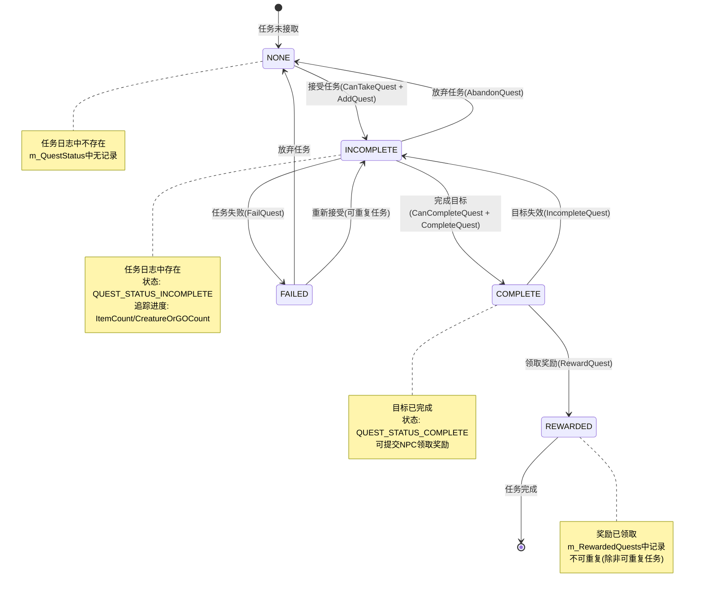

### 4.2 任务生命周期时序图

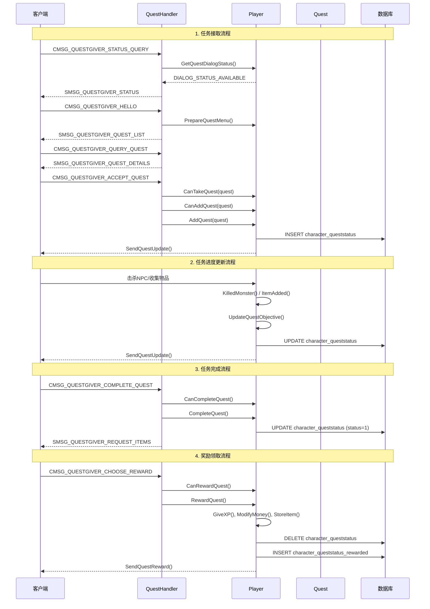

---

## 5. 核心流程详解

### 5.1 任务接取流程

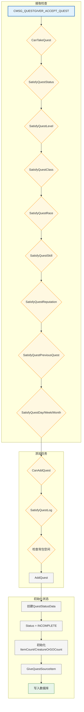

**关键函数**：

| 函数 | 位置 | 说明 |
|------|------|------|
| `CanTakeQuest()` | PlayerQuest.cpp:251 | 检查是否可以接取任务 |
| `CanAddQuest()` | PlayerQuest.cpp:265 | 检查任务日志是否有空位 |
| `AddQuest()` | PlayerQuest.cpp:508 | 添加任务到日志 |
| `SatisfyQuestStatus()` | Player.cpp | 检查任务状态(是否已完成) |
| `SatisfyQuestLevel()` | PlayerQuest.cpp:968 | 检查等级要求 |
| `SatisfyQuestPreviousQuest()` | Player.cpp | 检查前置任务 |

### 5.2 任务进度更新流程

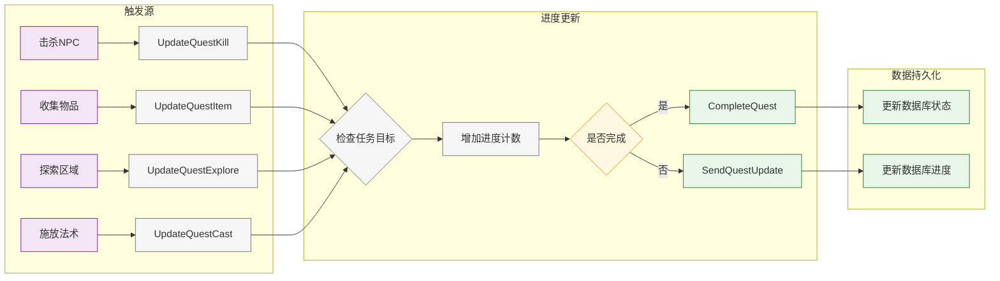

**进度更新函数**：

| 函数 | 说明 |
|------|------|
| `KilledMonster()` | 击杀怪物更新进度 |
| `TalkedToCreature()` | 与NPC对话更新进度 |
| `ItemAdded()` | 物品数量变化更新进度 |
| `AreaExplored()` | 探索区域更新进度 |
| `CastSpell()` | 施放法术更新进度 |

### 5.3 任务完成流程

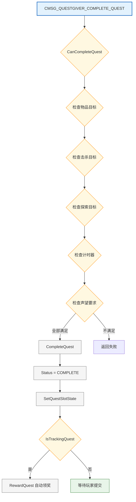

### 5.4 奖励领取流程

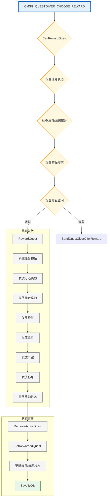

---

## 6. 网络消息处理

### 6.1 消息类型

| 消息 | 方向 | 说明 |
|------|------|------|
| `CMSG_QUESTGIVER_STATUS_QUERY` | C->S | 查询NPC任务状态 |
| `SMSG_QUESTGIVER_STATUS` | S->C | 返回NPC任务状态 |
| `CMSG_QUESTGIVER_HELLO` | C->S | 与NPC对话 |
| `SMSG_QUESTGIVER_QUEST_LIST` | S->C | 返回任务列表 |
| `CMSG_QUESTGIVER_QUERY_QUEST` | C->S | 查询任务详情 |
| `SMSG_QUESTGIVER_QUEST_DETAILS` | S->C | 返回任务详情 |
| `CMSG_QUESTGIVER_ACCEPT_QUEST` | C->S | 接受任务 |
| `CMSG_QUESTGIVER_COMPLETE_QUEST` | C->S | 完成任务 |
| `SMSG_QUESTGIVER_REQUEST_ITEMS` | S->C | 请求任务物品 |
| `CMSG_QUESTGIVER_CHOOSE_REWARD` | C->S | 选择奖励 |
| `SMSG_QUESTGIVER_OFFER_REWARD` | S->C | 显示奖励 |
| `CMSG_QUESTLOG_REMOVE_QUEST` | C->S | 放弃任务 |
| `CMSG_PUSHQUESTTOPARTY` | C->S | 分享任务给队伍 |
| `CMSG_QUEST_QUERY` | C->S | 查询任务信息 |
| `SMSG_QUEST_QUERY_RESPONSE` | S->C | 返回任务信息 |

### 6.2 Handler 函数列表

| 函数 | 文件位置 | 处理消息 |
|------|---------|---------|
| `HandleQuestgiverStatusQueryOpcode` | QuestHandler.cpp:35 | CMSG_QUESTGIVER_STATUS_QUERY |
| `HandleQuestgiverHelloOpcode` | QuestHandler.cpp:78 | CMSG_QUESTGIVER_HELLO |
| `HandleQuestgiverAcceptQuestOpcode` | QuestHandler.cpp:114 | CMSG_QUESTGIVER_ACCEPT_QUEST |
| `HandleQuestgiverQueryQuestOpcode` | QuestHandler.cpp:204 | CMSG_QUESTGIVER_QUERY_QUEST |
| `HandleQuestQueryOpcode` | QuestHandler.cpp:238 | CMSG_QUEST_QUERY |
| `HandleQuestgiverChooseRewardOpcode` | QuestHandler.cpp:251 | CMSG_QUESTGIVER_CHOOSE_REWARD |
| `HandleQuestgiverRequestRewardOpcode` | QuestHandler.cpp:356 | CMSG_QUESTGIVER_REQUEST_REWARD |
| `HandleQuestLogRemoveQuest` | QuestHandler.cpp:400 | CMSG_QUESTLOG_REMOVE_QUEST |
| `HandleQuestgiverCompleteQuest` | QuestHandler.cpp:488 | CMSG_QUESTGIVER_COMPLETE_QUEST |
| `HandlePushQuestToParty` | QuestHandler.cpp:539 | CMSG_PUSHQUESTTOPARTY |

---

## 7. 特殊任务类型

### 7.1 每日任务

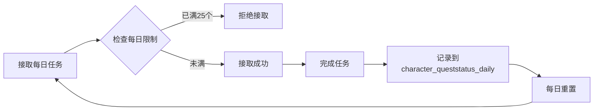

**特点**：
- 每天最多完成 25 个每日任务
- 每日服务器时间 03:00 重置
- 存储在 `character_queststatus_daily` 表

### 7.2 每周任务

**特点**：
- 每周重置一次
- 存储在 `character_queststatus_weekly` 表
- 通常与团队副本相关

### 7.3 计时任务

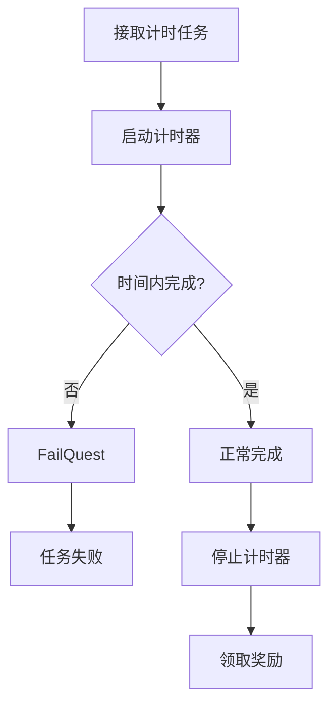

**特点**：
- 有时间限制（`TimeAllowed` 字段）
- 超时自动失败
- 显示倒计时 UI

### 7.4 任务链

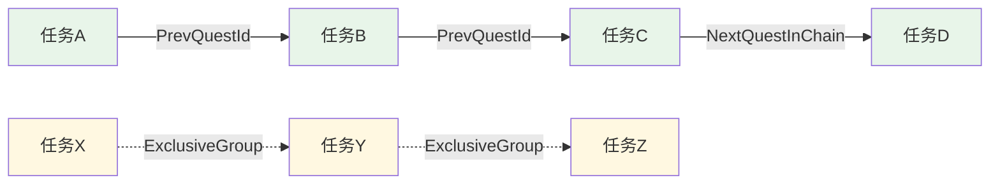

**关系类型**：
- **前置任务**：`PrevQuestId`，必须先完成前置任务
- **后续任务**：`NextQuestInChain`，完成后自动接取
- **互斥任务**：`ExclusiveGroup`，同组任务只能完成一个

---

## 8. 关键代码片段

### 8.1 接受任务

```cpp
// PlayerQuest.cpp:508
void Player::AddQuest(Quest const* quest, Object* questGiver)
{
    uint16 log_slot = FindQuestSlot(0);
    if (log_slot >= MAX_QUEST_LOG_SIZE)
        return;

    uint32 quest_id = quest->GetQuestId();
    
    // 创建任务状态数据
    QuestStatusData& questStatusData = m_QuestStatus[quest_id];
    questStatusData.Status = QUEST_STATUS_INCOMPLETE;
    questStatusData.Explored = false;
    
    // 初始化物品目标计数
    if (quest->HasSpecialFlag(QUEST_SPECIAL_FLAGS_DELIVER))
        for (uint8 i = 0; i < QUEST_ITEM_OBJECTIVES_COUNT; ++i)
            questStatusData.ItemCount[i] = 0;
    
    // 初始化击杀目标计数
    if (quest->HasSpecialFlag(QUEST_SPECIAL_FLAGS_KILL | QUEST_SPECIAL_FLAGS_CAST | QUEST_SPECIAL_FLAGS_SPEAKTO))
        for (uint8 i = 0; i < QUEST_OBJECTIVES_COUNT; ++i)
            questStatusData.CreatureOrGOCount[i] = 0;
    
    // 给予任务起始物品
    GiveQuestSourceItem(quest);
    
    // 设置任务日志槽位
    SetQuestSlot(log_slot, quest_id, qtime);
    
    // 标记需要保存
    m_QuestStatusSave[quest_id] = true;
}
```

### 8.2 完成任务

```cpp
// PlayerQuest.cpp:599
void Player::CompleteQuest(uint32 quest_id)
{
    if (!quest_id)
        return;

    // 设置状态为完成
    SetQuestStatus(quest_id, QUEST_STATUS_COMPLETE);
    
    // 更新任务日志槽位状态
    auto log_slot = FindQuestSlot(quest_id);
    if (log_slot < MAX_QUEST_LOG_SIZE)
        SetQuestSlotState(log_slot, QUEST_STATE_COMPLETE);
    
    // 追踪任务自动领奖
    Quest const* qInfo = sObjectMgr->GetQuestTemplate(quest_id);
    if (qInfo && qInfo->HasFlag(QUEST_FLAGS_TRACKING))
        RewardQuest(qInfo, 0, this, false);
}
```

### 8.3 领取奖励

```cpp
// PlayerQuest.cpp:660
void Player::RewardQuest(Quest const* quest, uint32 reward, Object* questGiver, bool announce, bool isLFGReward)
{
    uint32 quest_id = quest->GetQuestId();
    
    // 销毁任务物品
    for (uint8 i = 0; i < QUEST_ITEM_OBJECTIVES_COUNT; ++i)
        DestroyItemCount(quest->RequiredItemId[i], quest->RequiredItemCount[i], true);
    
    // 发放可选奖励
    if (quest->GetRewChoiceItemsCount() > 0)
        if (uint32 itemId = quest->RewardChoiceItemId[reward])
            StoreNewItem(dest, itemId, true);
    
    // 发放固定奖励
    if (quest->GetRewItemsCount() > 0)
        for (uint32 i = 0; i < quest->GetRewItemsCount(); ++i)
            if (uint32 itemId = quest->RewardItemId[i])
                StoreNewItem(dest, itemId, true);
    
    // 发放声望
    RewardReputation(quest);
    
    // 发放经验
    uint32 XP = CalculateQuestRewardXP(quest);
    GiveXP(XP, nullptr, 1.0f, isLFGReward);
    
    // 发放金币
    if (int32 rewOrReqMoney = quest->GetRewOrReqMoney(GetLevel()))
        ModifyMoney(rewOrReqMoney);
    
    // 更新每日/每周状态
    if (quest->IsDaily())
        SetDailyQuestStatus(quest_id);
    else if (quest->IsWeekly())
        SetWeeklyQuestStatus(quest_id);
    
    // 移除活动任务，标记为已完成
    RemoveActiveQuest(quest_id, false);
    SetRewardedQuest(quest_id);
}
```

---

## 9. 总结

### 9.1 系统特点

1. **模块化设计**：任务定义、状态管理、网络处理分离
2. **灵活的目标类型**：支持击杀、收集、探索、施法等多种目标
3. **丰富的任务类型**：支持普通、每日、每周、每月、季节性任务
4. **完善的任务链**：支持前置任务、后续任务、互斥任务
5. **自动完成机制**：支持追踪任务、自动接受、自动完成

### 9.2 数据流向

```
quest_template (定义) 
    ↓
ObjectMgr (加载到内存)
    ↓
Player::m_QuestStatus (运行时状态)
    ↓
character_queststatus (持久化)
    ↓
character_queststatus_rewarded (完成记录)
```

### 9.3 关键文件

| 文件 | 说明 |
|------|------|
| `QuestDef.h/cpp` | 任务定义类 |
| `QuestHandler.cpp` | 网络消息处理 |
| `PlayerQuest.cpp` | 玩家任务操作 |
| `GossipDef.cpp` | 任务对话界面 |

---

*本文档基于 AzerothCore WotLK 源代码分析生成*
