# AzerothCore 脚本(Scripting)系统深度分析

## 目录

- [1. 概述](#1-概述)
- [2. 目录结构与文件清单](#2-目录结构与文件清单)
- [3. 核心类架构](#3-核心类架构)
- [4. 脚本类型分类体系](#4-脚本类型分类体系)
- [5. 脚本注册与生命周期](#5-脚本注册与生命周期)
- [6. Hook 分发机制](#6-hook-分发机制)
- [7. 数据库绑定脚本与名称解析](#7-数据库绑定脚本与名称解析)
- [8. 数据库表结构](#8-数据库表结构)
- [9. 数据库驱动的脚本命令系统](#9-数据库驱动的脚本命令系统)
- [10. SmartAI 与脚本系统的关系](#10-smartai-与脚本系统的关系)
- [11. 设计模式分析](#11-设计模式分析)
- [12. 关键文件索引](#12-关键文件索引)
- [13. 总结](#13-总结)

---

## 1. 概述

**分析目标**: `src/server/game/Scripting` 模块
**分析范围**: Scripting 目录全部文件、ScriptDefines 子目录 37 种脚本类型、MapScripts 数据库脚本引擎、相关数据库表
**分析重点**: 脚本注册流程、Hook 分发机制、数据库绑定关系、DB 驱动脚本命令系统

AzerothCore 的脚本系统是一个 **双轨制架构**：

1. **C++ Hook 系统** — 通过继承 `ScriptObject` 子类实现自定义逻辑，运行时由 `ScriptMgr` 分发调用。这是扩展游戏行为的主要方式。
2. **数据库脚本命令系统** — 通过 `event_scripts` / `spell_scripts` / `waypoint_scripts` 三张表定义命令序列，由 `Map::ScriptsProcess()` 按时间调度执行。适用于简单的、数据驱动的脚本场景。

两大系统互不干扰但可协同工作，例如 C++ Hook 中可通过 `ScriptsStart()` 触发数据库脚本命令。

---

## 2. 目录结构与文件清单

```
src/server/game/Scripting/
├── ScriptMgr.h              # 脚本管理器(单例)，声明所有 Hook 分发方法
├── ScriptMgr.cpp            # ScriptMgr 实现：初始化、加载、卸载
├── ScriptObject.h           # 脚本基类 ScriptObject + UpdatableScript/MapScript 模板
├── ScriptObject.cpp         # MapScript 模板实例化
├── ScriptObjectFwd.h        # 前向声明(所有游戏类/枚举/结构体)
├── ScriptMgrMacros.h        # Hook 分发宏和辅助模板
├── ScriptSystem.h           # SystemMgr 单例 + ScriptPointMove 结构
├── ScriptSystem.cpp         # 加载 script_waypoint 数据库数据
├── MapScripts.cpp           # 数据库脚本命令执行引擎
└── ScriptDefines/           # 37 种脚本类型定义(每种 .h + .cpp)
    ├── AccountScript.h/.cpp
    ├── AchievementCriteriaScript.h/.cpp
    ├── AchievementScript.h/.cpp
    ├── ALEScript.h/.cpp
    ├── AllBattlegroundScript.h/.cpp
    ├── AllCommandScript.h/.cpp
    ├── AllCreatureScript.h/.cpp
    ├── AllGameObjectScript.h/.cpp
    ├── AllItemScript.h/.cpp
    ├── AllMapScript.h/.cpp
    ├── AllSpellScript.h/.cpp
    ├── AreaTriggerScript.h/.cpp
    ├── ArenaScript.h/.cpp
    ├── ArenaTeamScript.h/.cpp
    ├── AuctionHouseScript.h/.cpp
    ├── BattlegroundMapScript.h/.cpp
    ├── BattlegroundScript.h/.cpp
    ├── BattlefieldScript.h/.cpp
    ├── CommandScript.h/.cpp
    ├── ConditionScript.h/.cpp
    ├── CreatureScript.h/.cpp
    ├── DatabaseScript.h/.cpp
    ├── DynamicObjectScript.h/.cpp
    ├── FormulaScript.h/.cpp
    ├── GameEventScript.h/.cpp
    ├── GameObjectScript.h/.cpp
    ├── GlobalScript.h/.cpp
    ├── GroupScript.h/.cpp
    ├── GuildScript.h/.cpp
    ├── InstanceMapScript.h/.cpp
    ├── ItemScript.h/.cpp
    ├── LootScript.h/.cpp
    ├── MailScript.h/.cpp
    ├── MiscScript.h/.cpp
    ├── ModuleScript.h/.cpp
    ├── MovementHandlerScript.h/.cpp
    ├── OutdoorPvPScript.h/.cpp
    ├── PetScript.h/.cpp
    ├── PlayerScript.h/.cpp
    ├── ServerScript.h/.cpp
    ├── SpellScriptLoader.h/.cpp
    ├── TicketScript.h/.cpp
    ├── TransportScript.h/.cpp
    ├── UnitScript.h/.cpp
    ├── VehicleScript.h/.cpp
    ├── WeatherScript.h/.cpp
    ├── WorldMapScript.h/.cpp
    ├── WorldObjectScript.h/.cpp
    ├── WorldScript.h/.cpp
    └── AllScriptsObjects.h   # 便捷头文件，include 全部脚本类型
```

---

## 3. 核心类架构

### 3.1 类继承体系

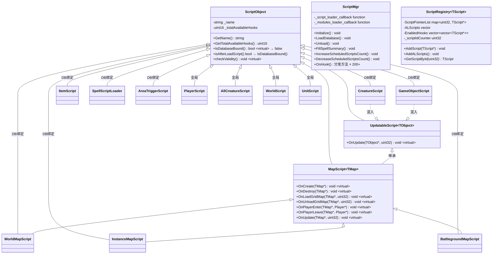

### 3.2 ScriptObject — 万物之源

`ScriptObject` 是所有脚本类型的根基类，核心属性只有两个：

| 属性 | 类型 | 说明 |
|------|------|------|
| `_name` | `string` | 脚本名称，用于与数据库 ScriptName 字段匹配 |
| `_totalAvailableHooks` | `uint16` | 该脚本类型可用的 Hook 总数，用于 EnabledHooks 优化 |

关键虚方法：

| 方法 | 默认行为 | 说明 |
|------|----------|------|
| `IsDatabaseBound()` | `false` | 是否绑定到数据库实体，决定注册时机 |
| `isAfterLoadScript()` | `= IsDatabaseBound()` | 是否在数据库加载后注册 |
| `checkValidity()` | 空操作 | 脚本有效性检查，加载后调用 |

### 3.3 ScriptMgr — 中央调度器

`ScriptMgr` 是一个单例（通过 `sScriptMgr` 访问），职责包括：

1. 持有脚本加载器回调
2. 声明 200+ 个 Hook 分发方法（每种脚本类型的每个 Hook 对应一个）
3. 管理脚本计数（用于安全关闭检查）

### 3.4 ScriptRegistry\<TScript\> — 类型化注册表

每种脚本类型 T 都有一个对应的 `ScriptRegistry<T>` 静态实例，维护该类型的所有注册脚本。这是 CRTP 模式的应用——通过模板参数区分不同类型的注册表。

| 容器 | 类型 | 说明 |
|------|------|------|
| `ScriptPointerList` | `map<uint32, TScript*>` | ID → 脚本实例映射 |
| `ALScripts` | `vector<pair<TScript*, vector<uint16>>>` | 延迟加载脚本（DB 绑定），pair 中 vector 保存 enabled hooks |
| `EnabledHooks` | `vector<vector<TScript*>>` | 按 Hook 索引分组的活跃脚本列表（仅非 DB 绑定脚本使用） |

`ALScripts` 中的 `vector<uint16>` 存储了 DB 绑定脚本所覆写的 Hook 索引列表。这些 hooks 在 `AddALScripts()` 执行时才会被填充到 `EnabledHooks`，使得 DB 绑定脚本在注册完成后也能受益于 EnabledHooks 优化。

---

## 4. 脚本类型分类体系

### 4.1 数据库绑定脚本 vs 全局脚本

这是脚本系统最重要的分类维度。

```mermaid
graph TD
    subgraph DB绑定["数据库绑定脚本 (IsDatabaseBound=true)"]
        CS[CreatureScript<br/>绑定 creature_template.ScriptName]
        GS[GameObjectScript<br/>绑定 gameobject_template.ScriptName]
        IS[ItemScript<br/>绑定 item_template.ScriptName]
        SSL[SpellScriptLoader<br/>绑定 spell_script_names.ScriptName]
        ATS[AreaTriggerScript<br/>绑定 areatrigger_scripts.ScriptName]
        IMS[InstanceMapScript<br/>绑定 instance_template.script]
        WMS[WorldMapScript<br/>绑定 map ID]
        BMS[BattlegroundMapScript<br/>绑定 map ID]
        BS[BattlegroundScript<br/>绑定 ScriptName]
        OPS[OutdoorPvPScript<br/>绑定 outdoorpvp_template.ScriptName]
        WS[WeatherScript<br/>绑定 ScriptName]
        TS[TransportScript<br/>绑定 ScriptName]
        VS[VehicleScript<br/>绑定 ScriptName]
        COS[CommandScript<br/>绑定 ScriptName]
        CNS[ConditionScript<br/>绑定 ScriptName]
        ACS[AchievementCriteriaScript<br/>绑定 ScriptName]
        DOS[DynamicObjectScript<br/>绑定 ScriptName]
    end

    subgraph 全局脚本["全局脚本 (IsDatabaseBound=false)"]
        PS[PlayerScript<br/>所有玩家事件]
        ACS2[AllCreatureScript<br/>所有生物事件]
        AGOS[AllGameObjectScript<br/>所有GO事件]
        AIS[AllItemScript<br/>所有物品事件]
        AMS[AllMapScript<br/>所有地图事件]
        ASS[AllSpellScript<br/>所有法术事件]
        ABS[AllBattlegroundScript<br/>所有战场事件]
        ACOS2[AllCommandScript<br/>所有命令事件]
        WOS[WorldScript<br/>世界级事件]
        SES[ServerScript<br/>网络事件]
        FS[FormulaScript<br/>公式覆盖]
        GLS[GlobalScript<br/>全局Hook]
        US[UnitScript<br/>所有Unit事件]
        ACS3[AccountScript<br/>账号事件]
        GUS[GuildScript<br/>公会事件]
        GRS[GroupScript<br/>队伍事件]
        ARS[ArenaScript<br/>竞技场事件]
        AHS[AuctionHouseScript<br/>拍卖行事件]
        DBS[DatabaseScript<br/>DB加载事件]
        GES[GameEventScript<br/>游戏事件]
        MS[MailScript<br/>邮件拦截]
        MIS[MiscScript<br/>杂项Hook]
        MHS[MovementHandlerScript<br/>移动处理]
        PES[PetScript<br/>宠物事件]
        TIS[TicketScript<br/>GM工单]
        BFS[BattlefieldScript<br/>冬拥湖]
        LS[LootScript<br/>拾取金钱]
        WOS2[WorldObjectScript<br/>世界对象生命周期]
        MOS[ModuleScript<br/>模块自定义]
        ALES[ALEScript<br/>加载后事件]
    end
```

### 4.2 "All" 脚本与特定脚本的协作模式

对于同时拥有 "All" 变体和特定变体的脚本类型（如 `AllCreatureScript` + `CreatureScript`），分发时采用 **先拦截后执行** 的两层模式：

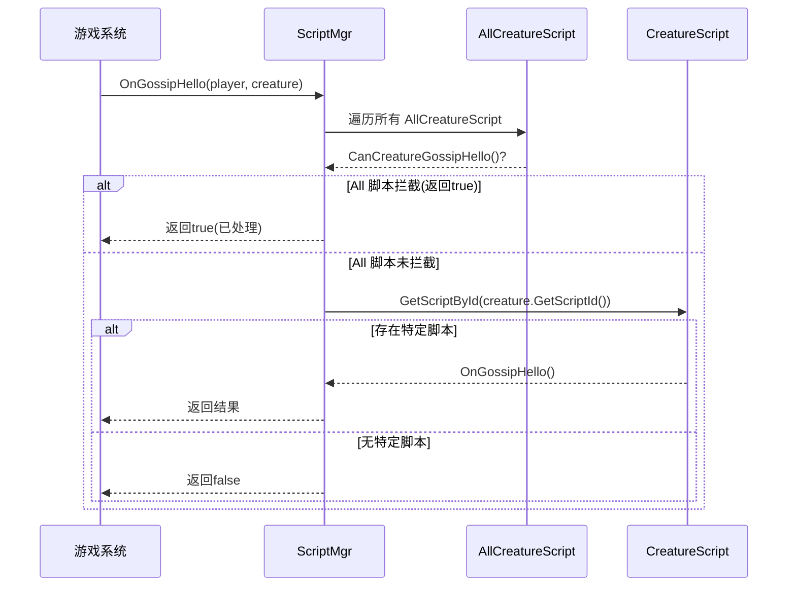

### 4.3 37 种脚本类型一览

| 脚本类型 | DB绑定 | 关联实体 | 主要 Hook 场景 |
|----------|--------|----------|----------------|
| CreatureScript | ✓ | 生物 | AI、Gossip、任务、战斗 |
| GameObjectScript | ✓ | 游戏对象 | Gossip、任务、AI、伤害、Loot |
| ItemScript | ✓ | 物品 | 任务接受、使用、过期 |
| SpellScriptLoader | ✓ | 法术 | 法术施放、光环应用 |
| AreaTriggerScript | ✓ | 区域触发器 | 玩家进入触发器 |
| InstanceMapScript | ✓ | 副本地图 | 副本脚本创建 |
| WorldMapScript | ✓ | 世界地图 | 世界地图事件 |
| BattlegroundMapScript | ✓ | 战场地图 | 战场地图事件 |
| BattlegroundScript | ✓ | 战场 | 自定义战场对象创建 |
| OutdoorPvPScript | ✓ | 野外PvP | 野外PvP对象创建 |
| WeatherScript | ✓ | 天气 | 天气变更、更新 |
| TransportScript | ✓ | 载具 | 乘客管理、更新 |
| VehicleScript | ✓ | 载具 | 安装、卸载、乘客 |
| CommandScript | ✓ | GM命令 | 自定义聊天命令 |
| ConditionScript | ✓ | 条件 | 自定义条件检查 |
| AchievementCriteriaScript | ✓ | 成就 | 脚本化成就条件 |
| DynamicObjectScript | ✓ | 动态对象 | 动态对象更新 |
| PlayerScript | ✗ | — | 玩家全生命周期事件(100+ Hook) |
| AllCreatureScript | ✗ | — | 所有生物事件拦截 |
| AllGameObjectScript | ✗ | — | 所有GO事件拦截 |
| AllItemScript | ✗ | — | 所有物品事件拦截 |
| AllMapScript | ✗ | — | 所有地图事件拦截 |
| AllSpellScript | ✗ | — | 所有法术事件拦截 |
| AllBattlegroundScript | ✗ | — | 所有战场事件拦截 |
| AllCommandScript | ✗ | — | 命令执行拦截 |
| WorldScript | ✗ | — | 世界级事件(MOTD、关服、更新) |
| ServerScript | ✗ | — | 网络事件(Socket、包过滤) |
| FormulaScript | ✗ | — | 公式覆盖(荣誉、经验、竞技场) |
| GlobalScript | ✗ | — | 全局Hook(Loot、副本、法术) |
| UnitScript | ✗ | — | 所有Unit事件(伤害、治疗、光环) |
| AccountScript | ✗ | — | 账号事件(登录、删除) |
| GuildScript | ✗ | — | 公会事件 |
| GroupScript | ✗ | — | 队伍事件 |
| ArenaScript | ✗ | — | 竞技场事件 |
| ArenaTeamScript | ✗ | — | 竞技场队伍事件 |
| AuctionHouseScript | ✗ | — | 拍卖行事件 |
| DatabaseScript | ✗ | — | 数据库加载后事件 |
| GameEventScript | ✗ | — | 游戏事件启停 |
| MailScript | ✗ | — | 邮件拦截 |
| MiscScript | ✗ | — | 杂项(对象创建、灵魂绑定等) |
| MovementHandlerScript | ✗ | — | 移动包处理 |
| PetScript | ✗ | — | 宠物/守卫者事件 |
| TicketScript | ✗ | — | GM工单事件 |
| BattlefieldScript | ✗ | — | 冬拥湖事件 |
| LootScript | ✗ | — | 金钱拾取 |
| WorldObjectScript | ✗ | — | 世界对象生命周期 |
| ModuleScript | ✗ | — | 模块自定义Hook基类 |
| ALEScript | ✗ | — | 加载后事件(天气、触发器) |

---

## 5. 脚本注册与生命周期

### 5.1 完整生命周期流程

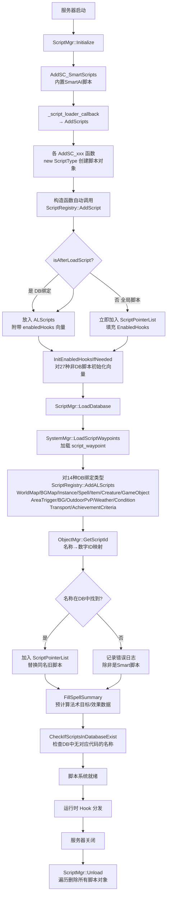

### 5.2 注册时序

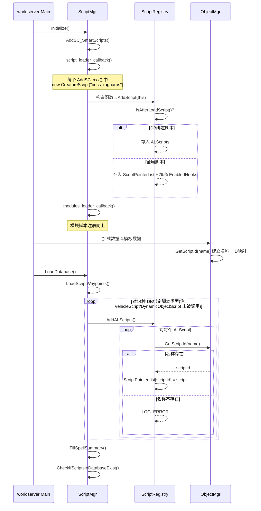

### 5.3 便捷注册宏

脚本系统提供了一组宏来简化常见注册模式：

| 宏 | 用途 | 等价代码 |
|----|------|----------|
| `RegisterCreatureAI(AI)` | 注册带AI的生物脚本 | `new GenericCreatureScript<AI>(#AI)` |
| `RegisterCreatureAIWithFactory(AI, fn)` | 注册带工厂函数的生物脚本 | `new FactoryCreatureScript<AI, fn>(#AI)` |
| `RegisterSpellScript(SS)` | 注册法术脚本 | `new GenericSpellAndAuraScriptLoader<SS>(#SS)` |
| `RegisterSpellScriptWithArgs(SS, name, ...)` | 注册带参数的法术脚本 | 带自定义名称和模板参数 |
| `RegisterSpellAndAuraScriptPair(S1, S2)` | 注册法术+光环脚本对 | 同时注册两种脚本 |
| `RegisterInstanceScript(IS, mapId)` | 注册副本脚本 | `new GenericInstanceMapScript<IS>(name, mapId)` |

---

## 6. Hook 分发机制

### 6.1 三种分发模式

`ScriptMgrMacros.h` 定义了三种核心分发宏，用于不同返回值类型的 Hook：

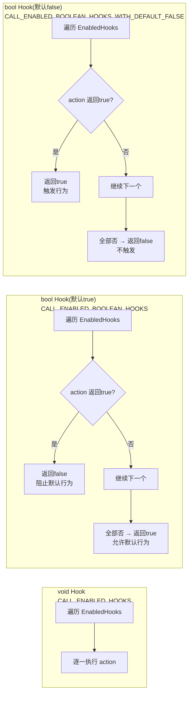

| 分发模式 | 适用场景 | 默认返回值 | 含义 |
|----------|----------|------------|------|
| `CALL_ENABLED_HOOKS` | 无返回值 Hook | — | 通知所有注册脚本 |
| `CALL_ENABLED_BOOLEAN_HOOKS` | 拦截型 Hook | `true` | 默认允许，任一脚本返回true则阻止 |
| `CALL_ENABLED_BOOLEAN_HOOKS_WITH_DEFAULT_FALSE` | 触发型 Hook | `false` | 默认不触发，任一脚本返回true则触发 |

### 6.2 EnabledHooks 优化

`EnabledHooks` 是按 Hook 枚举索引分组的脚本列表。**只有非 DB 绑定脚本类型享受此优化**（如 `PlayerScript`、`AllCreatureScript` 等 28 种全局脚本）。DB 绑定脚本（如 `CreatureScript`）通过按 ID 直接查找，不走 EnabledHooks 路径。

对于非 DB 绑定脚本，只有实际覆写了某个 Hook 方法的脚本才会被放入对应的 `EnabledHooks[hookIndex]`，避免了遍历不相关脚本的开销。这通过在构造函数中传递 `enabledHooks` 向量实现：

```cpp
// 非 DB 绑定脚本(如 PlayerScript)构造函数中:
ScriptRegistry<PlayerScript>::AddScript(this, std::move(enabledHooks));

// DB 绑定脚本(如 CreatureScript)构造函数中 — 无 enabledHooks:
ScriptRegistry<CreatureScript>::AddScript(this);
```

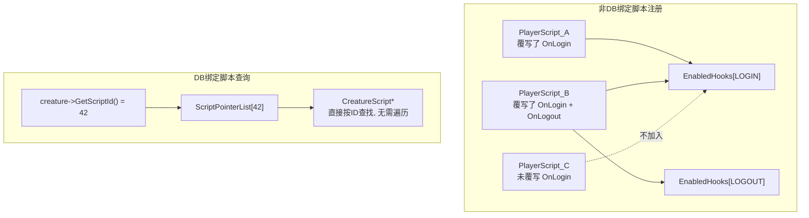

### 6.3 辅助模板函数

这三种模板函数主要用于 **非 DB 绑定脚本**（如 AllCreatureScript、PlayerScript 等）的分发，也是文档中 "All 脚本拦截" 机制的核心实现：

| 模板 | 用途 | 遍历方式 |
|------|------|----------|
| `IsValidBoolScript<T>(hook)` | 遍历 T 类型全部脚本，返回 `Optional<bool>` | 遍历 `ScriptPointerList` 全部条目 |
| `GetReturnAIScript<T, AI>(hook)` | 遍历 T 类型脚本获取AI指针，返回第一个非null结果 | 遍历 `ScriptPointerList` 全部条目 |
| `ExecuteScript<T>(hook)` | 对 T 类型所有脚本执行操作 | 遍历 `ScriptPointerList` 全部条目 |

注意：这三者遍历的是 `ScriptPointerList` 全部条目，**不使用 EnabledHooks 优化**。这是因为 All* 脚本数量通常很少（每个模块可能只注册一两个），全局遍历的开销可忽略。

---

## 7. 数据库绑定脚本与名称解析

### 7.1 名称解析流程

数据库绑定脚本的核心问题是：如何将数据库中的 `ScriptName` 字符串与 C++ 代码中创建的脚本对象关联起来？

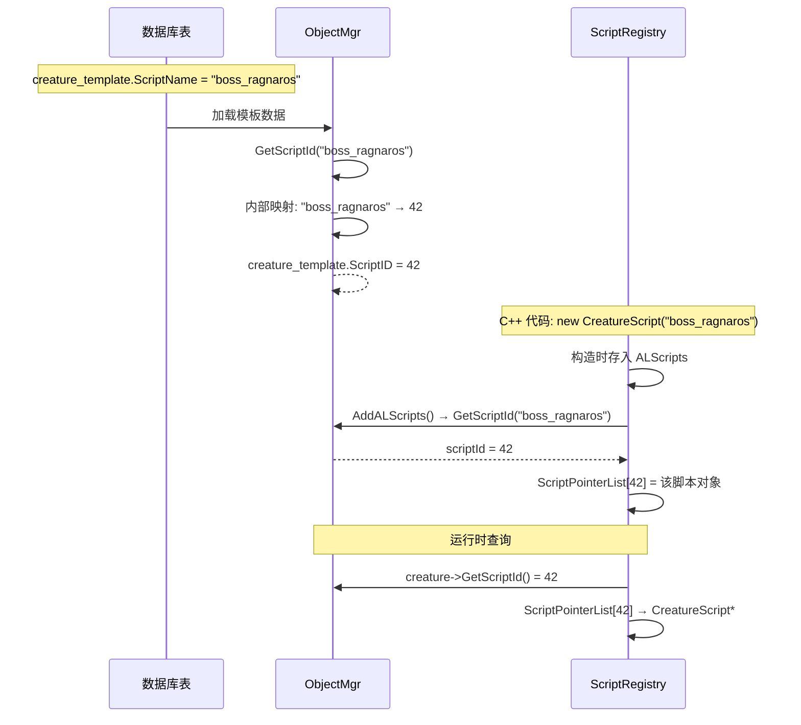

### 7.2 模块覆盖机制

`AddALScripts()` 中有一个重要特性：如果同一脚本名称已有注册的脚本对象，新注册的对象会替换旧对象。这允许模块(Mod)覆盖核心脚本的行为。

覆盖过程包括：
1. 遍历 `ScriptPointerList` 查找同名脚本
2. 如果找到，从 `EnabledHooks` 中移除旧脚本的引用
3. 删除旧脚本对象（`delete oldScript`）
4. 将新脚本放入 `ScriptPointerList[id]`
5. 将新脚本的 enabledHooks 填充到 `EnabledHooks`
6. 仅在新脚本时才增加 `_scriptCount`（避免计数膨胀）

---

## 8. 数据库表结构

### 8.1 脚本名称绑定表

这些表通过 `ScriptName` / `script` 字段将数据库实体与 C++ 脚本关联。

| 数据库表 | 关联字段 | 字段类型 | 绑定脚本类型 | 说明 |
|----------|----------|----------|-------------|------|
| `creature_template` | `ScriptName` | `char(64)` | CreatureScript | 生物模板的脚本名 |
| `gameobject_template` | `ScriptName` | `varchar(64)` | GameObjectScript | 游戏对象模板的脚本名 |
| `item_template` | `ScriptName` | `varchar(64)` | ItemScript | 物品模板的脚本名 |
| `instance_template` | `script` | `varchar(128)` | InstanceMapScript | 副本模板的脚本名(注意字段名不同) |
| `outdoorpvp_template` | `ScriptName` | `char(64)` | OutdoorPvPScript | 野外PvP模板的脚本名 |
| `areatrigger_scripts` | `ScriptName` | `char(64)` | AreaTriggerScript | 区域触发器脚本名 |
| `spell_script_names` | `ScriptName` | `char(64)` | SpellScriptLoader | 法术脚本名(支持多脚本/法术) |

### 8.2 核心绑定表详细结构

#### creature_template (ScriptName 字段)

```
ScriptName  char(64)  NOT NULL DEFAULT ''
```
- 与 `CreatureScript` 绑定
- 空字符串表示无脚本
- 通常设置为 Boss 的 AI 脚本名，如 `boss_ragnaros`

#### spell_script_names

| 字段 | 类型 | 说明 |
|------|------|------|
| `spell_id` | `int` | 法术 ID |
| `ScriptName` | `char(64)` | 脚本名称 |

- **唯一约束**: `(spell_id, ScriptName)` — 允许一个法术绑定多个脚本
- 这是最灵活的绑定表，因为一个法术可以有多个 SpellScript 处理不同效果

#### areatrigger_scripts

| 字段 | 类型 | 说明 |
|------|------|------|
| `entry` | `int` | 区域触发器 ID (主键) |
| `ScriptName` | `char(64)` | 脚本名称 |

- 每个区域触发器只能绑定一个脚本

#### instance_template (script 字段)

| 字段 | 类型 | 说明 |
|------|------|------|
| `map` | `smallint unsigned` | 地图 ID (主键) |
| `parent` | `smallint unsigned` | 父地图 ID |
| `script` | `varchar(128)` | 脚本名称 |
| `allowMount` | `tinyint unsigned` | 是否允许坐骑 |

- 注意：此表使用 `script` 而非 `ScriptName`，且长度为 128 而非 64

#### outdoorpvp_template

| 字段 | 类型 | 说明 |
|------|------|------|
| `TypeId` | `tinyint unsigned` | 类型 ID (主键) |
| `ScriptName` | `char(64)` | 脚本名称 |
| `comment` | `text` | 注释 |

### 8.3 数据库驱动脚本命令表

这组表定义了数据驱动的脚本命令序列，由 `Map::ScriptsProcess()` 执行。

#### event_scripts — 事件触发脚本

| 字段 | 类型 | 默认值 | 映射 | 说明 |
|------|------|--------|------|------|
| `id` | `int unsigned` | 0 | — | 事件 ID |
| `delay` | `int unsigned` | 0 | — | 延迟(秒) |
| `command` | `int unsigned` | 0 | ScriptCommands 枚举 | 命令类型 |
| `datalong` | `int unsigned` | 0 | 命令参数1 | 含义随命令变化 |
| `datalong2` | `int unsigned` | 0 | 命令参数2 | 含义随命令变化 |
| `dataint` | `int` | 0 | 命令参数3 | 含义随命令变化 |
| `x` | `float` | 0 | 坐标 X | 位置相关命令 |
| `y` | `float` | 0 | 坐标 Y | 位置相关命令 |
| `z` | `float` | 0 | 坐标 Z | 位置相关命令 |
| `o` | `float` | 0 | 朝向 | 位置相关命令 |

#### spell_scripts — 法术触发脚本

与 `event_scripts` 结构相同，额外增加：

| 字段 | 类型 | 默认值 | 说明 |
|------|------|--------|------|
| `effIndex` | `tinyint unsigned` | 0 | 法术效果索引 |

- `id` 对应法术 ID，`effIndex` 对应法术效果索引

#### waypoint_scripts — 路径点脚本

与 `event_scripts` 结构相同，额外增加：

| 字段 | 类型 | 默认值 | 说明 |
|------|------|--------|------|
| `guid` | `int` | 0 | 主键(自增) |

### 8.4 辅助表

#### script_waypoint — 脚本路径点

| 字段 | 类型 | 默认值 | 说明 |
|------|------|--------|------|
| `entry` | `int unsigned` | 0 | 生物模板 entry |
| `pointid` | `int unsigned` | 0 | 路径点序号 |
| `location_x` | `float` | 0 | X 坐标 |
| `location_y` | `float` | 0 | Y 坐标 |
| `location_z` | `float` | 0 | Z 坐标 |
| `waittime` | `int unsigned` | 0 | 等待时间(毫秒) |
| `point_comment` | `text` | — | 路径点注释 |

- **主键**: `(entry, pointid)`
- 由 `SystemMgr::LoadScriptWaypoints()` 加载
- 用于 C++ 脚本中的护送任务等场景

#### smart_scripts — SmartAI 脚本

| 字段 | 类型 | 说明 |
|------|------|------|
| `entryorguid` | `int` | 实体 entry 或 GUID |
| `source_type` | `tinyint unsigned` | 来源类型(0=生物,1=GO,2=Aura...) |
| `id` | `smallint unsigned` | 规则 ID |
| `link` | `smallint unsigned` | 关联规则 ID |
| `event_type` | `tinyint unsigned` | 事件类型 |
| `event_phase_mask` | `smallint unsigned` | 阶段掩码 |
| `event_chance` | `tinyint unsigned` | 触发概率(%) |
| `event_flags` | `smallint unsigned` | 事件标志 |
| `event_param1~6` | `int unsigned` | 事件参数 |
| `action_type` | `tinyint unsigned` | 动作类型 |
| `action_param1~6` | `int unsigned` | 动作参数 |
| `target_type` | `tinyint unsigned` | 目标类型 |
| `target_param1~4` | `int unsigned` | 目标参数 |
| `target_x/y/z/o` | `float` | 目标坐标/朝向 |
| `comment` | `text` | 注释 |

- **主键**: `(entryorguid, source_type, id, link)`
- SmartAI 是最常用的脚本系统，由 `SmartScript` 类处理，不属于 Scripting 模块的 Hook 系统，但通过 `CreatureScript` 注册

### 8.5 数据库表与脚本类型关系总图

```mermaid
erDiagram
    creature_template ||--o| CreatureScript : "ScriptName"
    gameobject_template ||--o| GameObjectScript : "ScriptName"
    item_template ||--o| ItemScript : "ScriptName"
    instance_template ||--o| InstanceMapScript : "script"
    outdoorpvp_template ||--o| OutdoorPvPScript : "ScriptName"
    areatrigger_scripts ||--o| AreaTriggerScript : "ScriptName"
    spell_script_names ||--o{ SpellScriptLoader : "ScriptName"

    event_scripts ||--o{ ScriptInfo : "id → 命令序列"
    spell_scripts ||--o{ ScriptInfo : "id+effIndex → 命令序列"
    waypoint_scripts ||--o{ ScriptInfo : "id → 命令序列"
    script_waypoint ||--o{ ScriptPointMove : "entry → 路径点序列"
    smart_scripts ||--o{ SmartScript : "entryorguid → SAI规则"

    creature_template {
        int entry PK
        char64 ScriptName "绑定 CreatureScript"
    }
    gameobject_template {
        int entry PK
        varchar64 ScriptName "绑定 GameObjectScript"
    }
    item_template {
        int entry PK
        varchar64 ScriptName "绑定 ItemScript"
    }
    instance_template {
        smallint map PK
        varchar128 script "绑定 InstanceMapScript"
    }
    outdoorpvp_template {
        tinyint TypeId PK
        char64 ScriptName "绑定 OutdoorPvPScript"
    }
    areatrigger_scripts {
        int entry PK
        char64 ScriptName "绑定 AreaTriggerScript"
    }
    spell_script_names {
        int spell_id
        char64 ScriptName "绑定 SpellScriptLoader"
    }
    event_scripts {
        int id "事件ID"
        int delay "延迟(秒)"
        int command "命令类型"
        int datalong "参数1"
        int datalong2 "参数2"
        int dataint "参数3"
        float x "坐标X"
        float y "坐标Y"
        float z "坐标Z"
        float o "朝向"
    }
    script_waypoint {
        int entry "生物Entry"
        int pointid "路径点序号"
        float location_x "X"
        float location_y "Y"
        float location_z "Z"
        int waittime "等待时间(ms)"
    }
    smart_scripts {
        int entryorguid "实体/GUID"
        tinyint source_type "来源类型"
        smallint id "规则ID"
        tinyint event_type "事件类型"
        tinyint action_type "动作类型"
        tinyint target_type "目标类型"
    }
```

---

## 9. 数据库驱动的脚本命令系统

### 9.1 概述

数据库脚本命令系统是独立于 C++ Hook 系统的第二套脚本机制，通过 `MapScripts.cpp` 实现。它从三张表（`event_scripts`、`spell_scripts`、`waypoint_scripts`）加载命令序列，按时间调度执行。

### 9.2 三种脚本来源

| ScriptsType 枚举 | 值 | 数据库表 | 触发场景 |
|------------------|---|----------|----------|
| `SCRIPTS_SPELL` | 1 | `spell_scripts` | 法术效果触发 |
| `SCRIPTS_EVENT` | 2 | `event_scripts` | 游戏事件触发 |
| `SCRIPTS_WAYPOINT` | 3 | `waypoint_scripts` | 路径点到达触发 |

### 9.3 命令执行流程

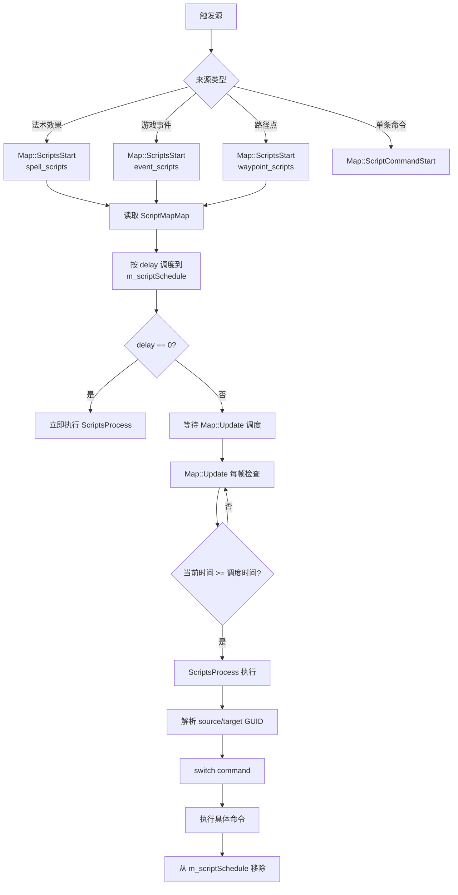

### 9.4 完整命令列表

| 值 | 命令 | Source | Target | 参数说明 |
|----|------|--------|--------|----------|
| 0 | TALK | Creature/Player | any | ChatType(say/whisper/yell/emote), TextID |
| 1 | EMOTE | Creature | — | EmoteID, Flags(0=播放 1=设置状态) |
| 2 | FIELD_SET | Creature | — | FieldID, FieldValue |
| 3 | MOVE_TO | Creature | — | DestX/Y/Z, TravelTime(ms) |
| 4 | FLAG_SET | Creature | — | FieldID, Bitmask |
| 5 | FLAG_REMOVE | Creature | — | FieldID, Bitmask |
| 6 | TELEPORT_TO | Player/Creature | — | MapID, DestX/Y/Z, Orientation |
| 7 | QUEST_EXPLORED | Player | GO/Creature | QuestID, Distance |
| 8 | KILL_CREDIT | Player | — | CreatureEntry, Flags(0=个人 1=小队) |
| 9 | RESPAWN_GAMEOBJECT | WorldObject | — | GOGuid, DespawnDelay |
| 10 | TEMP_SUMMON_CREATURE | WorldObject | — | CreatureEntry, DespawnDelay, PosX/Y/Z/O |
| 11 | OPEN_DOOR | Unit | — | GOGuid, ResetDelay(最低15秒) |
| 12 | CLOSE_DOOR | Unit | — | GOGuid, ResetDelay(最低15秒) |
| 13 | ACTIVATE_OBJECT | Unit | GO | — |
| 14 | REMOVE_AURA | Unit | — | SpellID, Flags(0=target 1=source) |
| 15 | CAST_SPELL | Unit | Unit | SpellID, Flags(施法方向), CreatureEntry |
| 16 | PLAY_SOUND | WorldObject | Player | SoundID, Flags(播放模式) |
| 17 | CREATE_ITEM | Player | — | ItemEntry, Amount |
| 18 | DESPAWN_SELF | Creature | — | DespawnDelay |
| 20 | LOAD_PATH | Unit | — | PathID, IsRepeatable |
| 21 | CALLSCRIPT_TO_UNIT | WorldObject | — | CreatureEntry, ScriptID, ScriptType |
| 22 | KILL | Creature | — | RemoveCorpse |
| 30 | ORIENTATION | Unit | Unit | Flags(0=固定朝向 1=面向目标) |
| 31 | EQUIP | Creature | — | EquipmentID |
| 32 | MODEL | Creature | — | ModelID |
| 33 | CLOSE_GOSSIP | Player | — | — |
| 34 | PLAYMOVIE | Player | — | MovieID |
| 35 | MOVEMENT | Creature | — | MovementType, Distance, PathID |

### 9.5 CAST_SPELL 方向标志

| 值 | 标志 | 含义 |
|----|------|------|
| 0 | SOURCE_TO_TARGET | source 对 target 施法 |
| 1 | SOURCE_TO_SOURCE | source 对自己施法 |
| 2 | TARGET_TO_TARGET | target 对自己施法 |
| 3 | TARGET_TO_SOURCE | target 对 source 施法 |
| 4 | SEARCH_CREATURE | source 搜索附近 entry 生物施法 |

### 9.6 PLAY_SOUND 播放标志(位掩码)

| 位 | 标志 | 含义 |
|----|------|------|
| 0 | TARGET_PLAYER | 仅目标玩家听到 |
| 1 | DISTANCE_SOUND | 距离衰减音效 |
| 2 | DISTANCE_RADIUS | 半径范围音效 |

---

## 10. SmartAI 与脚本系统的关系

SmartAI 是 AzerothCore 中使用最广泛的脚本系统，但它本身是 **通过 C++ Hook 系统注册的一个 CreatureScript**，而非独立于脚本系统之外。

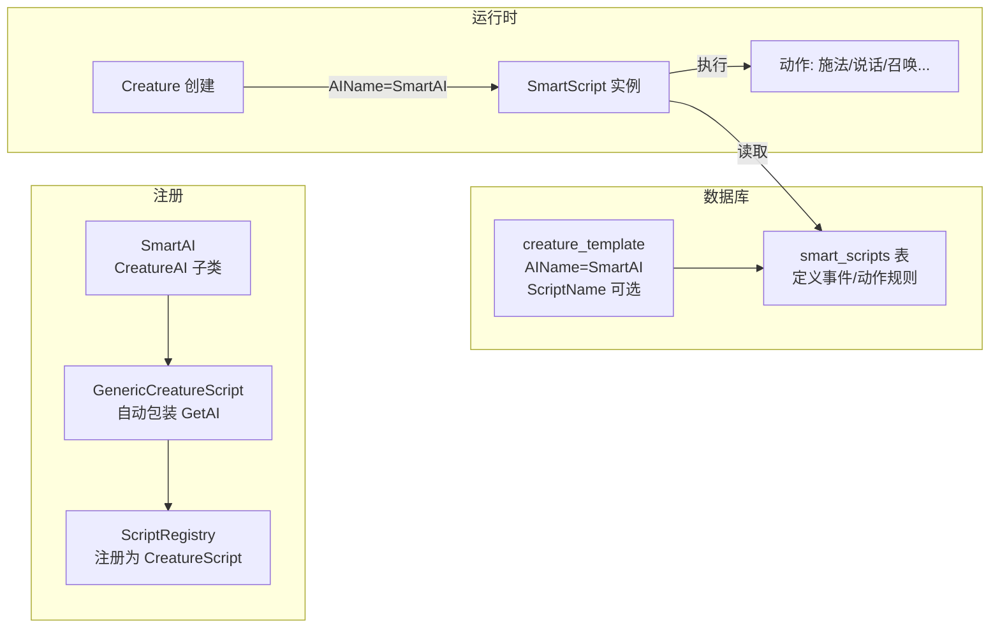

- `creature_template.AIName = "SmartAI"` → 使用 SmartAI 的 AI 入口（决定 AI 引擎）
- `creature_template.ScriptName` → 可选，用于设置额外的 C++ 脚本（如 Gossip Hook 等），与 AIName 独立
- `smart_scripts` 表 → 定义 SmartAI 的具体行为规则
- SmartAI 支持 70+ 种事件类型和 80+ 种动作类型，远超 DB 脚本命令的 27 种命令
- SmartAI 的 `entryorguid` 直接引用生物 entry 或 spawn GUID，无需通过 ScriptName 匹配

---

## 11. 设计模式分析

| 设计模式 | 应用位置 | 说明 |
|----------|----------|------|
| **单例模式** | `ScriptMgr` | 全局唯一的脚本管理器，通过 `sScriptMgr` 访问 |
| **CRTP 模式** | `ScriptRegistry<TScript>` | 每种脚本类型有独立的静态注册表实例，编译期多态 |
| **观察者模式** | 所有 Hook 分发 | 游戏系统是主题，脚本对象是观察者，Hook 是通知接口 |
| **模板方法模式** | `ScriptObject` 子类 | 基类定义 Hook 接口，子类选择性覆写 |
| **注册表模式** | `ScriptRegistry` | 集中管理同类型脚本，提供按 ID/按 Hook 查询 |
| **联合体(Union)模式** | `ScriptInfo` | 同一内存区域解释为不同命令的结构体，节省内存 |
| **优先级链** | All 脚本 + 特定脚本 | 先检查全局拦截，再执行特定脚本 |
| **命名映射** | `ObjectMgr::GetScriptId` | 字符串名称 → 数字 ID 的间接映射，解耦数据库与代码 |
| **工厂模式** | `GenericCreatureScript<AI>` | 模板化的 AI 工厂，自动创建 AI 实例 |
| **策略模式** | `FormulaScript` | 通过 Hook 覆写游戏公式，实现可插拔的计算策略 |
| **延迟绑定** | ALScripts 机制 | DB 绑定脚本延迟到数据库加载后才完成绑定 |

---

## 12. 关键文件索引

| 文件路径 | 说明 |
|----------|------|
| `src/server/game/Scripting/ScriptMgr.h` | 脚本管理器声明，200+ Hook 分发方法 |
| `src/server/game/Scripting/ScriptMgr.cpp` | 脚本管理器实现，初始化/加载/卸载逻辑 |
| `src/server/game/Scripting/ScriptObject.h` | 脚本基类 + 模板类声明 |
| `src/server/game/Scripting/ScriptMgrMacros.h` | Hook 分发宏和辅助模板 |
| `src/server/game/Scripting/MapScripts.cpp` | DB 脚本命令执行引擎 |
| `src/server/game/Scripting/ScriptSystem.h/cpp` | script_waypoint 数据加载 |
| `src/server/game/Scripting/ScriptDefines/` | 37 种脚本类型定义 |
| `src/server/game/Globals/ObjectMgr.h` | ScriptInfo、ScriptCommands、ScriptsType 定义 |
| `src/server/game/Globals/ObjectMgr.cpp` | DB 脚本数据加载和 ScriptName 解析 |
| `src/server/game/Maps/Map.h` | ScriptAction、ScriptScheduleMap、ScriptsStart 声明 |
| `data/sql/base/db_world/spell_script_names.sql` | 法术脚本名绑定表 |
| `data/sql/base/db_world/areatrigger_scripts.sql` | 区域触发器脚本绑定表 |
| `data/sql/base/db_world/event_scripts.sql` | 事件脚本命令表 |
| `data/sql/base/db_world/spell_scripts.sql` | 法术脚本命令表 |
| `data/sql/base/db_world/waypoint_scripts.sql` | 路径点脚本命令表 |
| `data/sql/base/db_world/script_waypoint.sql` | 脚本路径点表 |
| `data/sql/base/db_world/smart_scripts.sql` | SmartAI 脚本规则表 |
| `data/sql/base/db_world/creature_template.sql` | 含 ScriptName 字段 |
| `data/sql/base/db_world/gameobject_template.sql` | 含 ScriptName 字段 |
| `data/sql/base/db_world/item_template.sql` | 含 ScriptName 字段 |
| `data/sql/base/db_world/instance_template.sql` | 含 script 字段 |
| `data/sql/base/db_world/outdoorpvp_template.sql` | 含 ScriptName 字段 |

---

## 13. 总结

### 13.1 架构特征

AzerothCore 脚本系统是一个 **三层架构**：

1. **脚本注册层** — `ScriptObject` 子类 + `ScriptRegistry<T>` 模板，负责脚本的生命周期管理
2. **Hook 分发层** — `ScriptMgr` + 宏系统，负责高效地将游戏事件路由到正确的脚本
3. **数据驱动层** — DB 脚本命令 + SmartAI，提供无需 C++ 编译的脚本能力

### 13.2 核心设计权衡

| 设计决策 | 优势 | 代价 |
|----------|------|------|
| DB绑定 vs 全局脚本分类 | 全局脚本零查找开销；DB绑定脚本按需加载 | 需要理解两种注册时机 |
| EnabledHooks 优化 | 非 DB 绑定脚本只遍历实际覆写了 Hook 的脚本 | DB 绑定脚本不走此路径；AddALScripts 时才填充 DB 绑定脚本的 hooks |
| 字符串名称映射 | 数据库与代码解耦 | 间接查找有轻微性能开销 |
| Union 解释 ScriptInfo | 内存紧凑，一套字段适配所有命令 | 可读性差，需查文档理解各命令参数含义 |
| SmartAI 作为脚本子系统 | 无需 C++ 即可创建复杂行为 | 学习曲线陡峭，70+ 事件/80+ 动作类型 |

### 13.3 数据库关系速查

| 想要脚本化... | 设置数据库字段 | 继承脚本类型 |
|---------------|---------------|-------------|
| 一个生物的 AI | `creature_template.AIName` + `creature_template.ScriptName` | `CreatureScript` |
| 一个游戏对象 | `gameobject_template.ScriptName` | `GameObjectScript` |
| 一个物品 | `item_template.ScriptName` | `ItemScript` |
| 一个法术效果 | `spell_script_names.ScriptName` | `SpellScriptLoader` |
| 一个副本 | `instance_template.script` | `InstanceMapScript` |
| 一个区域触发器 | `areatrigger_scripts.ScriptName` | `AreaTriggerScript` |
| 所有玩家事件 | — | `PlayerScript` |
| 所有生物事件 | — | `AllCreatureScript` |
| 游戏公式 | — | `FormulaScript` |
| 简单命令序列 | `event/spell/waypoint_scripts` | 无需C++代码 |
